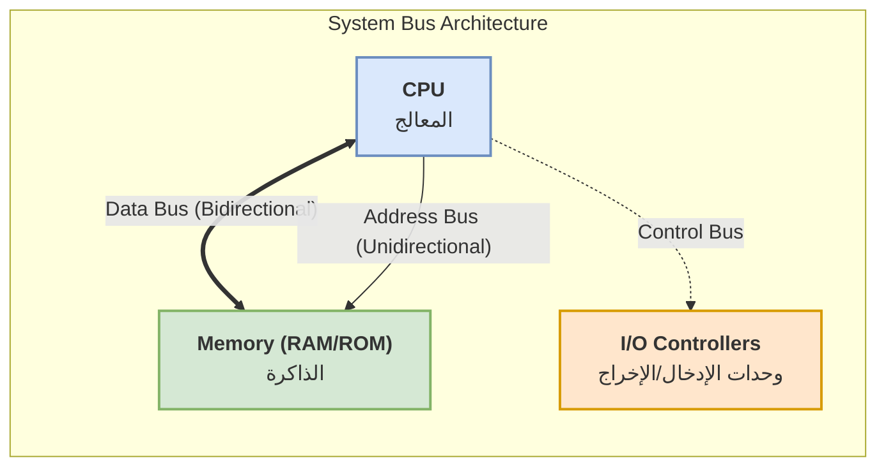

# بنية عتاد الحاسوب (Computer Hardware Architecture)

تُعد بنية عتاد الحاسوب (Computer Hardware Architecture) الأساس الذي تقوم عليه جميع عمليات المعالجة الرقمية. يهدف هذا الدرس إلى تفكيك الحاسوب إلى مكوناته الأساسية، وشرح كيفية تفاعلها معاً لتنفيذ المهام البرمجية، مع التركيز على المصطلحات التقنية المعتمدة عالمياً. تم تصميم هذا الدليل ليتدرج من المكونات الدقيقة (المعالج) إلى الأنظمة الأوسع (الذاكرة والنواقل)، وصولاً إلى معماريات التصميم الحديثة.

---

## الوحدة الأولى: المعالج المركزي (Central Processing Unit - CPU)

يعتبر المعالج المركزي (CPU) هو "عقل" الحاسوب، حيث يقوم بتنفيذ التعليمات (Instructions) وتحويل البيانات. تتكون بنية المعالج الداخلية من ثلاثة أجزاء رئيسية تعمل بتناغم:

### 1. وحدة التحكم (Control Unit - CU)
*   **الوظيفة:** توجيه وتنسيق عمل جميع مكونات الحاسوب. لا تقوم بمعالجة البيانات بنفسها، بل تعمل كـ "مدير مرور".
*   **آلية العمل:** تقوم بجلب التعليمات من الذاكرة (Fetch)، وفك تشفيرها (Decode) لمعرفة نوع العملية المطلوبة، ثم إرسال إشارات التحكم (Control Signals) لتنفيذها.

### 2. وحدة الحساب والمنطق (Arithmetic Logic Unit - ALU)
*   **الوظيفة:** تنفيذ جميع العمليات الحسابية (كالجمع والطرح والضرب) والعمليات المنطقية (كالقارنات بين القيم مثل: أكبر من، أصغر من، يساوي، AND, OR).
*   **آلية العمل:** تستقبل البيانات من المسجلات، وتنفذ العملية المطلوبة، ثم تعيد النتيجة إلى المسجلات أو الذاكرة.

### 3. المسجلات (Registers)
*   **الوظيفة:** هي مساحات تخزين صغيرة جداً وسريعة جداً تقع داخل قلب المعالج.
*   **آلية العمل:** تُستخدم لتخزين البيانات المؤقتة التي يعمل عليها المعالج في تلك اللحظة بالذات، مثل عنوان الذاكرة التالي (Memory Address)، أو نتيجة عملية حسابية جارية، أو التعليمات الحالية (Instruction Register).

### مخطط توضيحي: البنية الداخلية للمعالج

![[Phase01-Mod01-L01-Sh01.drawio.png]]

### تمرين عملي (1): تتبع تنفيذ التعليمات
**السيناريو:** افترض أن المعالج يحتاج إلى تنفيذ التعليمة البرمجية التالية: `ADD R1, R2, R3` (بمعنى: اجمع قيمة المسجل R2 وقيمة المسجل R3، وضع النتيجة في المسجل R1).
**المطلوب:** اشرح خطوة بخطوة كيف تتفاعل مكونات المعالج (CU, ALU, Registers) لتنفيذ هذه التعليمة.

**الحل المتوقع:**
1.  **Fetch & Decode:** تقوم وحدة التحكم (CU) بجلب التعليمة من الذاكرة وفك تشفيرها لتدرك أن العملية المطلوبة هي "جمع".
2.  **Read:** ترسل (CU) إشارة إلى المسجلات (Registers) لقراءة البيانات المخزنة في R2 و R3.
3.  **Execute:** تمرر المسجلات البيانات إلى وحدة الحساب والمنطق (ALU). تقوم (ALU) بإجراء عملية الجمع.
4.  **Write Back:** ترسل (ALU) النتيجة إلى المسجلات، وتقوم (CU) بتوجيه البيانات لتخزينها في المسجل R1.

---

## الوحدة الثانية: هرم الذاكرة (Memory Hierarchy)

تعتمد كفاءة الحاسوب بشكل كبير على سرعة الوصول إلى البيانات. تُصنف الذاكرة في هرم يعتمد على ثلاثة معايير: السرعة، السعة، والتكلفة. كلما ارتفعنا في الهرم، زادت السرعة وقلت السعة وارتفعت التكلفة.

### 1. المسجلات (Registers)
*   الأسرع على الإطلاق، تقع داخل المعالج (CPU). سعتها صغيرة جداً (تقاس بالبتات أو البايتات القليلة).

### 2. ذاكرة التخزين المؤقت (Cache Memory - L1, L2, L3) *(إضافة توضيحية)*
*   ذاكرة سريعة جداً تقع بين المعالج والذاكرة الرئيسية.
*   تخزن نسخاً من البيانات الأكثر استخداماً لتقليل وقت انتظار المعالج للذاكرة الرئيسية.

### 3. ذاكرة الوصول العشوائي (Random Access Memory - RAM)
*   ذاكرة مؤقتة (Volatile Memory)، تفقد محتواها عند انقطاع التيار الكهربائي.
*   تخزن البيانات والتعليمات التي يحتاجها النظام والتطبيقات بشكل نشط. كلما زادت سعتها وسرعتها، زادت قدرة الحاسوب على تشغيل تطبيقات متعددة بسلاسة.

### 4. ذاكرة القراءة فقط (Read-Only Memory - ROM)
*   ذاكرة دائمة (Non-Volatile Memory)، تحتفظ ببياناتها بدون طاقة.
*   تخزن التعليمات الأساسية اللازمة لبدء تشغيل الحاسوب (مثل نظام الـ BIOS أو UEFI).

### 5. الذاكرة الثانوية (Secondary Storage)
*   تشمل الأقراص الصلبة (Hard Disk Drive - HDD) والأقراص ذات الحالة الصلبة (Solid State Drive - SSD).
*   تستخدم لتخزين البيانات بشكل دائم (نظام التشغيل، الملفات). أبطأ من الذاكرة الرئيسية (RAM) ولكنها توفر سعات تخزين أكبر بتكلفة أقل.

### مخطط توضيحي: هرم الذاكرة
![[Phase01-Mod01-L01-Sh02.drawio.png]]

### تمرين عملي (2): تحليل عنق الزجاجة (Bottleneck Analysis)
**السيناريو:** يقوم مهندس مونتاج فيديو بتشغيل برنامج تحرير ثقيل. يقوم البرنامج بتحميل مقاطع فيديو بدقة 4K. يلاحظ المهندس أن المعالج (CPU)_usage لا يتجاوز 30%، ولكن النظام يتجمد بشكل متقطع. عند الفحص، يجد أن الذاكرة العشوائية (RAM) ممتلئة بنسبة 99% والنظام يعتمد بشكل كبير على الذاكرة الافتراضية (Virtual Memory) على القرص الصلب (SSD).
**المطلوب:** حلل المشكلة بناءً على هرم الذاكرة، واقترح حلاً عتادياً.

**الحل المتوقع:**
*   **التحليل:** المعالج ينتظر البيانات لأن الذاكرة الرئيسية (RAM) لم تعد تتسع لبيانات الفيديو. قام النظام بنقل البيانات إلى الذاكرة الثانوية (SSD) كذاكرة افتراضية. بما أن الذاكرة الثانوية أبطأ بكثير من RAM، حدث "عنق زجاجة" (Bottleneck)، مما أجبر المعالج على التوقف والانتظار (انخفض استخدامه).
*   **الحل:** ترقية العتاد بإضافة المزيد من سعة الذاكرة العشوائية (RAM) لتتناسب مع حجم ملفات الفيديو، مما يزيل الاعتماد على الذاكرة الثانوية البطيئة.

---

## الوحدة الثالثة: نظام النقل والربط (Bus System)

تتواصل مكونات الحاسوب عبر مسارات تسمى "النواقل" (Buses)، وهي عبارة عن مجموعات من الأسلاك النحاسية على اللوحة الأم التي تنقل الإشارات الكهربائية.

### أنواع النواقل الرئيسية:
1.  **ناقل البيانات (Data Bus):** ينقل البيانات الفعلية بين المعالج والذاكرة أو الأجهزة الأخرى. يكون عادةً ثنائي الاتجاه (Bidirectional).
2.  **ناقل العناوين (Address Bus):** ينقل عناوين الذاكرة (Memory Addresses) التي يريد المعالج القراءة منها أو الكتابة إليها. يكون أحادي الاتجاه (Unidirectional) من المعالج إلى الذاكرة.
3.  **ناقل التحكم (Control Bus):** ينقل إشارات التحكم مثل "اقرأ" (Read) أو "اكتب" (Write) من وحدة التحكم إلى باقي المكونات.

**ملاحظة هامة:** عرض الناقل (Bus Width) يحدد عدد البتات (Bits) التي يمكن نقلها في وقت واحد، مما يؤثر مباشرة على سرعة نقل البيانات.

### مخطط توضيحي: نظام النواقل

### تمرين عملي (3): حساب عرض النطاق الترددي (Bandwidth Calculation)
**السيناريو:** لديك لوحة أم تحتوي على ناقل بيانات (Data Bus) بعرض 64-bit، ويعمل بتردد ساعة (Clock Speed) مقداره 2000 MHz (أو 2 Gigatransfers per second).
**المطلوب:** احسب أقصى معدل لنقل البيانات (Maximum Bandwidth) بوحدة Gigabytes per second (GB/s).

**الحل المتوقع:**
*   عرض الناقل = 64 bit = 8 Bytes (بما أن 1 Byte = 8 bits).
*   تردد النقل = 2,000,000,000 transfer/second.
*   معدل النقل = عرض الناقل بالبايت × عدد النقلات في الثانية.
*   معدل النقل = 8 Bytes × 2,000,000,000 = 16,000,000,000 Bytes/second.
*   بالتحويل إلى Gigabytes: 16,000,000,000 / 1,000,000,000 = **16 GB/s**.

---

## الوحدة الرابعة: وحدات الإدخال والإخراج واللوحة الأم (I/O Devices & Motherboard)

### 1. وحدات الإدخال والإخراج (Input/Output Devices)
تتفاعل مع الحاسوب عبر واجهات (Interfaces) ونواقل خاصة.
*   **وحدات الإدخال (Input Units):** مثل لوحة المفاتيح (Keyboard)، الفأرة (Mouse)، والميكروفون. تقوم بتحويل البيانات من شكل يمكن للبشر فهمه إلى إشارات رقمية (Binary) يفهمها الحاسوب.
*   **وحدات الإخراج (Output Units):** مثل الشاشة (Monitor)، والطابعة (Printer)، ومكبرات الصوت (Speakers). تقوم بتحويل البيانات الرقمية من المعالج إلى شكل يمكن للمستخدم استهلاكه.

### 2. اللوحة الأم (Motherboard)
هي الدائرة الكهربائية الرئيسية (PCB) التي تربط جميع المكونات ببعضها.
*   **المقابس (Slots/Sockets):** تحتوي على مقبس المعالج (CPU Socket)، ومقابس الذاكرة (RAM Slots)، ومقابس التوسعة مثل (PCIe) لبطاقات كروت الشاشة والشبكات.
*   **شريحة التحكم (Chipset):** كانت تتكون قديماً من جسرين (Northbridge و Southbridge)، أما في التصاميم الحديثة فقد تم دمج معظم وظائف الـ Northbridge داخل المعالج (CPU) نفسه، بينما تتولى شريحة (Platform Controller Hub - PCH) أو Southbridge إدارة الأجهزة الأبطأ مثل منافذ USB، أقراص التخزين (SATA/NVMe)، والصوت.

---

## الوحدة الخامسة: معماريات التصميم الحديثة (Modern Design Architectures)

كيف يتم تنظيم المكونات السابقة هندسياً؟ هناك معماريات أساسية تحدد طريقة عمل الحاسوب:

### 1. معمارية فون نيومان (Von Neumann Architecture)
*   **المبدأ الأساسي:** تخزين البرامج (التعليمات) والبيانات في نفس الذاكرة الرئيسية، واستخدام نفس النواقل (Buses) لنقل كليهما.
*   **العيب الرئيسي:** عنق الزجاجة (Von Neumann Bottleneck). بما أن التعليمات والبيانات يتشاركان نفس الناقل، فلا يمكن للمعالج جلب تعليمة جديدة وقراءة/كتابة بيانات في نفس الدورة الزمنية (Clock Cycle)، مما يحد من السرعة القصوى.
*   **الاستخدام:** معظم الحواسيب الشخصية (PCs) والسيرفرات التقليدية.

### 2. معمارية هارفارد (Harvard Architecture)
*   **المبدأ الأساسي:** استخدام مسارات وذاكرة منفصلة تماماً للبيانات (Data) والتعليمات (Instructions).
*   **الميزة:** تسمح بجلب التعليمات والبيانات في نفس الوقت (Parallel Fetch)، مما يلغي عنق الزجاجة ويزيد من الأداء بشكل ملحوظ.
*   **الاستخدام:** شائعة جداً في المعالجات المدمجة (Microcontrollers)، ومعالجات الإشارات الرقمية (DSPs)، وداخل الذاكرة المخبئية (Cache Memory) في المعالجات الحديثة (حيث يتم فصل L1 Cache إلى L1-Data و L1-Instruction).

### 3. الحوسبة المتوازية (Parallel Processing)
*   **المبدأ:** استخدام معالجات متعددة أو أنوية متعددة (Multi-core Processors) لتنفيذ مهام متعددة في وقت واحد.
*   **الأنواع:**
    *   **Multi-core:** وجود عدة أنوية (Cores) مستقلة داخل شريحة معالج واحدة.
    *   **SIMD (Single Instruction, Multiple Data):** تنفيذ نفس التعليمة على عدة بيانات في وقت واحد (مفيد جداً في معالجة الرسوميات والفيديو).
*   **الميزة:** تحسن الكفاءة وتقلل استهلاك الطاقة والحرارة مقارنة بمحاولة زيادة سرعة النواة الواحدة (زيادة التردد - Clock Speed) والتي تواجه قيوداً فيزيائية في التبريد واستهلاك الطاقة.

---

### تمرين شامل (4): تصميم نظام وتقييم معماريته
**السيناريو:** أنت مصمم عتاد (Hardware Architect) ومطلوب منك تصميم معالج مدمج (Microcontroller) سيتم استخدامه داخل "فرامل مانعة للانغلاق" (ABS) في سيارة. هذا المعالج يجب أن يقرأ بيانات من حساسات السرعة (بيانات) ويقوم بتعليمات برمجية ثابتة للتحكم في المكابح في أجزاء من الثانية (Real-time processing).
**المطلوب:**
1. أي معمارية ستختار: Von Neumann أم Harvard؟ ولماذا؟
2. ما هو نوع الذاكرة الأنسب لتخزين "كود الفرامل"؟ ولماذا؟

**الحل المتوقع:**
1.  **المعمارية:** سأختار **Harvard Architecture**. السبب: أنظمة الفرامل تتطلب معالجة في الوقت الفعلي (Real-time) ولا تحتمل أي تأخير. معمارية هارفارد تسمح بقراءة بيانات الحساسات وتنفيذ التعليمات البرمجية في نفس الوقت، مما يضمن سرعة الاستجابة وتجنب عنق الزجاجة.
2.  **نوع الذاكرة:** سأستخدم **ROM / Flash Memory** (Non-Volatile) لتخزين كود الفرامل. السبب: الكود ثابت ولا يتغير، ويجب أن يحتفظ ببياناته حتى عند انقطاع بطارية السيارة (Non-Volatile)، ويجب أن يكون آمناً من التعديل العرضي.