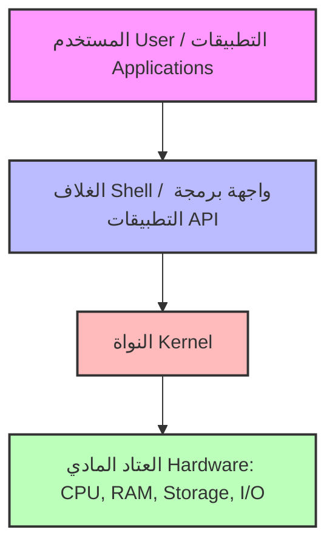
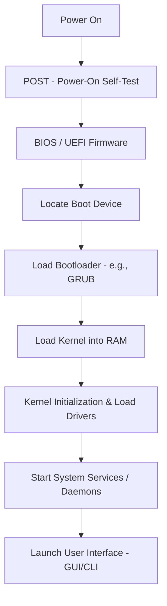

# أساسيات أنظمة التشغيل (Operating Systems Fundamentals)

يُعد نظام التشغيل (Operating System - OS) حجر الزاوية في أي حاسوب. هو مجموعة معقدة من البرامج التي تعمل كحلقة وصل (Interface) بين المستخدم (User)، التطبيقات (Applications)، والعتاد المادي (Hardware). بدون نظام التشغيل، يكون العتاد مجرد قطع إلكترونية صماء لا يمكن الاستفادة منها.

تم تصميم هذا الدرس ليتدرج من المفاهيم الأساسية إلى الآليات الداخلية المعقدة، مع التركيز على المصطلحات التقنية الدقيقة.

---

## الوحدة الأولى: البنية الأساسية لنظام التشغيل (Core Architecture)

ينقسم نظام التشغيل من حيث التصميم إلى طبقتين رئيسيتين تفصلان بين المستخدم والعتاد:

### 1. النواة (Kernel)
هي القلب النابض لنظام التشغيل وتعمل في ما يُسمى بـ "وضع النواة" (Kernel Mode) والذي يمنحها صلاحيات كاملة للوصول إلى العتاد.
**مهام النواة الأساسية:**
*   إدارة العمليات (Process Management).
*   إدارة الذاكرة (Memory Management).
*   إدارة الأجهزة (Device Handling).
*   إدارة الأمان والصلاحيات (Security & Access Control).

### 2. الغلاف (Shell)
هو الطبقة الخارجية التي تسمح للمستخدم أو للتطبيقات بالتفاعل مع النواة. يعمل الغلاف في "وضع المستخدم" (User Mode) لمنع التطبيقات من الوصول المباشر والخطير للعتاد.
**أنواع الأغلفة:**
*   **واجهة سطر الأوامر (Command Line Interface - CLI):** يكتب المستخدم أوامر نصية (مثل Bash في لينكس أو CMD/PowerShell في ويندوز).
*   **واجهة المستخدم الرسومية (Graphical User Interface - GUI):** يعتمد على النوافذ والأيقونات (Icons) والنقرات (مثل Windows Desktop أو GNOME).

### مخطط توضيحي: البنية الطبقية لنظام التشغيل

---

## الوحدة الثانية: الوظائف الرئيسية لنظام التشغيل (Core Functions)

تتلخص وظيفة نظام التشغيل في "إدارة الموارد" (Resource Management). فيما يلي تفصيل لهذه الوظائف:

### 1. إدارة المعالج (Processor Management)
يقوم النظام بجدولة المهام (Scheduling) لضمان الاستفادة القصوى من المعالج.
*   **تعدد المهام (Multitasking):** قدرة النظام على تشغيل عمليات متعددة (Processes) في وقت واحد. يتم ذلك عبر التبديل السريع بين العمليات (Context Switching)، حيث يحفظ النظام حالة العملية الحالية ويستعيد حالة العملية التالية.
*   **خوارزميات الجدولة (Scheduling Algorithms):** مثل (Round Robin) حيث يُعطى كل عملية شريحة زمنية (Time Slice)، أو (Priority Scheduling) حيث تُنفذ المهام حسب أولويتها.

### 2. إدارة الذاكرة (Memory Management)
يتحكم النظام في تخصيص الذاكرة العشوائية (RAM) للعمليات، ويمنع أي عملية من الوصول إلى ذاكرة عملية أخرى (Memory Protection).
*   **الذاكرة الافتراضية (Virtual Memory):** تقنية حيوية تسمح للنظام باستخدام جزء من مساحة التخزين الثانوية (Hard Disk / SSD) كذاكرة RAM إضافية عندما تمتلئ الذاكرة الفعلية. في ويندوز تُسمى (Page File) وفي لينكس (Swap Space).

### 3. إدارة الملفات (File System Management)
ينظم النظام كيفية تخزين البيانات واسترجاعها على الأقراص.
*   **نظام الملفات (File System):** هو الهيكل المنطقي (مثل NTFS, FAT32 في ويندوز، أو EXT4, BTRFS في لينكس). يحدد كيفية تسمية الملفات، وتقسيم القرص إلى قطاعات (Sectors) وعناقيد (Clusters)، وإدارة الصلاحيات.

### 4. إدارة الأجهزة (Device Management)
يتحكم النظام في الأجهزة الطرفية (Peripherals) المتصلة.
*   **برامج التشغيل (Device Drivers):** برامج متخصصة تعمل كـ "مترجم" بين النواة والجهاز المحدد.
*   **المقاطعات (Interrupts):** إشارات يرسلها الجهاز للمعالج عندما يكون جاهزاً لاستقبال بيانات أو أنهى مهمة ما، بدلاً من أن يظل المعالج يسأل الجهاز باستمرار (Polling).

---

### تمرين عملي (1): تحليل مشكلة الذاكرة الافتراضية (Virtual Memory Analysis)
**السيناريو:** يقوم مطور بتشغيل بيئة تطوير ثقيلة (IDE) مع عدة آلات افتراضية (Virtual Machines). يلاحظ أن النظام أصبح بطيئاً جداً، وصوت القرص الصلب (HDD) يعمل بشكل مستمر. عند فتح مراقب المهام (Task Manager)، يجد أن استخدام الذاكرة العشوائية (RAM) بنسبة 98%، واستخدام القرص (Disk Usage) بنسبة 100%.
**المطلوب:** 
1. ما الذي يحدث داخل نظام التشغيل؟
2. ما هو الحل العتادي والبرمجي لهذه المشكلة؟

**الحل المتوقع:**
1. **التحليل:** النظام يعاني من ظاهرة تُسمى (Thrashing). بسبب امتلاء الذاكرة الفعلية (RAM)، قام نظام التشغيل بنقل بيانات العمليات النشطة إلى الذاكرة الافتراضية (Virtual Memory) على القرص الصلب. بما أن القرص الصلب أبطأ بمئات المرات من RAM، فإن النظام يقضي وقتاً طويلاً في نقل البيانات ذهاباً وإياباً (Paging)، مما يسبب بطئاً شديداً واستهلاكاً كاملاً للقرص.
2. **الحل العتادي:** إضافة المزيد من سعة الذاكرة العشوائية (RAM) لتقليل الاعتماد على الذاكرة الافتراضية، أو استبدال القرص الصلب (HDD) بقرص ذو حالة صلبة (SSD) لتسريع عمليات القراءة/الكتابة للذاكرة الافتراضية.
3. **الحل البرمجي:** إغلاق التطبيقات غير الضرورية، أو تقليل حجم الذاكرة المخصصة للآلات الافتراضية.

---

## الوحدة الثالثة: عملية الإقلاع (The Boot Process)

عند الضغط على زر التشغيل، يمر الحاسوب بسلسلة دقيقة من المراحل للوصول إلى سطح المكتب:

1. **الفحص الذاتي عند التشغيل (Power-On Self-Test - POST):** تقوم شريحة (BIOS/UEFI) بفحص العتاد الأساسي (RAM, CPU, Keyboard) للتأكد من عمله.
2. **تحميل محمل الإقلاع (Bootloader):** يبحث النظام عن جهاز الإقلاع (Boot Device) ويقرأ القطاع الأول (MBR أو ESP) لتحميل برنامج صغير مثل (GRUB في لينكس أو Windows Boot Manager).
3. **تهيئة النواة (Kernel Initialization):** يقوم الـ Bootloader بتحميل النواة (Kernel) في الذاكرة (RAM). تقوم النواة بتهيئة نفسها، وفحص العتاد، وتحميل برامج التشغيل الأساسية (Drivers).
4. **بدء تشغيل النظام (System Startup / User Space):** تقوم النواة بتشغيل العمليات الأساسية (Daemons/Services)، وأخيراً تحميل واجهة المستخدم (GUI/CLI) لتسمح للمستخدم بتسجيل الدخول.

### مخطط توضيحي: مراحل الإقلاع

---

## الوحدة الرابعة: أنواع أنظمة التشغيل (Types of Operating Systems)

تُصمم أنظمة التشغيل لتلبية احتياجات بيئات مختلفة:

1. **أنظمة الدفعات (Batch Operating Systems):** تجمع المهام المتشابهة وتنفيذها كدفعة واحدة دون تفاعل مباشر. (استخدام قديم في الحواسيب المركزية Mainframes).
2. **أنظمة تقاسم الوقت (Time-Sharing / Multitasking OS):** تخصص شريحة زمنية (Time Slice) لكل مستخدم أو عملية، مما يعطي وهم التشغيل المتزامن. (مثل أنظمة الخوادم التقليدية).
3. **الأنظمة الموزعة (Distributed Operating Systems):** تدير مجموعة من الحواسيب المستقلة وتظهرها للمستخدم كنظام واحد موحد (Single System Image).
4. **أنظمة الوقت الحقيقي (Real-Time Operating Systems - RTOS):** مصممة للاستجابة الفورية للأحداث الخارجية.
   * **Hard Real-Time:** فشل الاستجابة في الوقت المحدد يعني كارثة (مثل أنظمة الفرامل في السيارة، أو أجهزة التنظيم القلبي).
   * **Soft Real-Time:** تأخير الاستجابة يقلل الجودة لكنه لا يسبب كارثة (مثل تشغيل الفيديو أو الصوت).
5. **الأنظمة المحمولة (Mobile Operating Systems):** مصممة لاستهلاك منخفض للطاقة، وإدارة اللمس، والاتصالات اللاسلكية (مثل Android, iOS).

---

### تمرين عملي (2): اختيار نظام التشغيل المناسب (OS Selection Scenario)
**السيناريو:** شركة ناشئة تحتاج إلى تطوير ثلاثة أنظمة مختلفة:
1. نظام للتحكم في ذراع روبوتي يقوم بعمليات جراحية دقيقة.
2. نظام لتشغيل خوادم الويب الخاصة بالشركة والتي تستقبل ملايين الطلبات.
3. نظام لتشغيل أجهزة الصراف الآلي (ATM) الخاصة بالبنك.

**المطلوب:** اقترح نوع نظام التشغيل (من الأنواع المذكورة) لكل حالة، وبرر اختيارك.

**الحل المتوقع:**
1. **الذراع الروبوتي الجراحي:** نظام الوقت الحقيقي الصارم (Hard Real-Time Operating System). **التبرير:** أي تأخير ولو جزء من الألف من الثانية في الاستجابة قد يؤدي إلى خطأ قاتل أثناء الجراحة.
2. **خوادم الويب:** نظام تقاسم الوقت (Time-Sharing) أو الأنظمة الموزعة (Distributed). **التبرير:** يحتاج النظام إلى خدمة آلاف المستخدمين في نفس الوقت (Multitasking) وتوزيع الحمل عبر خوادم متعددة لضمان الاستمرارية والأداء.
3. **أجهزة الصراف الآلي (ATM):** نظام الوقت الحقيقي اللين (Soft Real-Time) أو نظام مدمج مخصص (Embedded OS). **التبرير:** يجب أن يستجيب النظام لضغطات الأزرار وقراءة البطاقة بسرعة مقبولة، ولكن تأخيراً بسيطاً لا يسبب كارثة مادية، مع ضرورة توفير أمان عالي واستقرار.

---

## الوحدة الخامسة: واجهة برمجة التطبيقات واستدعاءات النظام (APIs & System Calls)

كيف تطلب التطبيقات من نظام التشغيل القيام بمهمة؟

### 1. واجهة برمجة التطبيقات (Application Programming Interface - API)
هي مجموعة من الدوال (Functions) والبروتوكولات التي يوفرها نظام التشغيل أو المكتبات البرمجية للمطورين. تسمح للمطور بكتابة كود (مثل: "افتح ملف") دون الحاجة لمعرفة كيفية تواصل القرص الصلب مع النواة.

### 2. استدعاءات النظام (System Calls)
هي الآلية الفعلية التي يطلب بها التطبيق (في User Mode) خدمة من النواة (في Kernel Mode). عندما يستدعي التطبيق دالة من الـ API، فإنها في النهاية تtrigger "System Call" ينتقل بالنواة إلى وضع Kernel Mode لتنفيذ المهمةHardware-related).

**أمثلة على استدعاءات النظام:**
*   `open()`: لفتح ملف.
*   `read()`: لقراءة بيانات.
*   `fork()`: لإنشاء عملية جديدة (Process).
*   `malloc()`: لطلب تخصيص مساحة في الذاكرة.

---

### تمرين عملي (3): تتبع استدعاء النظام (Tracing a System Call)
**السيناريو:** يقوم المستخدم بالنقر المزدوج على ملف نصي (document.txt) لفتحه في برنامج المفكرة (Notepad).
**المطلوب:** اشرح التسلسل التقني لما يحدث على مستوى استدعاءات النظام (System Calls) بين التطبيق (Notepad) والنواة (Kernel).

**الحل المتوقع:**
1. **طلب الفتح:** يقوم تطبيق Notepad (في User Mode) باستدعاء دالة API لفتح الملف، والتي تقوم بدورها بإصدار استدعاء نظام `open("document.txt", O_RDONLY)`.
2. **الانتقال للنواة:** يتحول المعالج من User Mode إلى Kernel Mode. تتدخل النواة للتحقق من صلاحيات المستخدم (Permissions) للوصول إلى الملف.
3. **البحث في نظام الملفات:** تقوم النواة بالبحث في جدول الملفات (File Allocation Table / Inodes) لمعرفة المكان الفعلي للملف على القرص الصلب.
4. **إصدار أوامر القراءة:** ترسل النواة أوامر إلى برنامج تشغيل القرص (Disk Driver) لقراءة البيانات من القطاعات (Sectors) الخاصة بالملف.
5. **نقل البيانات:** يتم نقل البيانات من القرص إلى الذاكرة العشوائية (RAM) عبر المقاطعات (Interrupts) وإبلاغ النواة بانتهاء القراءة.
6. **إرجاع النتيجة:** تقوم النواة بإرجاع "مُعرف الملف" (File Descriptor) إلى تطبيق Notepad، والعودة إلى User Mode.
7. **قراءة المحتوى:** يقوم الآن تطبيق Notepad باستخدام استدعاء النظام `read()` لجلب محتوى الملف من الذاكرة وعرضه على الشاشة عبر واجهة GUI.