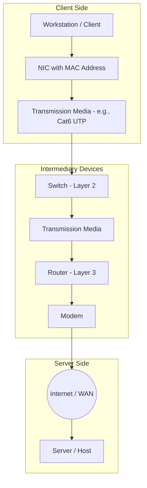

# مكونات الشبكة وتوبولوجياتها (Network Components & Topologies)

تُعد الشبكات الحاسوبية (Computer Networks) العمود الفقري للاتصالات الحديثة. لفهم كيفية انتقال البيانات من جهاز إلى آخر عبر العالم، يجب تفكيك الشبكة إلى مكوناتها المادية (Hardware Components) وفهم الأشكال الهندسية التي تربط هذه المكونات فيما بينها، وهو ما يُعرف بالتوبولوجيا (Topology). يتدرج هذا الدرس من الأجهزة الفردية والوسائط، مروراً بأجهزة الربط، وصولاً إلى تصميم الشبكات.

---

## الوحدة الأولى: المكونات المادية للشبكة (Network Hardware Components)

تنقسم مكونات الشبكة المادية إلى ثلاث فئات رئيسية: الأجهزة الطرفية (End Devices)، الأجهزة الوسيطة (Intermediary Devices)، ووسائط النقل (Transmission Media).

### 1. الأجهزة الطرفية (End Devices / Hosts)
هي الأجهزة التي يستخدمها المستخدمون النهائيون أو التي تقدم الخدمات.
*   **أجهزة العمل (Workstations / Clients):** مثل أجهزة الحاسوب الشخصية (PCs)، الهواتف الذكية، وأجهزة اللوحية. تطلب هذه الأجهزة الخدمات من الشبكة.
*   **الخوادم (Servers):** أجهزة قوية توفر الموارد والخدمات للأجهزة الطرفية الأخرى (مثل Web Servers, File Servers).

### 2. بطاقة الشبكة (Network Interface Card - NIC)
هي العتاد المادي الذي يسمح للجهاز الطرفي بالاتصال بالشبكة. يمكن أن تكون مدمجة في اللوحة الأم (Motherboard) أو كبطاقة توسعة (Expansion Card).
*   **العنوان الفيزيائي (MAC Address):** تحتوي كل بطاقة شبكة على عنوان فيزيائي فريد عالمياً (Media Access Control) يُستخدم لتحديد هوية الجهاز على مستوى الشبكة المحلية (Data Link Layer).

### 3. الأجهزة الوسيطة (Intermediary Devices)
هي الأجهزة التي تربط الأجهزة الطرفية ببعضها وتوجه البيانات عبر الشبكة.
*   **الموزع (Hub):** جهاز يعمل في الطبقة الأولى (Physical Layer). يستقبل الإشارة الكهربائية ويقوم ببثها (Broadcast) إلى جميع المنافذ (Ports) الأخرى دون معرفة الجهاز المستهدف. يسبب ازدحاماً (Collisions) ويقلل من كفاءة الشبكة.
*   **المحول (Switch):** جهاز ذكي يعمل في الطبقة الثانية (Data Link Layer). يقوم ببناء جدول عناوين (MAC Address Table) لتوجيه البيانات (Frame) فقط إلى المنفذ الخاص بالجهاز المستهدف بدقة، مما يقلل الازدحام ويزيد الأمان والسرعة.
*   **الموجه (Router):** جهاز يعمل في الطبقة الثالثة (Network Layer). وظيفته ربط شبكات مختلفة (مثل ربط الشبكة المحلية LAN بشبكة الإنترنت WAN). يستخدم العناوين المنطقية (IP Addresses) وجداول التوجيه (Routing Tables) لاختيار أفضل مسار (Path) للبيانات.
*   **نقطة الوصول اللاسلكية (Wireless Access Point - WAP):** جهاز يسمح للأجهزة المزودة ببطاقات شبكة لاسلكية (Wireless NIC) بالاتصال بالشبكة السلكية وتحويل الإشارات إلى موجات راديو (Wi-Fi).
*   **المودم (Modem):** جهاز يقوم بتعديل (Modulation) وفك تعديل (Demodulation) الإشارات. يحول الإشارات الرقمية (Digital) من الشبكة المحلية إلى إشارات تناظرية (Analog) أو ضوئية تناسب خطوط مزود خدمة الإنترنت (ISP)، والعكس صحيح.

### 4. وسائط النقل (Transmission Media)
هي القنوات الفيزيائية التي تنتقل عبرها البيانات على شكل إشارات.
*   **السلك المجدول (Twisted Pair Cable):** الأكثر شيوعاً في الشبكات المحلية (LAN). ينقسم إلى نوعين: UTP (غير محمي) و STP (محمي). الفئات الشائعة هي Cat5e و Cat6 والتي تدعم سرعات تصل إلى 1 Gbps و 10 Gbps لمسافات تصل إلى 100 متر.
*   **الألياف الضوئية (Fiber Optic Cable):** تستخدم نبضات ضوئية (Light Pulses) لنقل البيانات. توفر سرعات فائقة، مسافات طويلة جداً (كيلومترات)، وحصانة كاملة ضد التداخل الكهرومغناطيسي (EMI).
*   **الكابل المحوري (Coaxial Cable):** كان شائعاً في شبكات التلفزيون والإنترنت القديم (Broadband)، ويستخدم حالياً في بعض توصيلات الـ ISP.

### مخطط توضيحي: تدفق البيانات عبر مكونات الشبكة

---

### تمرين عملي (1): اختيار العتاد المناسب (Hardware Selection)
**السيناريو:** تقوم بتصميم شبكة لمبنى مكاتب مكون من 3 طوابق. كل طابق يحتوي على 20 جهاز حاسوب (PC). المسافة بين الطابق الأول والثالث تبلغ 250 متراً.
**المطلوب:**
1. ما نوع الكابل الأنسب لربط أجهزة كل طابق ببعضها؟ ولماذا؟
2. ما نوع الكابل الأنسب لربط طابق بآخر (عبر المسافة الطويلة)؟ ولماذا؟
3. أي جهاز ستستخدم لربط الأجهزة في كل طابق: Hub أم Switch؟ برر اختيارك بناءً على أداء الشبكة.

**الحل المتوقع:**
1. **ربط الأجهزة في نفس الطابق:** كابل السلك المجدول غير المحمي (UTP - Cat6). **التبرير:** المسافة أقل من 100 متر، وهو الحل الأقل تكلفة والأسهل في التركيب للمكاتب.
2. **ربط الطوابق ببعضها (مسافة 250 متر):** كابل الألياف الضوئية (Fiber Optic). **التبرير:** كابل UTP محدود بـ 100 متر. الألياف الضوئية تدعم مسافات طويلة جداً ولا تتأثر بالتداخل الكهرومغناطيسي الناتج عن تمديدات الكهرباء في المبنى.
3. **جهاز الربط في كل طابق:** Switch. **التبرير:** الـ Hub يقوم ببث البيانات لجميع الأجهزة مما يسبب تصادم البيانات (Collisions) ويقلل السرعة. الـ Switch يوجه البيانات فقط للجهاز المستهدف باستخدام عناوين MAC، مما يضمن أداءً عالياً وأماناً أفضل.

---

## الوحدة الثانية: توبولوجيات الشبكة (Network Topologies)

التوبولوجيا (Topology) هي الخطة الهندسية التي تحدد كيفية ترتيب وتوصيل الأجهزة والوسائط في الشبكة. تنقسم إلى:
*   **التوبولوجيا الفيزيائية (Physical Topology):** الشكل الهندسي الفعلي لكيفية توصيل الكابلات والأجهزة.
*   **التوبولوجيا المنطقية (Logical Topology):** كيفية تدفق البيانات فعلياً عبر الشبكة بغض النظر عن الشكل الفيزيائي.

سنركز على التوبولوجيات الفيزيائية الأساسية:

### 1. توبولوجيا الحافلة (Bus Topology)
*   **الوصف:** تعتمد على كابل مركزي واحد (Backbone) يربط جميع الأجهزة بشكل تسلسلي. يتم إنهاء طرفي الكابل بمقاومات (Terminators) لمنع ارتداد الإشارات.
*   **المميزات:** تكلفة منخفضة جداً، سهلة التركيب للشبكات الصغيرة جداً.
*   **العيوب:** إذا انقطع الكابل المركزي في أي نقطة، تتوقف الشبكة بالكامل (Single Point of Failure). صعوبة عزل الأخطاء، وتزداد تصادمات البيانات (Collisions) بزيادة عدد الأجهزة.

### 2. توبولوجيا النجم (Star Topology)
*   **الوصف:** تتصل جميع الأجهزة بجهاز مركزي وسيط (عادةً Switch) عبر كابل مستقل لكل جهاز.
*   **المميزات:** الأكثر شيوعاً في الشبكات المحلية (LAN) الحديثة. إذا تعطل كابل جهاز واحد، لا يتأثر باقي الشبكة. سهولة إضافة أجهزة جديدة وعزل الأعطال.
*   **العيوب:** تتطلب كمية أكبر من الكابلات. إذا تعطل الجهاز المركزي (Switch)، تتوقف الشبكة بأكملها.

### 3. توبولوجيا الحلقة (Ring Topology)
*   **الوصف:** ترتبط الأجهزة في حلقة مغلقة، حيث يمرر كل جهاز البيانات إلى الجهاز التالي حتى تصل إلى الوجهة. تستخدم تقنية تمرير الإشارة (Token Passing) لمنع التصادم.
*   **المميزات:** أداء مستقر تحت حمل ثقيل، لا توجد تصادمات في البيانات.
*   **العيوب:** تعطل جهاز واحد أو انقطاع كابل واحد يعطل الشبكة بأكملها (ما لم يتم استخدام حلقة مزدوجة Dual Ring). إضافة أو إزالة جهاز تتطلب كسر الحلقة.

### 4. توبولوجيا الشبكة (Mesh Topology)
*   **الوصف:** توفر مسارات متعددة بين الأجهزة. في التوبولوجيا الشبكية الكاملة (Full Mesh)، يكون كل جهاز متصل بجميع الأجهزة الأخرى مباشرة.
*   **المميزات:** موثوقية وتسامح مع الأخطاء (Fault Tolerance) عالي جداً. إذا انقطع كابل، يمكن للبيانات العثور على مسار بديل.
*   **العيوب:** تكلفة عالية جداً، تعقيد في التركيب، واستهلاك كبير لمنافذ الأجهزة الوسيطة.

### 5. توبولوجيا الهجين / الشجرة (Hybrid / Tree Topology)
*   **الوصف:** مزيج من توبولوجيتين أو أكثر (مثل Star-Bus أو Star-Ring). عادة ما تكون على شكل شجرة حيث تتصل عدة شبكات نجمية بمحول مركزي (Root Switch).
*   **المميزات:** قابلة للتوسع (Scalable) جداً، سهلة الإدارة للشبكات الكبيرة، وعزل الأخطاء فعال.
*   **العيوب:** تعتمد بشكل حاسم على العقدة الرئيسية (Root Device)، وتعقيدها يتطلب إدارة متقدمة.

### جدول مقارنة سريع (Summary Table)
| التوبولوجيا (Topology) | الموثوقية (Reliability) | التكلفة (Cost) | سهولة الإدارة (Manageability) |
| :--- | :--- | :--- | :--- |
| الحافلة (Bus) | منخفضة | منخفضة | متوسطة |
| النجم (Star) | متوسطة | متوسطة | عالية |
| الحلقة (Ring) | متوسطة | متوسطة | متوسطة |
| الشبكة (Mesh) | عالية جداً | عالية جداً | منخفضة (معقدة) |
| الهجين (Hybrid) | عالية | عالية | عالية |

---

### تمرين عملي (2): تصميم توبولوجيا لبيئة عمل (Topology Design Scenario)
**السيناريو:** شركة ناشئة تستأجر مكتباً وتحتاج إلى تصميم شبكتها. لديهم المتطلبات التالية:
1. **قسم المحاسبة:** يحتوي على 5 أجهزة حاسوب، وتحتاج الشبكة إلى أن تكون اقتصادية وسهلة الصيانة.
2. **قسم الخوادم (Data Center):** يحتوي على خادمين (Servers) حيويين للغاية. أي انقطاع في الشبكة يعني خسائر فادحة، ولا يمكن تحمل أي توقف (Zero Downtime).
3. **قاعة الاجتماعات:** تحتاج إلى اتصال شبكة للموظفين الذين يستخدمون أجهزة لابتوب، ولا يمكن تمديد كابلات في الأرضيات والجدران.

**المطلوب:** حدد التوبولوجيا الفيزيائية والعتاد المناسب لكل قسم من الأقسام الثلاثة، وبرر اختيارك.

**الحل المتوقع:**
1. **قسم المحاسبة:** 
   * **التوبولوجيا:** Star Topology.
   * **العتاد:** Switch واحد من فئة Gigabit، وكابلات UTP (Cat6).
   * **التبرير:** توبولوجيا النجم هي المعيار للشبكات المحلية، اقتصادية، وإذا تعطل كابل جهاز واحد لا يتأثر القسم بأكمله.
2. **قسم الخوادم (Data Center):**
   * **التوبولوجيا:** Full Mesh Topology (أو Partial Mesh مع مسارات بديلة).
   * **العتاد:** Switches متعددة مع روابط متقاطعة (Cross-links) أو ربط مباشر بين الخوادم.
   * **التبرير:** توبولوجيا الشبكة توفر Fault Tolerance عالي جداً. إذا انقطع كابل أو تعطل Switch، ستستمر البيانات في التدفق عبر المسار البديل، مما يضمن Zero Downtime.
3. **قاعة الاجتماعات:**
   * **التوبولوجيا:** Star Topology (لاسلكية).
   * **العتاد:** Wireless Access Point (WAP).
   * **التبرير:** لا يمكن استخدام الكابلات الفيزيائية، لذا يوفر الـ WAP اتصالاً لاسلكياً (Wi-Fi) يربط الأجهزة اللاسلكية بالشبكة السلكية الأساسية للشركة.

---

### تمرين عملي (3): تحليل الأعطال واستكشاف الأخطاء (Troubleshooting & Fault Analysis)
**السيناريو:** في شبكة قديمة لمختبر حاسوب (20 جهاز)، تم توصيل جميع الأجهزة باستخدام Hub واحد في توبولوجيا نجم (Star). يشتكي المستخدمون من بطء شديد في الشبكة، خاصة عندما يقوم أكثر من شخص بنقل ملفات كبيرة في نفس الوقت. كما يلاحظ مدير الشبكة أن مؤشر الضوء (LED) على الـ Hub يومض بشكل جنوني ومستمر لجميع المنافذ.

**المطلوب:**
1. حلل المشكلة من منظور كيفية عمل الـ Hub وتعامله مع البيانات (Collision Domain).
2. اقترح حلاً جذرياً للعتاد والتوبولوجيا لحل هذه المشكلة.

**الحل المتوقع:**
1. **التحليل:** الـ Hub يعمل في الطبقة الفيزيائية (Physical Layer) ولا يميز بين الأجهزة. عندما يرسل جهاز بيانات، يقوم الـ Hub بنسخها وبثها (Broadcast) إلى جميع المنافذ الـ 19 الأخرى. هذا يخلق "نطاق تصادم واحد" (Single Collision Domain). عندما يحاول جهازان الإرسال في نفس الوقت، يحدث تصادم (Collision)، ويجب على الأجهزة إعادة الإرسال، مما يسبب البطء الشديد. وميض جميع المؤشرات يدل على أن الـ Hub يقوم ببث كل حزمة بيانات لجميع المنافذ.
2. **الحل الجذري:** استبدال الـ Hub بـ Switch. الـ Switch يعمل في الطبقة الثانية (Data Link Layer) ويتعلم عناوين MAC للأجهزة المتصلة. سيقوم بإنشاء "نطاق تصادم منفصل" (Separate Collision Domain) لكل منفذ، وتوجيه البيانات (Unicast) فقط إلى الجهاز المستهدف. سيحل هذا مشكلة الازدحام والتصادمات فوراً ويزيد من سرعة الشبكة بشكل ملحوظ.