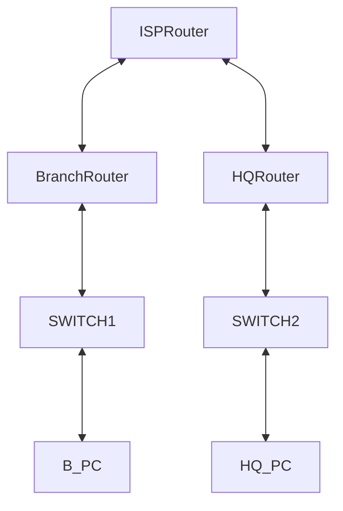

# المفاهيم الأساسية لشبكات الـ VPN (Basic VPN Concepts)

## أولاً: ما هو الـ VPN؟

**شبكة VPN (Virtual Private Network - الشبكة الخاصة الافتراضية):** هي تقنية تسمح بإنشاء قناة اتصال منطقية معزولة ومشفرة (تُعرف بالنفق الآمن **Secure Tunnel**) فوق شبكة عامة وغير موثوقة مثل شبكة الإنترنت.

تعتمد هذه التقنية على ركيزتين أساسيتين:

- **التغليف (Tunneling):** إخفاء حزمة البيانات الأصلية (Original Packet) داخل حزمة بيانات جديدة (Encapsulated Packet) لحمايتها وتوجيهها عبر الشبكة العامة.
    
- **التشفير (Encryption):** تحويل البيانات إلى صيغة غير مقروءة (Ciphertext) باستخدام خوارزميات معقدة، ولا يتم فكها إلا عند الطرف المصرح له بالاستلام.
    
---

## ثانياً: ما أهمية الـ VPN؟

تكمن أهمية الـ VPN في حل معضلة الأمان والتكلفة للمؤسسات الحديثة من خلال:

- **سرية البيانات وسلامتها (Confidentiality & Integrity):** حماية البيانات الحساسة من التجسس (Sniffing) أو التعديل أثناء انتقالها.
    
- **المصادقة (Authentication):** التحقق من هوية الأطراف المتصلة لضمان عدم دخول أي عنصر غير مصرح له.
    
- **خفض التكاليف (Cost Efficiency):** الاستغناء عن الخطوط المؤجرة المكلفة (Leased Lines) والاعتماد على الإنترنت العام بأسعار زهيدة.
    
- **مرونة العمل عن بُعد (Scalability & Mobility):** تمكين الموظفين من الوصول إلى موارد الشركة من أي مكان في العالم وكأنهم داخل مقر الشركة.
    
---

## ثالثاً: كيف يُستخدم الـ VPN؟ (أبرز الأنواع والتقنيات)

يُستخدم الـ VPN في بيئات العمل عبر نمطين رئيسيين يغطيان متطلبات شهادة CCNA:

### 1. شبكات الوصول عن بُعد (Remote Access VPN)

- **كيف تُستخدم؟** يقوم الموظف بتشغيل برنامج عميل (Client Software) مثل _Cisco AnyConnect_ على جهازه، ويقوم بإنشاء اتصال مشفر عبر الإنترنت مع بوابة الـ VPN الخاصة بالشركة (VPN Gateway).
    
- **بروتوكولاتها:** تعتمد بشكل كبير على SSL/TLS أو IPsec.
    

### 2. شبكات الموقع إلى الموقع (Site-to-Site VPN)

- **كيف تُستخدم؟** يتم ربط شبكة محلية (LAN) في فرع كامل بشبكة محلية في فرع آخر عبر أجهزة الراوتر دون أي تدخل من المستخدمين النهائيين. وتنقسم إلى:
    
    - **Intranet VPN:** لربط فروع الشركة الواحدة ببعضها.
        
    - **Extranet VPN:** لربط الشركة بشركائها أو مورديها.
        

> **البروتوكولات التشغيلية المستخدمة:**
> 
> - **IPsec (Internet Protocol Security):** الإطار الأمني الأقوى ويتم تطبيقه على مرحلتين: **Phase 1** (إنشاء قناة تحكم آمنة IKE SA للمصادقة) و **Phase 2** (إنشاء قناة نقل البيانات الفعلية IPsec SA وتعتمد على بروتوكول ESP لتوفير التشفير والمصادقة معاً).
>     
> - **GRE (Generic Routing Encapsulation):** بروتوكول يُستخدم للتغليف فقط لدعم تمرير بروتوكولات التوجيه الديناميكية (مثل OSPF أو EIGRP)، ولكنه لا يشفر البيانات؛ لذا يُدمج دائماً في بيئات سيسكو تحت مسمى **GRE over IPsec** لجمع الميزتين (التوجيه والتشفير).
>     
---
## رابعاً: التدريب العملي المتوافق مع Cisco Packet Tracer

سيناريو بناء **Site-to-Site GRE over IPsec VPN** لربط الفرع الرئيسي (HQ) بفرع مدينة أخرى (Branch) عبر شبكة الإنترنت الافتراضية باستخدام راوترات **Cisco 2911** واعتماد طريقة الـ **Crypto Map** المتوافقة تماماً مع البرنامج.

### 1. المكونات والتسميات في التوبولوجي (Topology):

- **الفرع الرئيسي (HQ):**
    
    - جهاز كمبيوتر: `PC-HQ` (IP: `192.168.10.10 /24` | Gateway: `192.168.10.1`)
        
    - سويتش: `SW-HQ`
        
    - راوتر الفرع الرئيسي: `R-HQ` (موديل **2911** | الواجهة الداخلية: `G0/0/1` ، الواجهة الخارجية نحو الإنترنت: `G0/0/0`)
        
- **شبكة الإنترنت الافتراضية (ISP):**
    
    - راوتر يمثل الـ ISP: `R-ISP` (الواجهات: `G0/0/0` نحو HQ، و `G0/0/1` نحو Branch)
        
- **الفرع الآخر (Branch):**
    
    - راوتر الفرع: `R-Branch` (موديل **2911** | الواجهة الداخلية: `G0/0/1` ، الواجهة الخارجية نحو الإنترنت: `G0/0/0`)
        
    - سويتش: `SW-Branch`
        
    - جهاز كمبيوتر: `PC-Branch` (IP: `192.168.20.10 /24` | Gateway: `192.168.20.1`)
        

### 2. خطة العناوين للروابط الفيزيائية والنفق:

- الرابط بين `R-HQ` و `R-ISP`: الشبكة `192.0.2.0/30`
    
    - IP الراوتر `R-HQ` (واجهة `G0/0/0`) هو `192.0.2.1`
        
    - IP الراوتر `R-ISP` (واجهة `G0/0/0`) هو `192.0.2.2`
        
- الرابط بين `R-Branch` و `R-ISP`: الشبكة `198.51.100.0/30`
    
    - IP الراوتر `R-Branch` (واجهة `G0/0/0`) هو `198.51.100.1`
        
    - IP الراوتر `R-ISP` (واجهة `G0/0/1`) هو `198.51.100.2`
        
- **شبكة النفق الافتراضية (Tunnel Interface):** الشبكة `10.0.0.0/30`
    

### 3. خطوات الإعداد والأوامر المشروحة (Configuration Commands):

#### خطوة تمهيدية إلزامية (تفعيل رخصة الأمان):

يجب تطبيق هذه الخطوة على راوتري `R-HQ` و `R-Branch` أولاً ليتعرف الراوتر على أوامر الـ Crypto. اكتب `yes` للموافقة عند ظهور شروط الرخصة.



 أمر تفعيل رخصة حزمة الأمان لموديول الراوتر 2900 لتفعيل ميزات التشفير والـ VPN
```
Router(config)# license boot module c2900 technology-package securityk9
```

 العودة لوضع التميز الرئيسي لحفظ التغييرات
```
Router(config)# exit
```

 حفظ الإعدادات الحالية في الـ NVRAM للراوتر
```
Router# write memory
```
 
 إعادة تشغيل الراوتر لتثبيت وتحميل رخصة الأمان الجديدة
```
Router# reload
```

(انتظر حتى يكتمل الـ Reload للراوترين تماماً قبل البدء في الخطوات التالية).

#### أولاً: إعدادات الراوتر الوسيط (R-ISP)

تفعيل المنافذ وتشغيل التوجيه الأساسي للإنترنت الافتراضي.

```
 الدخول لواجهة الإنترنت المتصلة بالفرع الرئيسي
R-ISP(config)# interface GigabitEthernet0/0/0

 تعيين عنوان الـ IP الخاص بالربط مع الفرع الرئيسي
R-ISP(config-if)# ip address 192.0.2.2 255.255.255.252

 تفعيل وتشغيل الواجهة فيزيائياً
R-ISP(config-if)# no shutdown

 الخروج من إعدادات الواجهة الحالية
R-ISP(config-if)# exit

 الدخول لواجهة الإنترنت المتصلة بالفرع الآخر
R-ISP(config)# interface GigabitEthernet0/0/1

 تعيين عنوان الـ IP الخاص بالربط مع الفرع الآخر
R-ISP(config-if)# ip address 198.51.100.2 255.255.255.252

 تفعيل وتشغيل الواجهة فيزيائياً
R-ISP(config-if)# no shutdown

 الخروج من إعدادات الواجهة الحالية
R-ISP(config-if)# exit


 تفعيل بروتوكول التوجيه الديناميكي OSPF ذو المعرف رقم 1
R-ISP(config)# router ospf 1

 إعلان شبكة الربط الأولى الخاصة بالفرع الرئيسي داخل منطقة OSPF Area 0
R-ISP(config-router)# network 192.0.2.0 0.0.0.3 area 0

 إعلان شبكة الربط الثانية الخاصة بالفرع الآخر داخل منطقة OSPF Area 0
R-ISP(config-router)# network 198.51.100.0 0.0.0.3 area 0
```

#### ثانياً: إعدادات راوتر الفرع الرئيسي (R-HQ)

1. إعداد الواجهات الفيزيائية والتوجيه:

```
 الدخول إلى الواجهة المحلية المتصلة بالشبكة الداخلية للفرع الرئيسي
R-HQ(config)# interface GigabitEthernet0/0/1

 تعيين الـ IP الافتراضي الذي يعمل كبوابة (Gateway) للأجهزة الداخلية
R-HQ(config-if)# ip address 192.168.10.1 255.255.255.0

 تفعيل الواجهة المحلية
R-HQ(config-if)# no shutdown

 الخروج من إعدادات الواجهة
R-HQ(config-if)# exit


 الدخول للواجهة الخارجية المتصلة بإنترنت الـ ISP
R-HQ(config)# interface GigabitEthernet0/0/0

 تعيين الـ IP العلني المخصص للفرع الرئيسي
R-HQ(config-if)# ip address 192.0.2.1 255.255.255.252

 تفعيل الواجهة الخارجية
R-HQ(config-if)# no shutdown

 الخروج من إعدادات الواجهة
R-HQ(config-if)# exit


 تشغيل بروتوكول OSPF رقم 1 على الراوتر
R-HQ(config)# router ospf 1

 إعلان الشبكة الخارجية فقط لربط الاتصال الأساسي مع الـ ISP والإنترنت
R-HQ(config-router)# network 192.0.2.0 0.0.0.3 area 0
```

2. إنشاء نفق GRE (باستخدام اسم الواجهة كـ source لتفادي خطأ السنتاكس):

```
 إنشاء واجهة النفق الافتراضية رقم 0 والدخول لإعداداتها
R-HQ(config)# interface Tunnel0

 تعيين عنوان الـ IP الخاص بالنفق داخل الشبكة المعزولة
R-HQ(config-if)# ip address 10.0.0.1 255.255.255.252

 تحديد منفذ الخروج الفيزيائي للراوتر كبداية وانطلاق للنفق (لمنع خطأ الـ Syntax)
R-HQ(config-if)# tunnel source GigabitEthernet0/0/0

 تحديد الـ IP العلني للطرف الآخر (راوتر الفرع) كنهاية مستهدفة للنفق
R-HQ(config-if)# tunnel destination 198.51.100.1

 الخروج من إعدادات النفق
R-HQ(config-if)# exit


 العودة لبروتوكول OSPF لتمرير الشبكات الداخلية عبر النفق
R-HQ(config)# router ospf 1

 إعلان الشبكة المحلية الداخلية للفرع ليتم تمريرها عبر الـ VPN
R-HQ(config-router)# network 192.168.10.0 0.0.0.255 area 0

 إعلان شبكة النفق الافتراضية لتبادل التحديثات مع الراوتر الآخر مباشرة
R-HQ(config-router)# network 10.0.0.0 0.0.0.3 area 0
```

3. تشفير النفق باستخدام IPsec البديل (Phase 1 & Phase 2 Crypto Map):

```
 [المرحلة 1]: إنشاء سياسة إدارة المفاتيح ISAKMP برقم تعريف 10
R-HQ(config)# crypto isakmp policy 10

 تحديد خوارزمية AES لتشفير قنوات التحكم بين الراوترات
R-HQ(config-isakmp)# encryption aes

 تحديد خوارزمية SHA لضمان سلامة حزم التحكم
R-HQ(config-isakmp)# hash sha

 اختيار طريقة المصادقة عبر المفاتيح المشتركة مسبقاً
R-HQ(config-isakmp)# authentication pre-share

 استخدام المجموعة رقم 2 (Diffie-Hellman Group 2) لتبادل المفاتيح الآمن
R-HQ(config-isakmp)# group 2

 الخروج من وضع سياسة ISAKMP
 
R-HQ(config-isakmp)# exit

 تعيين كلمة سر التشفير المشتركة وتحديد الـ IP العلني المستهدف للراوتر المقابل
R-HQ(config)# crypto isakmp key CiscoVpnKey address 198.51.100.1


 [المرحلة 2]: إنشاء حزمة التحويل الأمنية باسم TS-SET وتحديد بروتوكولات التشفير والهاش لحزم البيانات
R-HQ(config)# crypto ipsec transform-set TS-SET esp-aes esp-sha-hmac

 إنشاء الخريطة الأمنية الكلاسيكية باسم VPN-MAP وربطها بالرقم الترتيبي 10 وبروتوكول IPsec
R-HQ(config)# crypto map VPN-MAP 10 ipsec-isakmp

 تحديد عنوان الطرف الآخر المقابل (Peer) المراد تشفير البيانات المتجهة إليه
R-HQ(config-crypto-map)# set peer 198.51.100.1

 ربط الخريطة الأمنية بحزمة التحويل TS-SET التي قمنا بإنشائها
R-HQ(config-crypto-map)# set transform-set TS-SET

 ربط الخريطة بجدول قائمة الوصول رقم 100 لتحديد حركة المرور المستهدفة بالتشفير
R-HQ(config-crypto-map)# match address 100

 الخروج من إعدادات الـ Crypto Map
R-HQ(config-crypto-map)# exit


 إنشاء قائمة وصول ممتدة رقم 100 للسماح بتشفير كافة حزم نفق (GRE) الصادرة من IP الفرع الرئيسي للفرع الآخر
R-HQ(config)# access-list 100 permit gre host 192.0.2.1 host 198.51.100.1


 الدخول للواجهة الخارجية الفيزيائية المتصلة بالإنترنت مجدداً
R-HQ(config)# interface GigabitEthernet0/0/0

 تطبيق وتفعيل الـ Crypto Map على المنفذ ليقوم بتشفير حزم النفق فور خروجها للإنترنت
R-HQ(config-if)# crypto map VPN-MAP
```

#### ثالثاً: إعدادات راوتر الفرع الآخر (R-Branch)

1. إعداد الواجهات الفيزيائية والتوجيه:

```
 الدخول إلى الواجهة المحلية المتصلة بالشبكة الداخلية لفرع المدينة الأخرى
R-Branch(config)# interface GigabitEthernet0/0/1

 تعيين الـ IP الافتراضي للـ Gateway الخاص بالأجهزة الداخلية بالفرع
R-Branch(config-if)# ip address 192.168.20.1 255.255.255.0

 تفعيل الواجهة المحلية
R-Branch(config-if)# no shutdown

 الخروج من إعدادات الواجهة
R-Branch(config-if)# exit


 الدخول للواجهة الخارجية المتصلة بإنترنت الـ ISP للفرع الآخر
R-Branch(config)# interface GigabitEthernet0/0/0

 تعيين الـ IP العلني المخصص لراوتر الفرع الآخر
R-Branch(config-if)# ip address 198.51.100.1 255.255.255.252

 تفعيل الواجهة الخارجية
R-Branch(config-if)# no shutdown

 الخروج من إعدادات الواجهة
R-Branch(config-if)# exit


 تشغيل بروتوكول OSPF رقم 1 على راوتر الفرع
R-Branch(config)# router ospf 1

 إعلان الشبكة الخارجية لضمان الوصول الأساسي لشبكة الإنترنت
R-Branch(config-router)# network 198.51.100.0 0.0.0.3 area 0
```

2. إنشاء نفق GRE:

```
 إنشاء واجهة النفق الافتراضية رقم 0 والدخول لإعداداتها
R-Branch(config)# interface Tunnel0

 تعيين عنوان الـ IP الخاص بالطرف الآخر للنفق داخل الشبكة المعزولة
R-Branch(config-if)# ip address 10.0.0.2 255.255.255.252

 تحديد منفذ الخروج الفيزيائي للراوتر كبداية وانطلاق للنفق
R-Branch(config-if)# tunnel source GigabitEthernet0/0/0

 تحديد الـ IP العلني لراوتر الفرع الرئيسي كنهاية مستهدفة للنفق
R-Branch(config-if)# tunnel destination 192.0.2.1

 الخروج من إعدادات النفق
R-Branch(config-if)# exit


 الدخول لبروتوكول OSPF لتمرير شبكات الفرع الآخر عبر النفق المشفر
R-Branch(config)# router ospf 1

 إعلان الشبكة المحلية الداخلية لفرع المدينة الأخرى ليراها الفرع الرئيسي
R-Branch(config-router)# network 192.168.20.0 0.0.0.255 area 0

 إعلان شبكة النفق الافتراضية لتمرير تحديثات التوجيه المتبادلة
R-Branch(config-router)# network 10.0.0.0 0.0.0.3 area 0
```

3. تشفير النفق باستخدام IPsec (Phase 1 & Phase 2 Crypto Map):

```
 [المرحلة 1]: إنشاء سياسة إدارة المفاتيح ISAKMP برقم تعريف 10 مطابقة للطرف الآخر
R-Branch(config)# crypto isakmp policy 10

 تفعيل خوارزمية التشفير التناظري AES
R-Branch(config-isakmp)# encryption aes

 تفعيل خوارزمية الهاش SHA
R-Branch(config-isakmp)# hash sha

 تفعيل المصادقة عبر المفاتيح التشاركية المسبقة
R-Branch(config-isakmp)# authentication pre-share

 استخدام مجموعة تبادل المفاتيح رقم 2
R-Branch(config-isakmp)# group 2

 الخروج من وضع سياسة ISAKMP
R-Branch(config-isakmp)# exit

 تعيين كلمة سر التشفير المشتركة وتحديد الـ IP العلني للفرع الرئيسي (HQ) المقابل
R-Branch(config)# crypto isakmp key CiscoVpnKey address 192.0.2.1


 [المرحلة 2]: إنشاء حزمة التحويل الأمنية المطابقة تماماً للطرف الأول باسم TS-SET
R-Branch(config)# crypto ipsec transform-set TS-SET esp-aes esp-sha-hmac

 إنشاء الخريطة الأمنية المحلية باسم VPN-MAP وبرقم ترتيب 10
R-Branch(config)# crypto map VPN-MAP 10 ipsec-isakmp

 تحديد الـ IP العلني الخاص براوتر الفرع الرئيسي كـ Peer مستهدف بالتشفير
R-Branch(config-crypto-map)# set peer 192.0.2.1

 ربط الخريطة الأمنية بحزمة التحويل المتفق عليها
R-Branch(config-crypto-map)# set transform-set TS-SET

 ربط الخريطة بجدول قائمة الوصول المحلية رقم 100
R-Branch(config-crypto-map)# match address 100

 الخروج من إعدادات الـ Crypto Map
R-Branch(config-crypto-map)# exit

 إنشاء قائمة وصول ممتدة رقم 100 لتحديد حزم نفق (GRE) الصادرة من فرع المدينة المتجهة نحو الفرع الرئيسي لتشفيرها
R-Branch(config)# access-list 100 permit gre host 198.51.100.1 host 192.0.2.1

 الدخول للواجهة الخارجية الفيزيائية المتصلة بالإنترنت لراوتر الفرع
R-Branch(config)# interface GigabitEthernet0/0/0

 تطبيق وتفعيل الـ Crypto Map على المنفذ ليقوم بتشفير البيانات الصادرة وحماية النفق
R-Branch(config-if)# crypto map VPN-MAP
```

### 4. التحقق من التثبيت والتشغيل (Verification)

:

1. **ارسال Ping اختبار:** من `PC-HQ` إلى `PC-Branch` (سينجح الاتصال مباشرة بمجرد اكتمال تقارب الـ OSPF عبر النفق).
    
2. التحقق من حالة النفق للتأكد من استقراره العملي:
    
   
    ```
    R-HQ# show interfaces tunnel 0
    ```
    
    (يجب أن يظهر في السطر الأول: `Tunnel0 is up, line protocol is up`)
    
3. التحقق من التشفير الفعلي لحزم البيانات وعمل الـ VPN:
    
   
    ```
    R-HQ# show crypto ipsec sa
    ```
    
    (ستلاحظ بوضوح تصاعد عدادات الـ `# pkts encaps` و الـ `# pkts decrypt` بعد البنج، مما يؤكد للطلاب بشكل قطعي أن الـ Crypto Map التقطت حزم الـ GRE وقامت بتشفيرها بنجاح داخل الـ Packet Tracer).
---
---
