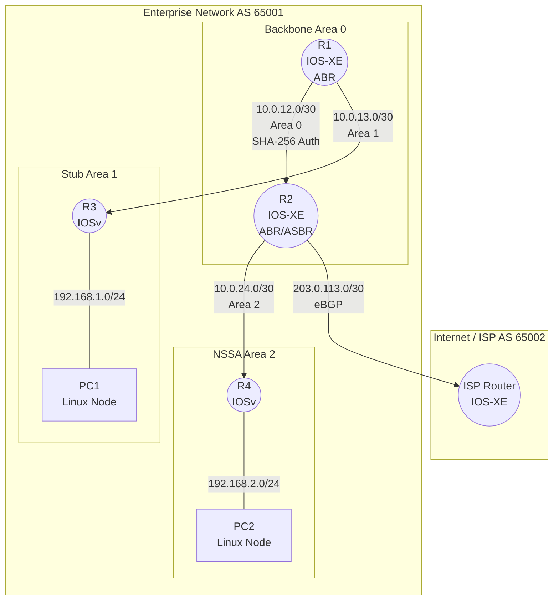

### 1. الغرض من التمرين (Lab Objectives)
يهدف هذا التمرين إلى محاكاة **شبكة مؤسسة حقيقية (Enterprise Edge & Core)** وتطبيق المفاهيم التالية:
1. **تصميم OSPF متعدد المناطق (Multi-Area):** لتقليل حجم الـ LSDB وعزل تحديثات الـ LSA.
2. **المناطق الخاصة (Special Areas):** تطبيق Stub Area و NSSA للتحكم في تدفق المسارات الخارجية.
3. **الأمن المتقدم (Advanced Security):** استخدام مصادقة **SHA-256** (ميزة حصرية لـ IOS-XE في CML) وتصفية المسارات (Prefix Filtering).
4. **الربط بالإنترنت (eBGP):** ربط حافة الشبكة بمزود خدمة (ISP) باستخدام BGP.

---

### 2. الطوبولوجيا المقترحة (Topology Diagram)



---

### 3. جدول العناوين (Addressing Scheme)

| الجهاز | الواجهة | عنوان IP | المنطقة / البروتوكول | الوظيفـة |
|---|---|---|---|---|
| **R1** | Gi1 / Gi2 / Lo0 | 10.0.12.1 / 10.0.13.1 / 1.1.1.1 | Area 0 / Area 1 | ABR (Backbone & Stub) |
| **R2** | Gi1 / Gi2 / Gi3 / Lo0| 10.0.12.2 / 10.0.24.1 / 203.0.113.1 / 2.2.2.2| Area 0 / Area 2 / eBGP | ABR, ASBR, Edge |
| **R3** | Gi1 / Gi2 / Lo0 | 10.0.13.2 / 192.168.1.1 / 3.3.3.3 | Area 1 | Internal Router |
| **R4** | Gi1 / Gi2 / Lo0 | 10.0.24.2 / 192.168.2.1 / 4.4.4.4 | Area 2 | Internal Router (NSSA) |
| **ISP** | Gi1 / Gi2 | 203.0.113.2 / 198.51.100.1 | eBGP AS 65002 | External Peer |

---

### 4. خطوات الإعداد والتكوين (Step-by-Step Configuration)

#### المرحلة الأولى: الإعداد الأساسي و OSPF Multi-Area
نبدأ بتفعيل الواجهات وإعلان الشبكات في OSPF.

**على R1 (ABR):**
```cisco
hostname R1
interface Loopback0
 ip address 1.1.1.1 255.255.255.255
interface GigabitEthernet1
 ip address 10.0.12.1 255.255.255.252
interface GigabitEthernet2
 ip address 10.0.13.1 255.255.255.252
!
router ospf 1
 router-id 1.1.1.1
 network 1.1.1.1 0.0.0.0 area 0
 network 10.0.12.0 0.0.0.3 area 0
 network 10.0.13.0 0.0.0.3 area 1
```

**على R2 (ABR & ASBR):**
```cisco
hostname R2
interface Loopback0
 ip address 2.2.2.2 255.255.255.255
interface GigabitEthernet1
 ip address 10.0.12.2 255.255.255.252
interface GigabitEthernet2
 ip address 10.0.24.1 255.255.255.252
interface GigabitEthernet3
 ip address 203.0.113.1 255.255.255.252
!
router ospf 1
 router-id 2.2.2.2
 network 2.2.2.2 0.0.0.0 area 0
 network 10.0.12.0 0.0.0.3 area 0
 network 10.0.24.0 0.0.0.3 area 2
```

*(قم بتكوين R3 و R4 بنفس الطريقة بإعلان واجهاتهما في Area 1 و Area 2 على التوالي).*

---

#### المرحلة الثانية: المناطق الخاصة (Special Areas)
لتقليل حجم جداول التوجيه كما هو موضح في الدرس.

**1. تحويل Area 1 إلى Stub Area:**
```cisco
! على R1 (ABR)
router ospf 1
 area 1 stub

! على R3
router ospf 1
 area 1 stub
```
*النتيجة:* سيختفي الـ Type 3 & 5 من جدول R3، وسيظهر مسار افتراضي `O* 0.0.0.0/0`.

**2. تحويل Area 2 إلى NSSA وإدخال مسار خارجي:**
```cisco
! على R2 و R4
router ospf 1
 area 2 nssa

! على R4 (ASBR) - سنقوم بحقن مسار وهمي لشبكة خارجية
ip route 192.168.99.0 255.255.255.0 Null0
router ospf 1
 redistribute static subnets
```
*النتيجة:* ستظهر الشبكة `192.168.99.0/24` في جدول R2 كمسار `O N2` (Type 7 LSA تم تحويله).

---

#### المرحلة الثالثة: الأمن المتقدم (Advanced Security) - ميزة CML
هنا نطبق ميزة **SHA-256** التي ذكر الملف أنها المعيار في IOS XE (غير متوفرة في Packet Tracer). سنستخدم Keychains.

**على R1 و R2 (لتأمين Area 0):**
```cisco
! إنشاء سلسلة المفاتيح مع خوارزمية SHA-256
key chain OSPF_AREA0_AUTH
 key 1
  key-string SecureSHA256_Pass!
  cryptographic-algorithm hmac-sha-256
  lifetime infinite
!
! تطبيق المصادقة على OSPF
router ospf 1
 area 0 authentication key-chain OSPF_AREA0_AUTH
```
*ملاحظة:* إذا حاولت إضافة R3 أو R4 في Area 0 بدون هذا المفتاح، ستفشل الجيرة (Adjacency) تماماً، مما يحمي الشبكة من الراوترات المزيفة (Rogue Routers).

---

#### المرحلة الرابعة: تصفية المسارات (Route Filtering)
سنمنع الشبكة الوهمية `192.168.99.0/24` (التي أدخلها R4) من الوصول إلى R3 لحماية الشبكة الطرفية.

**على R1 (ABR):**
```cisco
! إنشاء قائمة التصفية
ip prefix-list BLOCK_NSSA_ROUTES seq 5 deny 192.168.99.0/24
ip prefix-list BLOCK_NSSA_ROUTES seq 10 permit 0.0.0.0/0 le 32

! تطبيق التصفية على المسارات القادمة من Area 2 إلى Area 1
router ospf 1
 area 1 filter-list prefix BLOCK_NSSA_ROUTES in
```
*النتيجة:* الشبكة `192.168.99.0` ستصل إلى R2 (ASBR) ولكن R1 سيمنعها من إنشاء Type 3 LSA لإرسالها إلى Area 1.

---

#### المرحلة الخامسة: حافة الشبكة وتكوين eBGP
ربط الشبكة بالإنترنت عبر R2 ومزود الخدمة (ISP).

**على R2 (Enterprise Edge):**
```cisco
router bgp 65001
 bgp router-id 2.2.2.2
 neighbor 203.0.113.2 remote-as 65002
 !
 address-family ipv4 unicast
  network 10.0.0.0 mask 255.255.0.0   ! إعلان ملخص للشبكة الداخلية
  neighbor 203.0.113.2 activate
  neighbor 203.0.113.2 prefix-list BGP_FILTER in
  exit
!
! حماية حافة BGP من استقبال مسارات خاصة (Security)
ip prefix-list BGP_FILTER seq 5 deny 10.0.0.0/8 le 32
ip prefix-list BGP_FILTER seq 10 deny 172.16.0.0/12 le 32
ip prefix-list BGP_FILTER seq 15 deny 192.168.0.0/16 le 32
ip prefix-list BGP_FILTER seq 20 permit 0.0.0.0/0 le 32
```

**على ISP Router:**
```cisco
router bgp 65002
 bgp router-id 198.51.100.1
 neighbor 203.0.113.1 remote-as 65001
 !
 address-family ipv4 unicast
  network 198.51.100.0 mask 255.255.255.0
  neighbor 203.0.113.1 activate
```

---

### 5. التحقق واستكشاف الأخطاء (Verification & Troubleshooting)

استخدم الأوامر التالية في CML للتأكد من نجاح التمرين:

| الأمر | الغرض من التحقق | النتيجة المتوقعة |
|---|---|---|
| `show ip ospf neighbor` | التأكد من الجيران والمصادقة | يجب أن تكون الحالة `FULL` بين R1 و R2 (بفضل SHA-256). |
| `show ip ospf database` | فحص الـ LSDB | تأكد من وجود Type 1, 3, 5, 7 حسب المنطقة. |
| `show ip route ospf` (على R3) | التحقق من Stub Area | يجب أن ترى مساراً افتراضياً `O* 0.0.0.0/0` فقط، واختفاء المسارات الأخرى. |
| `show ip route` (على R3) | التحقق من التصفية | الشبكة `192.168.99.0/24` **يجب ألا تظهر** (بسبب Filter-list). |
| `show ip bgp summary` (على R2) | التحقق من جيرة BGP | الحالة يجب أن تكون `Established` مع ISP. |
| `show ip bgp` (على R2) | التحقق من مسارات BGP | يجب أن تظهر شبكة ISP `198.51.100.0/24`، مع منع المسارات الخاصة. |

---

### 6. في هذا التمرين قمنا بـ:
1. **مصادقة SHA-256:** طبقت معيار الأمان الحقيقي لشبكات المؤسسات الحديثة (IOS-XE) بدلاً من MD5 الضعيف.
2. **التفاعل الحقيقي للـ BGP:** قمت بربط بروتوكولين مختلفين تماماً (IGP و EGP) ومحاكاة سياسة الأمان (Prefix Filtering) على حافة الشبكة لمنع هجمات `Route Injection`.
3. **فصل الـ Control Plane:** من خلال المناطق الخاصة (Stub/NSSA)، لاحظت كيف يتحكم الـ ABR في تدفق الـ LSAs لحماية موارد الراوترات الطرفية (R3 و R4).