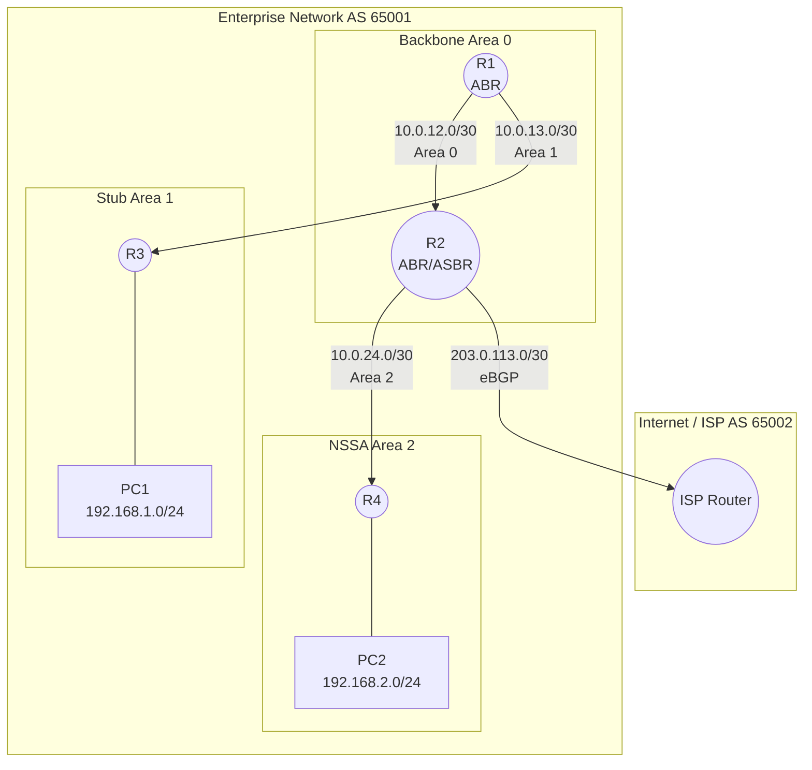

# دليل التدريب الشامل: OSPF Multi-Area مع الأمن المتقدم و BGP

## 1. الغرض من التمرين (Lab Objectives)
يهدف هذا التمرين إلى محاكاة شبكة مؤسسة حقيقية وتطبيق:
- OSPF متعدد المناطق (Multi-Area)
- المناطق الخاصة (Stub Area & NSSA)
- الأمن المتقدم (SHA-256 Authentication & Prefix Filtering)
- الربط بالإنترنت (eBGP)

---

## 2. الطوبولوجيا (Topology)



---

## 3. جدول العناوين (Addressing Scheme)

| الجهاز | الواجهة | عنوان IP | المنطقة / البروتوكول | الوظيفة |
|--------|---------|----------|----------------------|---------|
| **R1** | Gi1 / Gi2 / Lo0 | 10.0.12.1 / 10.0.13.1 / 1.1.1.1 | Area 0 / Area 1 | ABR |
| **R2** | Gi1 / Gi2 / Gi3 / Lo0 | 10.0.12.2 / 10.0.24.1 / 203.0.113.1 / 2.2.2.2 | Area 0 / Area 2 / eBGP | ABR, ASBR, Edge |
| **R3** | Gi1 / Gi2 / Lo0 | 10.0.13.2 / 192.168.1.1 / 3.3.3.3 | Area 1 | Internal Router |
| **R4** | Gi1 / Gi2 / Lo0 | 10.0.24.2 / 192.168.2.1 / 4.4.4.4 | Area 2 | Internal Router (NSSA) |
| **ISP** | Gi1 / Gi2 | 203.0.113.2 / 198.51.100.1 | eBGP AS 65002 | External Peer |

---

## 4. الإعدادات الكاملة لكل جهاز (Complete Configurations)

### **R1 - ABR (Area 0 & Area 1)**

```cisco
hostname R1
!
! --- Loopback Interface ---
interface Loopback0
 ip address 1.1.1.1 255.255.255.255
!
! --- Physical Interfaces ---
interface GigabitEthernet1
 description Link-to-R2-Area0
 ip address 10.0.12.1 255.255.255.252
 ip ospf authentication key-chain OSPF_AREA0_AUTH
 no shutdown
!
interface GigabitEthernet2
 description Link-to-R3-Area1
 ip address 10.0.13.1 255.255.255.252
 no shutdown
!
! --- Keychain for SHA-256 Authentication (Area 0) ---
key chain OSPF_AREA0_AUTH
 key 1
  key-string SecureSHA256_Pass!
  cryptographic-algorithm hmac-sha-256
  lifetime infinite
!
! --- Prefix List for Route Filtering ---
ip prefix-list BLOCK_NSSA_ROUTES seq 5 deny 192.168.99.0/24
ip prefix-list BLOCK_NSSA_ROUTES seq 10 permit 0.0.0.0/0 le 32
!
! --- OSPF Configuration ---
router ospf 1
 router-id 1.1.1.1
 ! Network Statements
 network 1.1.1.1 0.0.0.0 area 0
 network 10.0.12.0 0.0.0.3 area 0
 network 10.0.13.0 0.0.0.3 area 1
 ! Area 1 as Stub Area
 area 1 stub
 ! Area 0 Authentication with SHA-256
 area 0 authentication key-chain OSPF_AREA0_AUTH
 ! Filter routes from Area 2 to Area 1
 area 1 filter-list prefix BLOCK_NSSA_ROUTES in
!
end
```

---

###  **R2 - ABR/ASBR (Area 0 & Area 2 + BGP Edge)**

```cisco
hostname R2
!
! --- Loopback Interface ---
interface Loopback0
 ip address 2.2.2.2 255.255.255.255
!
! --- Physical Interfaces ---
interface GigabitEthernet1
 description Link-to-R1-Area0
 ip address 10.0.12.2 255.255.255.252
 ip ospf authentication key-chain OSPF_AREA0_AUTH
 no shutdown
!
interface GigabitEthernet2
 description Link-to-R4-Area2
 ip address 10.0.24.1 255.255.255.252
 no shutdown
!
interface GigabitEthernet3
 description Link-to-ISP-eBGP
 ip address 203.0.113.1 255.255.255.252
 no shutdown
!
! --- Keychain for SHA-256 Authentication (Area 0) ---
key chain OSPF_AREA0_AUTH
 key 1
  key-string SecureSHA256_Pass!
  cryptographic-algorithm hmac-sha-256
  lifetime infinite
!
! --- BGP Prefix Filter (Security) ---
ip prefix-list BGP_FILTER seq 5 deny 10.0.0.0/8 le 32
ip prefix-list BGP_FILTER seq 10 deny 172.16.0.0/12 le 32
ip prefix-list BGP_FILTER seq 15 deny 192.168.0.0/16 le 32
ip prefix-list BGP_FILTER seq 20 permit 0.0.0.0/0 le 32
!
! --- OSPF Configuration ---
router ospf 1
 router-id 2.2.2.2
 ! Network Statements
 network 2.2.2.2 0.0.0.0 area 0
 network 10.0.12.0 0.0.0.3 area 0
 network 10.0.24.0 0.0.0.3 area 2
 ! Area 2 as NSSA
 area 2 nssa
 ! Area 0 Authentication with SHA-256
 area 0 authentication key-chain OSPF_AREA0_AUTH
!
! --- BGP Configuration (eBGP with ISP) ---
router bgp 65001
 bgp router-id 2.2.2.2
 neighbor 203.0.113.2 remote-as 65002
 !
 address-family ipv4 unicast
  network 10.0.0.0 mask 255.255.0.0
  neighbor 203.0.113.2 activate
  neighbor 203.0.113.2 prefix-list BGP_FILTER in
 exit-address-family
!
end
```

---

### **R3 - Internal Router (Area 1 - Stub)**

```cisco
hostname R3
!
! --- Loopback Interface ---
interface Loopback0
 ip address 3.3.3.3 255.255.255.255
!
! --- Physical Interfaces ---
interface GigabitEthernet1
 description Link-to-R1-Area1
 ip address 10.0.13.2 255.255.255.252
 no shutdown
!
interface GigabitEthernet2
 description Link-to-PC1
 ip address 192.168.1.1 255.255.255.0
 no shutdown
!
! --- OSPF Configuration ---
router ospf 1
 router-id 3.3.3.3
 ! Network Statements
 network 3.3.3.3 0.0.0.0 area 1
 network 10.0.13.0 0.0.0.3 area 1
 network 192.168.1.0 0.0.0.255 area 1
 ! Area 1 as Stub Area
 area 1 stub
!
end
```

---

### **R4 - Internal Router (Area 2 - NSSA)**

```cisco
hostname R4
!
! --- Loopback Interface ---
interface Loopback0
 ip address 4.4.4.4 255.255.255.255
!
! --- Physical Interfaces ---
interface GigabitEthernet1
 description Link-to-R2-Area2
 ip address 10.0.24.2 255.255.255.252
 no shutdown
!
interface GigabitEthernet2
 description Link-to-PC2
 ip address 192.168.2.1 255.255.255.0
 no shutdown
!
! --- Static Route for External Network (to be redistributed) ---
ip route 192.168.99.0 255.255.255.0 Null0
!
! --- OSPF Configuration ---
router ospf 1
 router-id 4.4.4.4
 ! Network Statements
 network 4.4.4.4 0.0.0.0 area 2
 network 10.0.24.0 0.0.0.3 area 2
 network 192.168.2.0 0.0.0.255 area 2
 ! Area 2 as NSSA
 area 2 nssa
 ! Redistribute Static Routes (External)
 redistribute static subnets
!
end
```

---

###  **ISP Router (External AS 65002)**

```cisco
hostname ISP
!
! --- Physical Interfaces ---
interface GigabitEthernet1
 description Link-to-R2-eBGP
 ip address 203.0.113.2 255.255.255.252
 no shutdown
!
interface GigabitEthernet2
 description Simulated-Internet
 ip address 198.51.100.1 255.255.255.0
 no shutdown
!
! --- BGP Configuration ---
router bgp 65002
 bgp router-id 198.51.100.1
 neighbor 203.0.113.1 remote-as 65001
 !
 address-family ipv4 unicast
  network 198.51.100.0 mask 255.255.255.0
  neighbor 203.0.113.1 activate
 exit-address-family
!
end
```

---

## 5. التحقق والاستكشاف (Verification & Troubleshooting)

| الأمر | الغرض | النتيجة المتوقعة |
|-------|-------|------------------|
| `show ip ospf neighbor` | التحقق من الجيران والمصادقة | الحالة **FULL** بين R1 و R2 (SHA-256) |
| `show ip ospf database` | فحص الـ LSDB | وجود Type 1, 3, 5, 7 حسب المنطقة |
| `show ip route ospf` (على R3) | التحقق من Stub Area | مسار افتراضي **O\* 0.0.0.0/0** فقط |
| `show ip route` (على R3) | التحقق من التصفية | الشبكة **192.168.99.0/24** غير موجودة |
| `show ip bgp summary` (على R2) | التحقق من جيرة BGP | الحالة **Established** مع ISP |
| `show ip bgp` (على R2) | التحقق من مسارات BGP | ظهور شبكة ISP مع منع المسارات الخاصة |

---

## 6. ما تم تطبيقه

**مصادقة SHA-256**: حماية Area 0 باستخدام Keychains مع HMAC-SHA-256  
**Stub Area**: تقليل حجم LSDB في Area 1 (R3)  
**NSSA Area**: السماح بإدخال مسارات خارجية في Area 2 (R4)  
**Route Filtering**: منع الشبكة 192.168.99.0/24 من الوصول إلى Area 1  
**eBGP**: ربط الشبكة بالإنترنت مع تصفية المسارات الخاصة  
**فصل Control Plane**: حماية الراوترات الطرفية عبر المناطق الخاصة

---

**ملاحظة مهمة**: تأكد من تطبيق الإعدادات بالترتيب من R1 إلى ISP للحصول على أفضل نتائج في بناء الجيران (Adjacencies).