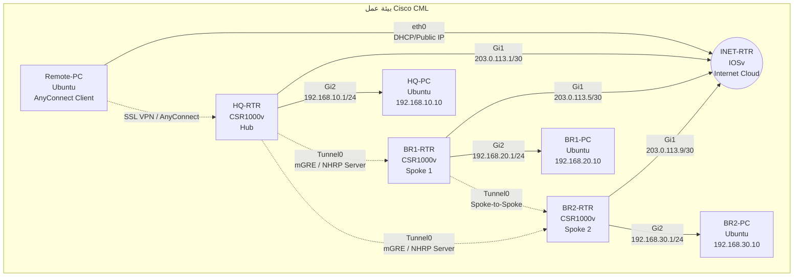

### أنواع الأجهزة في CML (Node Types)
- **الراوترات:** CSR1000v (لأنها تدعم ميزات FlexVPN و DMVPN و AnyConnect بشكل كامل).
- **سحابة الإنترنت:** IOSv (لمحاكاة توجيه الإنترنت).
- **أجهزة الكمبيوتر:** Ubuntu Linux (لمحاكاة أجهزة المستخدمين والخوادم).

### مخطط الطوبولوجيا في CML



---

### جدول توزيع العناوين (Addressing Table)

| الجهاز | الواجهة | عنوان IP | القناع (Mask) | البوابة (Gateway) |
| :--- | :--- | :--- | :--- | :--- |
| **HQ-RTR** | Gi1 (WAN) | 203.0.113.1 | /30 | - |
| | Gi2 (LAN) | 192.168.10.1 | /24 | - |
| | Tunnel0 | 10.0.0.1 | /24 | - |
| **BR1-RTR** | Gi1 (WAN) | 203.0.113.5 | /30 | - |
| | Gi2 (LAN) | 192.168.20.1 | /24 | - |
| | Tunnel0 | 10.0.0.2 | /24 | - |
| **BR2-RTR** | Gi1 (WAN) | 203.0.113.9 | /30 | - |
| | Gi2 (LAN) | 192.168.30.1 | /24 | - |
| | Tunnel0 | 10.0.0.3 | /24 | - |
| **INET-RTR** | Gi1 (to HQ) | 203.0.113.2 | /30 | - |
| | Gi2 (to BR1) | 203.0.113.6 | /30 | - |
| | Gi3 (to BR2) | 203.0.113.10 | /30 | - |
| | Gi4 (to Remote)| 198.51.100.1 | /24 | - |

---

### الإعدادات الكاملة للراوترات (Full Configurations)
تم دمج الإعدادات في كتلة واحدة لكل راوتر، مرتبة تصاعدياً: (الواجهات -> التوجيه -> التشفير IKEv2/IPsec -> نفق DMVPN -> AnyConnect).

#### 1. إعدادات راوتر المقر الرئيسي (HQ-RTR)
```text
hostname HQ-RTR
!
! --- 1. Underlay & Interfaces ---
interface GigabitEthernet1
 ip address 203.0.113.1 255.255.255.252
 ip nat outside
 no shutdown
!
interface GigabitEthernet2
 ip address 192.168.10.1 255.255.255.0
 ip nat inside
 no shutdown
!
interface Tunnel0
 ip address 10.0.0.1 255.255.255.0
 ip ospf network point-to-multipoint
 ip nhrp map 10.0.0.1 203.0.113.1
 ip nhrp network-id 100
 ip nhrp holdtime 300
 ip nhrp redirect
 tunnel source GigabitEthernet1
 tunnel mode gre multipoint
 tunnel protection ipsec profile FLEXVPN_PROFILE
 no shutdown
!
! --- 2. Routing (OSPF & Default Route) ---
ip route 0.0.0.0 0.0.0.0 203.0.113.2
!
router ospf 1
 network 192.168.10.0 0.0.0.255 area 0
 network 10.0.0.0 0.0.0.255 area 0
!
! --- 3. NAT Exemption ---
ip nat inside source list NAT-ACL interface GigabitEthernet1 overload
ip access-list extended NAT-ACL
 deny ip 192.168.10.0 0.0.0.255 192.168.20.0 0.0.0.255
 deny ip 192.168.10.0 0.0.0.255 192.168.30.0 0.0.0.255
 permit ip 192.168.10.0 0.0.0.255 any
!
! --- 4. IKEv2 & IPsec ---
crypto ikev2 keyring HQ-KEYS
 peer BRANCHES
  address 0.0.0.0 0.0.0.0
  pre-shared-key Cisco123
!
crypto ikev2 profile HQ-PROFILE
 match identity remote address 0.0.0.0 0.0.0.0 
 authentication local pre-share
 authentication remote pre-share
 keyring local HQ-KEYS
 lifetime 240
!
crypto ipsec profile FLEXVPN_PROFILE
 set ikev2-profile HQ-PROFILE
!
! --- 5. Remote Access (AnyConnect SSL VPN) ---
ip local pool ANYCONNECT-POOL 10.10.10.10 10.10.10.50
!
webvpn
 ! anyconnect image disk0:/anyconnect-win-4.10.01075-webdeploy-k9.pkg 1
 anyconnect enable
 anyconnect certificate-trust
!
aaa authentication webvpn
!
webvpn context default
 gateway 203.0.113.1
!
group-policy ANYCONNECT-POL internal
 address-pools pool ANYCONNECT-POOL
 vpn-tunnel-protocol ssl-client
 split-tunnel-policy tunnelspecified
 split-tunnel-network-list value SPLIT-ACL
!
access-list SPLIT-ACL extended permit ip 192.168.10.0 0.0.0.255 any
!
username vpnuser password 0 Cisco123
```

#### 2. إعدادات راوتر الفرع الأول (BR1-RTR)
```text
hostname BR1-RTR
!
! --- 1. Underlay & Interfaces ---
interface GigabitEthernet1
 ip address 203.0.113.5 255.255.255.252
 ip nat outside
 no shutdown
!
interface GigabitEthernet2
 ip address 192.168.20.1 255.255.255.0
 ip nat inside
 no shutdown
!
interface Tunnel0
 ip address 10.0.0.2 255.255.255.0
 ip ospf network point-to-multipoint
 ip nhrp nhs 10.0.0.1 nbma 203.0.113.1
 ip nhrp network-id 100
 ip nhrp holdtime 300
 tunnel source GigabitEthernet1
 tunnel mode gre multipoint
 tunnel protection ipsec profile FLEXVPN_PROFILE
 no shutdown
!
! --- 2. Routing (OSPF & Default Route) ---
ip route 0.0.0.0 0.0.0.0 203.0.113.6
!
router ospf 1
 network 192.168.20.0 0.0.0.255 area 0
 network 10.0.0.0 0.0.0.255 area 0
!
! --- 3. NAT Exemption ---
ip nat inside source list NAT-ACL interface GigabitEthernet1 overload
ip access-list extended NAT-ACL
 deny ip 192.168.20.0 0.0.0.255 192.168.10.0 0.0.0.255
 deny ip 192.168.20.0 0.0.0.255 192.168.30.0 0.0.0.255
 permit ip 192.168.20.0 0.0.0.255 any
!
! --- 4. IKEv2 & IPsec ---
crypto ikev2 keyring BR1-KEYS
 peer HQ
  address 203.0.113.1
  pre-shared-key Cisco123
!
crypto ikev2 profile BR1-PROFILE
 match identity remote address 203.0.113.1 255.255.255.255
 authentication local pre-share
 authentication remote pre-share
 keyring local BR1-KEYS
!
crypto ipsec profile FLEXVPN_PROFILE
 set ikev2-profile BR1-PROFILE
```

#### 3. إعدادات راوتر الفرع الثاني (BR2-RTR)
```text
hostname BR2-RTR
!
! --- 1. Underlay & Interfaces ---
interface GigabitEthernet1
 ip address 203.0.113.9 255.255.255.252
 ip nat outside
 no shutdown
!
interface GigabitEthernet2
 ip address 192.168.30.1 255.255.255.0
 ip nat inside
 no shutdown
!
interface Tunnel0
 ip address 10.0.0.3 255.255.255.0
 ip ospf network point-to-multipoint
 ip nhrp nhs 10.0.0.1 nbma 203.0.113.1
 ip nhrp network-id 100
 ip nhrp holdtime 300
 tunnel source GigabitEthernet1
 tunnel mode gre multipoint
 tunnel protection ipsec profile FLEXVPN_PROFILE
 no shutdown
!
! --- 2. Routing (OSPF & Default Route) ---
ip route 0.0.0.0 0.0.0.0 203.0.113.10
!
router ospf 1
 network 192.168.30.0 0.0.0.255 area 0
 network 10.0.0.0 0.0.0.255 area 0
!
! --- 3. NAT Exemption ---
ip nat inside source list NAT-ACL interface GigabitEthernet1 overload
ip access-list extended NAT-ACL
 deny ip 192.168.30.0 0.0.0.255 192.168.10.0 0.0.0.255
 deny ip 192.168.30.0 0.0.0.255 192.168.20.0 0.0.0.255
 permit ip 192.168.30.0 0.0.0.255 any
!
! --- 4. IKEv2 & IPsec ---
crypto ikev2 keyring BR2-KEYS
 peer HQ
  address 203.0.113.1
  pre-shared-key Cisco123
!
crypto ikev2 profile BR2-PROFILE
 match identity remote address 203.0.113.1 255.255.255.255
 authentication local pre-share
 authentication remote pre-share
 keyring local BR2-KEYS
!
crypto ipsec profile FLEXVPN_PROFILE
 set ikev2-profile BR2-PROFILE
```

#### 4. إعدادات راوتر الإنترنت (INET-RTR) - لتوجيه الحركة بين الأطراف
```text
hostname INET-RTR
!
interface GigabitEthernet0/0
 ip address 203.0.113.2 255.255.255.252
 no shutdown
!
interface GigabitEthernet0/1
 ip address 203.0.113.6 255.255.255.252
 no shutdown
!
interface GigabitEthernet0/2
 ip address 203.0.113.10 255.255.255.252
 no shutdown
!
interface GigabitEthernet0/3
 ip address 198.51.100.1 255.255.255.0
 no shutdown
!
router ospf 1
 default-information originate always
!
ip route 0.0.0.0 0.0.0.0 Null0
```

---

### إعدادات أجهزة الكمبيوتر (End Devices Configurations)
في بيئة CML، يتم استخدام أوامر Linux (Ubuntu/Alpine) لتكوين واجهات الشبكة.

#### 1. جهاز كمبيوتر المقر الرئيسي (HQ-PC)
```bash
!this is a shell script which will be sourced at boot
hostname PC-HQ
configurable user account
USERNAME=cisco
PASSWORD=cisco
ip addr add 192.168.10.10/24 dev eth0
ip link set eth0 up
ip route add default via 192.168.10.1
```

#### 2. جهاز كمبيوتر الفرع الأول (BR1-PC)
```bash
!this is a shell script which will be sourced at boot
hostname PC-BR1
configurable user account
USERNAME=cisco
PASSWORD=cisco
ip addr add 192.168.20.10/24 dev eth0
ip link set eth0 up
ip route add default via 192.168.20.1
```

#### 3. جهاز كمبيوتر الفرع الثاني (BR2-PC)
```bash
!this is a shell script which will be sourced at boot
hostname PC-BR2
configurable user account
USERNAME=cisco
PASSWORD=cisco
ip addr add 192.168.30.10/24 dev eth0
ip link set eth0 up
ip route add default via 192.168.30.1
```

#### 4. جهاز الموظف عن بعد (Remote-PC)
```bash
# تعيين IP عام للوصول للإنترنت
this is a shell script which will be sourced at boot
hostname Remote-PC
configurable user account
USERNAME=cisco
PASSWORD=cisco
ip addr add 198.51.100.10/24 dev eth0
ip link set eth0 up
ip route add default via 198.51.100.1

# إعدادات AnyConnect (تتم عبر واجهة المستخدم أو سطر الأوامر الخاص بالعميل)
# في بيئة CML، يمكن تثبيت عميل AnyConnect Linux وتشغيله بالأمر:
/opt/cisco/anyconnect/bin/vpn -s connect 203.0.113.1
# إدخال بيانات الدخول:
# username: vpnuser
# password: Cisco123

# بعد نجاح الاتصال، سيتم تعيين IP من نطاق 10.10.10.0/24
# اختبار الوصول إلى شبكة المقر:
ping 192.168.10.10
```

### ملاحظات للتشغيل في CML:
1. تأكد من تفعيل ميزة `crypto` و `webvpn` في صورة الـ CSR1000v المستخدمة (يُفضل استخدام إصدار 16.x أو أحدث).
2. في حالة DMVPN Stage 3، سيقوم بروتوكول OSPF بتبادل المسارات عبر نفق Tunnel0، وسيتولى NHRP مهمة إنشاء أنفاق Spoke-to-Spoke المباشرة عند الحاجة.
3. لا تنسَ تفعيل `ip routing` و `ip cef` بشكل افتراضي في راوترات CSR1000v.