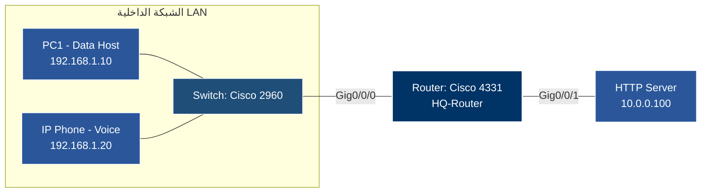

# المحتوى التدريبي: تقنيات ضبط جودة الخدمة (QoS Techniques)
**المرجع:** Phase 5 – Advanced Cisco Enterprise (Weeks 21–30)
**المقرر:** CCNP Enterprise Security (Core + Concentration)
**الوحدة:** Enterprise Core (ENCOR 350-401)

## 1. مقدمة (Introduction)

في بيئات الشبكات الحديثة، لا يمكن الاعتماد على أفضل الأجهزة لضمان تجربة مستخدم سلسة، خاصة عند مرور حركة المرور عبر روابط ذات سعة محدودة (Bottlenecks). هنا يأتي دور تقنية **Quality of Service (QoS)**.

تعريف **QoS** هو مجموعة من التقنيات التي تدير موارد الشبكة (مثل عرض النطاق الترددي - Bandwidth، والكمون - Latency، والاهتزاز - Jitter، وفقدان الحزم - Packet Loss) لضمان أن التطبيقات الحرجة (مثل الصوت عبر IP - VoIP، والفيديو المؤتمت) تحصل على الأولوية في المعالجة والنقل.

## 2. أعمدة هندسة QoS (QoS Architecture Pillars)

تعتمد هندسة **QoS** في أجهزة **Cisco** على أربع ركائز أساسية يجب فهمها وتطبيقها بالترتيب:

1.  **Classification & Marking (التصنيف والوسم):** تحديد ماهية الحزمة وتعليمها لتتعامل معها الأجهزة التالية بنفس الطريقة.
2.  **Traffic Conditioning (تكييف حركة المرور):** التحكم في معدل التدفق عبر **Policing** أو **Shaping**.
3.  **Congestion Management (إدارة الازدحام):** تحديد أولوية الحزم عند امتلاء الذاكرة المؤقتة (Buffer) عبر تقنيات **Queuing**.
4.  **Congestion Avoidance (تجنب الازدحام):** منع الازدحام قبل حدوثه باستخدام تقنيات مثل **WRED**.

---

## 3. التصنيف والوسم (Classification & Marking)

قبل أن تتمكن الشبكة من معاملة الحزم بشكل مختلف، يجب عليها أولاً التمييز بينها.

### أ. معايير التصنيف (Classification Criteria)
يمكن تصنيف الحزم بناءً على:
*   عنوان المصدر/الوجهة (Source/Destination IP).
*   رقم المنفذ (Port Number).
*   بروتوكول التطبيق.
*   **QoS Groups:** وسوم داخلية تستخدمها أجهزة **Cisco** فقط ولا تنتقل عبر الشبكة (Internal Marking).

### ب. معايير الوسم (Marking Standards)
الوسم هو وضع قيمة في رأس الحزمة تخبر الشبكة بأولويتها. المعايير الرئيسية هي:

1.  **DSCP (Differentiated Services Code Point):**
    *   هو المعيار الحالي والأكثر استخداماً في شبكات **IP**.
    *   يتكون من 6 bits في حقل **DS (Differentiated Services)** من رأس الـ **IP Packet**.
    *   يسمح بـ 64 فئة (Class) مختلفة.
    *   أمثلة: **EF (Expedited Forwarding)** للصوت، **AF (Assured Forwarding)** لبيانات الأعمال.

2.  **CoS (Class of Service):**
    *   يستخدم في الطبقة الثانية (Layer 2).
    *   يتكون من 3 bits في واجهة **802.1Q** (VLAN Tagging).
    *   القيم من 0 إلى 7.
    *   *ملاحظة:* عند عبور الحزمة لجهاز الراوتر (Layer 3)، تفقد قيمة **CoS** إلا إذا تمت إعادة تعيينها.

3.  **IP Precedence:**
    *   معيار قديم يعتمد على أول 3 bits من حقل **ToS**.
    *   أقل مرونة من **DSCP**.

---

## 4. تكييف حركة المرور (Traffic Conditioning)

عندما تتجاوز سرعة البيانات الحد المسموح به، يجب اتخاذ قرار إما برفض البيانات أو تأخيرها.

### أ. الـ Policing (المراقبة/الضبط)
*   **المبدأ:** يفحص معدل التدفق (Rate) ويقوم **برفض (Drop)** الحزم التي تتجاوز الحد المسموح به فوراً.
*   **الاستخدام:** مناسب للتحكم في الدخول (Ingress) أو لحماية الشبكة من الفيضانات.
*   **الأداة:** **Committed Access Rate (CAR)** أو **Policy Map**.

### ب. الـ Shaping (التشكيل)
*   **المبدأ:** يقوم **بتأخير (Delay)** الحزم التي تتجاوز الحد المسموح به عن طريق تخزينها في طابور (Buffer) ثم إرسالها عندما يصبح النطاق متاحاً.
*   **الاستخدام:** مناسب للتحكم في الخروج (Egress) أو عند الاتصال مع مزود خدمة (ISP) يتعامل مع المعدل بشكل مختلف عن معدلك.
*   **الفرق الجوهري:** الـ **Policing** يرمي الحزم، بينما الـ **Shaping** يؤخرها.

---

## 5. إدارة الازدحام (Congestion Management)

عندما تمتلئ الذاكرة المؤقتة (Interface Buffer) ولا تستوعب المزيد من الحزم، يجب على الراوتر أن يختار أي حزمة يرسل أولاً.

### أ. FIFO (First-In, First-Out)
*   هي الطريقة الافتراضية في الراوترات.
*   لا تعطي أي أولوية؛ الحزمة الأولى تُرسل أولاً بغض النظر عن أهميتها.
*   *عيبها:* قد يتم تأخير حزم الصوت (Voice) بحزم البيانات (Data) الكبيرة.

### ب. WFQ (Weighted Fair Queuing)
*   يقسم حركة المرور إلى تدفقات (Flows) ويعطي كل تدفق حصة عادلة من النطاق.
*   يمنع تدفق واحد من احتكار الرابط.
*   *عيبها:* لا يعطي أولوية مطلقة لحزم الصوت الحرجة.

### ج. CBWFQ (Class-Based Weighted Fair Queuing)
*   تسمح للمدير بتعريف فئات (Classes) محددة بناءً على معايير (مثل بروتوكول أو عنوان IP).
*   يضمن لكل فئة حد أدنى من النطاق (Guaranteed Bandwidth) وحداً أقصى (Maximum Bandwidth).

### د. LLQ (Low Latency Queuing)
*   **الأهم لتطبيقات الصوت والفيديو.**
*   يجمع بين **CBWFQ** و **Priority Queue**.
*   **Priority Queue:** يعطي أولوية قصوى (تُعالج دائماً قبل أي طابور آخر) لحزم الصوت الحرجة (EF).
*   *تنبيه:* يجب تحديد حجم للطابور ذو الأولوية (Priority Queue) لتجنب "Starvation" (جوع) باقي الفئات الأخرى.

---

## 6. تجنب الازدحام (Congestion Avoidance)

### أ. WRED (Weighted Random Early Detection)
*   تقنية تعمل **قبل** امتلاء الذاكرة المؤقتة بالكامل.
*   تقوم برمي الحزم عشوائياً بناءً على وزنها (Priority) عندما يبدأ الازدحام في التكون.
*   **الهدف:** منع ظاهرة **TCP Global Synchronization** (حيث تتوقف جميع اتصالات TCP في نفس الوقت ثم تعود كلها معاً، مما يسبب اهتزازاً في الشبكة).
*   تعمل بشكل أفضل مع **DSCP** markings.

---

## 7. ملخص المصطلحات التقنية (Technical Glossary)

*   **DSCP:** Differentiated Services Code Point (الوسم الطبقة 3).
*   **CoS:** Class of Service (الوسم الطبقة 2).
*   **EF:** Expedited Forwarding (أولوية عالية جداً للصوت).
*   **AF:** Assured Forwarding (أولوية لبيانات الأعمال).
*   **CBWFQ:** Class-Based Weighted Fair Queuing.
*   **LLQ:** Low Latency Queuing.
*   **Policing:** رفض الحزم الزائدة.
*   **Shaping:** تأخير الحزم الزائدة.
*   **WRED:** Weighted Random Early Detection.

---

## 8. سيناريو تطبيقي (Implementation Scenario)

في بيئة **Cisco Enterprise**، عند تصميم سياسة **QoS**:

1.  **عند الدخول (Ingress):** يجب تصنيف وتوسيم الحزم (Classification & Marking) باستخدام **DSCP** لأن الـ **CoS** قد يضيع عند التوجيه.
2.  **عند الخروج (Egress):** تطبيق الـ **Queuing** (يفضل **LLQ** للصوت).
3.  **عند الحدود (Edge):** استخدام الـ **Policing** لمنع العملاء من تجاوز السعة المتفق عليها مع المزود.

هذا المحتوى يغطي الجوانب الأساسية المطلوبة لامتحان **ENCOR** في موضوع **QoS**.

---

### 1. مخطط الطوبولوجيا




### 2. الأجهزة والموديلات المستخدمة في Cisco Packet Tracer

- **الراوتر (HQ-Router):**
    
      
    - **الموديل:** `Cisco 4331` (أو `Cisco 2911`)
        
          
        
    - **السبب:** يدعم محرك **Modular QoS CLI (MQC)** الذي يسمح بتطبيق `class-map` و `policy-map`.
        
          
        
- **السويتش (SW1):**
    
      
    - **الموديل:** `Cisco 2960`
        
          
        
- **أجهزة الطرفية:**
    
      
    - **PC1:** لجهاز الكمبيوتر (بيانات عادي - HTTP/FTP).
        
          
        
    - **IP Phone / PC2:** لتشغيل حركة مرور الصوت (VoIP - RTP/SIP).
        
          
        
    - **Server1:** خادم ويب/اختبار.
        
          
        

### 3. السيناريو والهدف من التدريب

يمر عبر منفذ الخروج للراوتر (`GigabitEthernet0/0/1`) نوعان من حركة المرور:

  

1. **حركة مرور الصوت (Voice Traffic):** تتطلب أولوية قصوى لتجنب التأخير (Latency) والاهتزاز (Jitter).
    
      
    
2. **حركة مرور البيانات (Data Traffic):** نقل ملفات أو تصفح ويب عادي.
    
      
    

**الهدف:** تطبيق سياسة **LLQ (Low Latency Queuing)** لتخصيص **Priority Queue** لحزم الصوت المكسوة بـ `EF` (Expedited Forwarding)، وتخصيص نطاق ترددي محدد لبيانات التصفح `AF21`.

  

### 4. خطوات الإعداد والتطبيق (Step-by-Step Configuration)

#### الخطوة الأولى: إنشاء فئات حركة المرور (Classification using Class-Maps)

ندخل على الراوتر **Cisco 4331** ونعرف نوعية الحزم التي نريد معالجتها:

  


```
configure terminal
hostname HQ-Router

! 1. تصنيف حركة مرور الصوت بناءً على قيمة DSCP EF
class-map match-all VOICE-CLASS
 match ip dscp ef
exit

! 2. تصنيف حركة مرور البيانات العادية (HTTP/HTTPS)
class-map match-any DATA-CLASS
 match protocol http
 match protocol https
exit
```

#### الخطوة الثانية: تحديد السياسة والإجراءات (Marking & Queuing using Policy-Map)

نستخدم أسلوب **MQC** لتحديد كيف سيتعامل الراوتر مع كل فئة عند الازدحام:

  


```
! إنشاء سياسة جودة الخدمة
policy-map QOS-EDGE-POLICY

 ! إعطاء الأولوية المطلقة للصوت (LLQ) مع تحديد سعة 512Kbps لمنع Starvation
 class VOICE-CLASS
  priority 512
 
 ! تخصيص حد أدنى من السعة (CBWFQ) لبيانات الويب مع وسمها بـ AF21
 class DATA-CLASS
  bandwidth percent 30
  set dscp af21
 
 class class-default
  fair-queue
exit
```

#### الخطوة الثالثة: تطبيق السياسة على المنفذ (Applying Policy to Interface)

تُطبق سياسات إدارة الطوابير (Queuing) والـ Shaping عند منفذ الخروج (**Egress**) للرابط المتجه نحو السيرفر أو المزود:

  


```
interface GigabitEthernet0/0/1
 ip address 10.0.0.1 255.255.255.0
 service-policy output QOS-EDGE-POLICY
 no shutdown
exit
```

### 5. التحقق والاختبار (Verification Commands)

للتحقق من عمل السياسة وقياس الحزم التي تمت معالجتها وإعطاؤها الأولوية، استخدم الأوامر التالية داخل الراوتر:

  

1. **عرض إحصائيات QoS المفصلة على المنفذ:**
    
      
    
    Bash
    
    ```
    show policy-map interface GigabitEthernet0/0/1
    ```
    
    _ستلاحظ زيادة عدد الحزم (Packets) داخل `Priority Queue` عند إجراء مكالمة أو توليد حزم صوتية._
    
      
    
2. **عرض حالة الطوابير الحالية:**
    
      
    
    Bash
    
    ```
    show interface GigabitEthernet0/0/1
    ```
    

### 💡 ملاحظة تطبيقية للـ Packet Tracer

لإجراء اختبار عملي (Traffic Simulation):

  

1. قم بالانتقال إلى وضع **Simulation Mode** في Packet Tracer.
    
      
    
2. أنشئ حزمة مخصصة (Complex PDU) من `PC1` واجعل التطبيق `HTTP` ثم راقب وسمها.
    
      
    
3. أنشئ حزمة من `IP Phone` ببروتوكول `RTP` واجعل قيمة الـ DSCP الخاصة بها `EF (46)`.
    
      
    
4. ابدأ المحاكاة وراقب كيف يمنح الراوتر `HQ-Router` أولوية المرور لحزم الصوت أولاً عند الخروج من المنفذ `Gig0/0/1`.