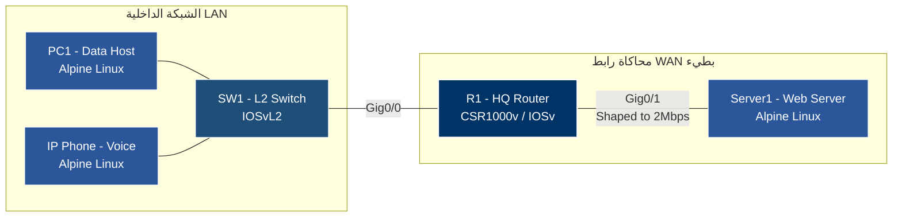

# التدريب العملي: تطبيق جودة الخدمة (QoS) وإدارة الازدحام في CML

## 1. أهداف التدريب
- فهم كيفية تصنيف الحزم (Classification) ووضع العلامات (Marking).
- تطبيق تقنية **LLQ** لإعطاء أولوية قصوى لحركة الصوت.
- تطبيق تقنية **CBWFQ** لضمان حد أدنى من النطاق لبيانات الويب.
- محاكاة رابط WAN بطيء باستخدام **Shaping** لإجبار الراوتر على استخدام طوابير QoS.

## 2. مخطط الطوبولوجيا (Topology)



---
## الأجهزة والموديلات في CML

| الجهاز      | النوع في CML (Node Type)    | الوظيفـة                                       |
| ----------- | --------------------------- | ---------------------------------------------- |
| **R1**      | `csr1000v` أو `iosv`        | الراوتر الرئيسي (HQ-Router) لتطبيق سياسات MQC. |
| **SW1**     | `iosvl2`                    | سويتش الطبقة الثانية لربط الأجهزة الطرفية.     |
| **PC1**     | `alpine-linux` أو `desktop` | جهاز طرفي لتوليد حركة بيانات (HTTP/UDP).       |
| **Phone1**  | `alpine-linux`              | جهاز طرفي لتوليد حركة صوتية (UDP - DSCP EF).   |
| **Server1** | `alpine-linux`              | خادم الويب/الوجهة النهائية.                    |

---
## 3. الإعدادات الكاملة لكل جهاز (Node Configurations)

### الجهاز الأول: الراوتر الرئيسي (HQ-Router - R1)
**النوع في CML:** `csr1000v` أو `iosv`

#### شرح الإعدادات وأهميتها:
1. **إعداد الواجهات (Interfaces):** يتم تفعيل المنافذ وتوزيع الـ IPs لربط الشبكة المحلية (LAN) بشبكة الخادم (WAN).
2. **التصنيف (Classification - Class-Maps):** 
   - نعرف فئة `VOICE-CLASS` للبحث عن الحزم الموسومة بـ `DSCP EF` (وهي حزم الصوت).
   - نعرف فئة `DATA-CLASS` باستخدام `ACL` للبحث عن حزم الويب (HTTP/HTTPS/iperf). *ملاحظة: نستخدم ACL بدلاً من NBAR لضمان التوافق مع جميع صور CML.*
3. **تحديد السياسة (Policy-Map):**
   - `priority 512`: تقنية **LLQ**، تعطي الصوت أولوية قصوى وسعة 512Kbps.
   - `bandwidth percent 30`: تقنية **CBWFQ**، تضمن للبيانات 30% من النطاق وتعيد وسمها بـ `AF21`.
4. **تطبيق السياسة والازدحام (Interface & Shaping):** 
   - `service-policy output`: تطبق السياسة على حركة الخروج.
   - **`shape average 2000000`**: **(خطوة حاسمة)** في بيئة CML، المنافذ الافتراضية سريعة جداً (Gigabit). لن يحدث ازدحام (Congestion) ولن تعمل طوابير QoS إلا إذا قمنا بتحديد سرعة المنفذ (2 Mbps) لمحاكاة رابط WAN حقيقي.

#### الإعداد الكامل (انسخ والصق في Console الخاص بـ R1):
```cisco
enable
configure terminal
hostname HQ-Router

! --- 1. إعداد الواجهات الأساسية ---
interface GigabitEthernet1
 description Link-to-Server1-WAN
 ip address 10.0.0.1 255.255.255.0
 no shutdown
!
interface GigabitEthernet2
 description Link-to-SW1-LAN
 ip address 192.168.1.1 255.255.255.0
 no shutdown

! --- 2. التصنيف (Classification) ---
class-map match-all VOICE-CLASS
 match ip dscp ef
!
ip access-list extended DATA-TRAFFIC
 permit tcp any any eq 80
 permit tcp any any eq 443
 permit tcp any any eq 5201
!
class-map match-any DATA-CLASS
 match access-group name DATA-TRAFFIC

! --- 3. تحديد السياسة (Policy-Map) ---
policy-map QOS-EDGE-POLICY
 class VOICE-CLASS
  priority 512
 class DATA-CLASS
  bandwidth percent 30
  set dscp af21
 class class-default
  fair-queue

! --- 4. التطبيق ومحاكاة الازدحام (Application & Shaping) ---
interface GigabitEthernet2
 service-policy output QOS-EDGE-POLICY
 shape average 2000000

end
write memory
```

---

### الجهاز الثاني: السويتش (SW1)
**النوع في CML:** `iosvl2`

#### شرح الإعدادات وأهميته:
- **الدور:** يعمل كجهاز تجميع (Aggregation) من الطبقة الثانية (Layer 2).
- **الأهمية:** يقوم بربط الأجهزة الطرفية (PC1 و Phone1) بالراوتر R1. الإعدادات هنا بسيطة (Access Mode) لأننا نطبق سياسات QoS على الراوتر (Layer 3 Edge) وليس على السويتش في هذا السيناريو.

#### الإعداد الكامل (انسخ والصق في Console الخاص بـ SW1):
```cisco
enable
configure terminal
hostname SW1

interface GigabitEthernet0/0
 description Link-to-R1
 switchport mode access
 no shutdown
!
interface GigabitEthernet0/1
 description Link-to-PC1-Data
 switchport mode access
 no shutdown
!
interface GigabitEthernet0/2
 description Link-to-Phone1-Voice
 switchport mode access
 no shutdown

end
write memory
```

---

### الجهاز الثالث: خادم الاختبار (Server1)
**النوع في CML:** `alpine-linux`

#### شرح الإعدادات وأهميتها:
- **الدور:** يمثل الخادم النهائي (Destination) الذي يستقبل حركة البيانات والصوت.
- **الأهمية:** نقوم بتثبيته وتشغيل أداة `iperf3` في وضع الخادم (`-s`) وبشكل Daemon (`-D`) ليعمل في الخلفية، مما يسمح باستقبال الاتصالات من PC1 و Phone1 في نفس الوقت لقياس الأداء.

#### الإعداد الكامل (انسخ والصق في Console الخاص بـ Server1):
```bash
# الدخول لوضع Root
su root

# 1. إعداد عنوان IP والمسار الافتراضي
ip addr add 10.0.0.100/24 dev eth0
ip link set eth0 up
ip route add default via 10.0.0.1

# 2. تثبيت وتشغيل أداة iperf3 في الخلفية
apk add iperf3
iperf3 -s -D

# للتأكد من أن الخادم يعمل ويستمع:
netstat -tulnp | grep iperf
```

---

###  الجهاز الرابع: جهاز البيانات (PC1 - Data Host)
**النوع في CML:** `alpine-linux`

####  شرح الإعدادات وأهميتها:
- **الدور:** يمثل مستخدم عادي يقوم بتحميل ملفات أو تصفح الويب.
- **الأهمية:** سنستخدم `iperf3` لإرسال حركة **TCP** بسرعة `5Mbps`. بما أن الرابط بين R1 و Server1 محدود بـ `2Mbps` (بفضل الـ Shaping)، فإن هذا سيتسبب في **ازدحام (Congestion)** حقيقي، مما يجبر الراوتر على تفعيل طوابير QoS (CBWFQ) وإسقاط بعض حزم البيانات أو تأخيرها.

####  الإعداد الكامل (انسخ والصق في Console الخاص بـ PC1):
```bash
# الدخول لوضع Root
su root

# 1. إعداد عنوان IP والمسار الافتراضي
ip addr add 192.168.1.10/24 dev eth0
ip link set eth0 up
ip route add default via 192.168.1.1

# 2. اختبار الاتصال بالسيرفر
ping -c 4 10.0.0.100

# 3. توليد حركة بيانات كثيفة (TCP) لإغراق الرابط
apk add iperf3
# إرسال حركة TCP بسرعة 5Mbps لمدة 60 ثانية (المنفذ 5201 هو منفذ iperf3 الافتراضي)
iperf3 -c 10.0.0.100 -p 5201 -b 5M -t 60
```

---

### الجهاز الخامس: جهاز الصوت (Phone1 - Voice Host)
**النوع في CML:** `alpine-linux`

#### شرح الإعدادات وأهميتها:
- **الدور:** يمثل هاتف IP (VoIP) يرسل مكالمة صوتية.
- **الأهمية:** سنستخدم `iperf3` لإرسال حركة **UDP** بحجم حزمة `160 byte` (محاكاة دقيقة لحزم الصوت G.711). الأهم هو استخدام الخيار `--dscp 46` لوسم الحزم بـ **EF (Expedited Forwarding)**. هذا سيثبت أن طابور **LLQ** في الراوتر سيتعرف على هذا الوسم ويمنحه أولوية قصوى، مما يحميه من الـ Drops التي ستحدث لحزم البيانات.

#### الإعداد الكامل (انسخ والصق في Console الخاص بـ Phone1):
```bash
# الدخول لوضع Root
su root

# 1. إعداد عنوان IP والمسار الافتراضي
ip addr add 192.168.1.20/24 dev eth0
ip link set eth0 up
ip route add default via 192.168.1.1

# 2. اختبار الاتصال بالسيرفر
ping -c 4 10.0.0.100

# 3. توليد حركة صوتية (UDP) مع وسم DSCP EF
apk add iperf3
# إرسال حركة UDP بحجم 160 byte مع وسم DSCP 46 (EF)
iperf3 -c 10.0.0.100 -u -b 1M -l 160 --dscp 46 -t 60
```

---

## 4. خطوات التنفيذ والمراقبة (Execution & Verification)

### أ. ترتيب التشغيل وتوليد الازدحام
1. شغّل الأجهزة بالترتيب: **Server1** ➔ **SW1** ➔ **R1** ➔ **PC1 & Phone1**.
2. انتظر حتى تكتمل أوامر `ping` للتأكد من وصول الـ Routing.
3. **الخطوة الأهم:** قم بفتح Console لـ **PC1** و **Phone1** في نفس الوقت (استخدم Tabs في CML) وقم بتشغيل أوامر `iperf3` فيهما **بالتزامن**.

### ب. مراقبة النتائج على الراوتر (R1)
اذهب إلى Console الخاص بـ **HQ-Router** ونفذ الأمر التالي:
```cisco
show policy-map interface GigabitEthernet0/1
```

#### ماذا ستلاحظ في المخرجات؟
1. **صوت (VOICE-CLASS):** ستجد أن الحزم مرت عبر `Priority Queue`. ستلاحظ أن عدد الحزم (Packets) يزداد، ولكن **عدد الحزم المرفوضة (Drops) يساوي 0**، حتى مع امتلاء الرابط. هذا يثبت نجاح تقنية **LLQ**.
2. **بيانات (DATA-CLASS):** ستجد أن الحزم مرت عبر `CBWFQ`. بسبب أن PC1 يرسل بـ 5Mbps والنطاق المضمون هو 30% من 2Mbps، ستلاحظ وجود **Drops** أو تأخير في هذا الطابور.
3. **حالة المنفذ:** إذا نفذت الأمر `show interfaces GigabitEthernet0/1`، ستجد سطر `Output queue: size/total drops` يوضح أن هناك حزم تم إسقاطها بسبب الـ Shaping، ولكن حزم الصوت كانت محمية بفضل الـ Marking والـ Queuing.