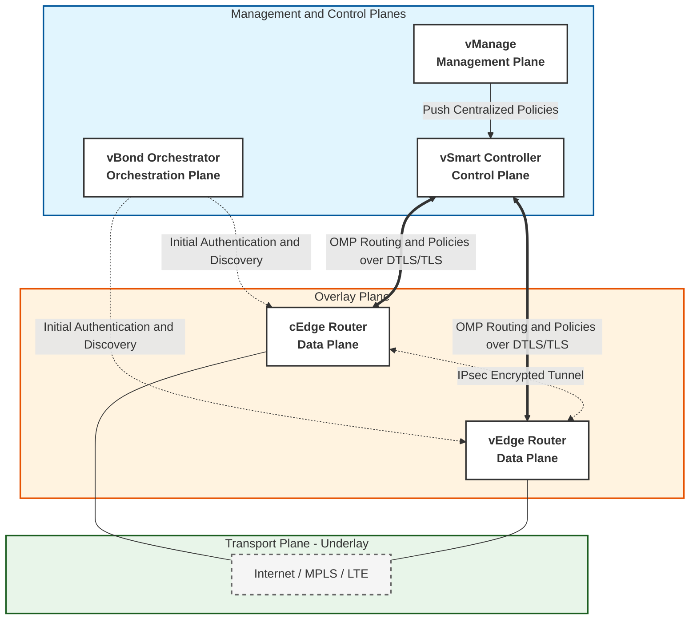

### المستوى الأول: المقدمة والمفاهيم الأساسية (Introduction & Core Concepts)

في بيئة شبكات المؤسسات الحديثة، لم تعد شبكات Multiprotocol Label Switching (MPLS) التقليدية كافية بمفردها بسبب تكلفتها العالية وعدم مرونتها مع التطبيقات السحابية. هنا ظهرت تقنية Software-Defined Wide Area Network (SD-WAN) كحل معماري متقدم.

الفكرة الجوهرية في SD-WAN هي فصل مستوى التحكم (Control Plane) عن مستوى البيانات (Data Plane). هذا الفصل يسمح بـ:
1. الإدارة المركزية (Centralized Management) لكافة أجهزة الشبكة من موقع واحد.
2. السيطرة الديناميكية على حركة المرور (Dynamic Traffic Steering) بناءً على حالة الرابط (Link Health) ونوع التطبيق (Application-Aware Routing).
3. الاستفادة من روابط نقل متعددة ومختلطة (Hybrid WAN) مثل الإنترنت العام (Broadband)، شبكات الجيل الرابع والخامس (LTE/5G)، وروابط MPLS في آن واحد.

في سياق مقرات الأمان مثل CCNP Security، يعد فهم هذه البنية شرطاً أساسياً لتطبيق سياسات الأمان (Security Policies) وضمان تشفير البيانات (Data Encryption) أثناء عبورها الشبكات غير الموثوقة.

---

### المستوى الثاني: المكونات المعمارية (Architecture Components)

تعتمد بنية Cisco SD-WAN على تقسيم الوظائف إلى أربعة مستويات رئيسية (Planes)، كل مستوى يمثل جهازاً أو مجموعة أجهزة بوظيفة محددة:

1. مستوى الإدارة (Management Plane)
- المكون: vManage
- الوظيفة: يعمل كواجهة إدارة مركزية (Centralized Management GUI). من خلاله يقوم مسؤولو الشبكة بتعريف السياسات (Policies)، ومراقبة أداء الشبكة (Monitoring and Telemetry)، وإدارة الشهادات الرقمية (Certificates) وتكوين الأجهزة الطرفية (Edge Devices).

2. مستوى التحكم (Control Plane)
- المكون: vSmart Controllers
- الوظيفة: يعتبر "عقل" الشبكة. مسؤوليته الأساسية هي تبادل معلومات التوجيه (Routing Information) وسياسات التوجيه (Routing Policies) بين الأجهزة الطرفية. كما يقوم بإنشاء أنفاق البيانات (Data Tunnels) وتوزيع مفاتيح التشفير (Encryption Keys).
- ملاحظة: في الإصدارات الحديثة (Integrated vManage)، يمكن دمج وظائف vSmart و vManage في جهاز واحد لتبسيط البنية في الشبكات الصغيرة.

3. مستوى التنسيق والمصادقة (Orchestration Plane)
- المكون: vBond Orchestrator
- الوظيفة: هو نقطة الدخول الآمنة للشبكة. يقوم بالمهام التالية أثناء عملية التشغيل الأولي (Bootstrapping):
  - المصادقة الأولية (Initial Authentication) للأجهزة الجديدة باستخدام الشهادات الرقمية.
  - تسهيل عملية اكتشاف الأجهزة (Device Discovery)، خاصة عند وجود الأجهزة خلف بوابات ترجمة عناوين الشبكة (NAT Traversal).
  - توزيع عناوين IP الخاصة بـ vManage و vSmart على الأجهزة الطرفية الجديدة.

4. مستوى التوجيه والتنفيذ (Data Plane)
- المكونات: Edge Devices
- الوظيفة: التعامل مع حركة المرور الفعلية (Actual Traffic) وتطبيق السياسات محلياً. تنقسم إلى نوعين:
  - vEdge Routers: أجهزة افتراضية (Virtual Appliances) تعمل على منصات الخوادم الافتراضية (Hypervisors) مثل VMware أو KVM، وتستخدم غالباً في مراكز البيانات.
  - cEdge Routers: أجهزة مادية (Physical Appliances) مخصصة للفروع، مثل سلسلة Cisco Catalyst 8000 أو أجهزة ISR 4000، بشرط تفعيل ترخيص SD-WAN (SD-WAN License) عليها.

---

### المستوى الثالث: طبقات الشبكة والبروتوكولات (Network Planes & Protocols)

لفهم تدفق البيانات، يجب التمييز بين الطبقات المنطقية والفيزيائية والبروتوكولات التي تربطها:

1. طبقات الشبكة (Network Planes)
- Transport Plane (طبقة النقل): تمثل البنية التحتية الفعلية (Underlay)، وهي الروابط الفيزيائية (Physical Links) مثل MPLS أو Broadband.
- Overlay Plane (طبقة التراكب): هي الشبكة الافتراضية المنطقية التي تعمل فوق طبقة النقل. يتم إنشاء أنفاق مشفرة (Encrypted Tunnels) بين أجهزة Edge عبر هذه الطبقة.
- Forwarding Plane (طبقة التوجيه): المسؤولة عن توجيه الحزم (Packets) فعلياً بناءً على سياسات التوجيه (Forwarding Policies) التي تم تنزيلها من مستوى التحكم.

2. البروتوكولات المستخدمة (Protocols)
- Overlay Management Protocol (OMP): بروتوكول خاص بـ Cisco SD-WAN يجمع بين وظائف بروتوكولات التوزيع (Distribution Protocols) مثل BGP و IS-IS في بروتوكول واحد. يقوم OMP بتوزيع مسارات التراكب (Overlay Routes) وسياسات التوجيه من vSmart إلى Edge Devices.
- Underlay Routing Protocols: بروتوكولات مثل BGP، OSPF، أو IS-IS تُستخدم في طبقة النقل (Transport Plane) لضمان وصول أجهزة Edge إلى عناوين IP الخاصة بـ Controllers (vManage, vSmart, vBond).
- Control and Data Encapsulation Protocols:
  - DTLS / TLS: تُستخدم لتشفير حركة مرور التحكم (Control Traffic) بين أجهزة Edge و Controllers.
  - IPsec: يُستخدم لتشفير حركة مرور البيانات الفعلية (Data Traffic) عبر أنفاق Overlay لضمان السرية (Confidentiality).

---

### المستوى الرابع: آليات الأمان في البنية (Security Mechanisms)

نظراً لاعتماد SD-WAN على الروابط العامة (Public Internet)، فإن الأمان مُدمج في صميم البنية (Security by Design):

1. تشفير الأنفاق (Tunnel Encryption)
يتم تشفير جميع أنفاق Overlay تلقائياً باستخدام بروتوكول IPsec (غالباً بخوارزميات قوية مثل AES-GCM). إذا كانت الروابط تدعم TLS 1.2 أو أحدث، يمكن استخدام DTLS أو TLS للتشفير بدلاً من IPsec لتحسين الأداء وتقليل استهلاك المعالج (CPU Overhead).

2. المصادقة والأمان الهوياتي (Authentication & Identity)
تستخدم أجهزة Edge شهادة رقمية (X.509 Certificate) للمصادقة مع vBond Orchestrator. لا يُسمح لأي جهاز بالانضمام إلى شبكة SD-WAN أو تبادل معلومات التوجيه عبر OMP إلا بعد التحقق من هويته بنجاح عبر vBond.

3. عزل حركة المرور (Traffic Segmentation)
من خلال مفهوم Virtual Routing and Forwarding (VRF) أو ما يُعرف بـ VPNs في مصطلحات SD-WAN، يمكن عزل حركة المرور الحساسة (مثل VoIP أو قواعد البيانات) عن حركة المرور العامة. يمكن تطبيق سياسات أمان (Security Policies) مختلفة لكل VRF بشكل مستقل تماماً.

4. المصادقة المحلية (Local Web Authentication - LWA)
تسمح SD-WAN بتطبيق سياسات LWA على المستخدمين الذين يتصلون بالشبكة عبر نقطة وصول Edge (مثل شبكة Wi-Fi للضيوف) قبل منحهم الوصول الكامل، مما يعزز الأمان في بيئات الدخول البعيد (Remote Access).

---

### المستوى الخامس: تمارين عملية وسيناريوهات تطبيقية (Practical Exercises)

تم تصميم هذه التمارين لتدريب الطلاب على التفكير التحليلي وتطبيق المفاهيم النظرية على سيناريوهات واقعية.

#### التمرين الأول: تسلسل التشغيل والمصادقة (Bootstrapping Sequence)
السيناريو:
قام فني الشبكة بتوصيل جهاز cEdge جديد في فرع بعيد وربطه بالإنترنت (Broadband). الجهاز يعمل حالياً ولكنه لا يعرف عنوان IP الخاص بـ vManage أو vSmart للاتصال بهما.
المطلوب:
1. ما هو أول مكون في البنية يجب أن يتصل به جهاز cEdge؟ ولماذا؟
2. ما هو الإجراء الأمني الذي يتحقق منه هذا المكون قبل منح الجهاز أي معلومات؟
3. بعد نجاح هذه الخطوة، ما هو البروتوكول الذي سيستخدمه cEdge لتبادل معلومات التوجيه مع vSmart؟

الحل والتحليل:
1. يتصل الجهاز أولاً بـ vBond Orchestrator. السبب: vBond هو المكون الوحيد الذي تكون عناوينه معروفة مسبقاً (عبر DHCP أو تكوين يدوي بسيط)، وهو المسؤول عن توجيه الجهاز الجديد إلى بقية البنية.
2. الإجراء الأمني هو المصادقة الأولية (Initial Authentication) عبر التحقق من الشهادة الرقمية (Certificate) المثبتة على جهاز cEdge للتأكد من أنه جهاز Cisco أصلي ومصرح له.
3. البروتوكول المستخدم هو Overlay Management Protocol (OMP)، ويعمل هذا البروتوكول فوق نفق تحكم مشفر بـ DTLS أو TLS.

#### التمرين الثاني: تحليل طبقات الشبكة والبروتوكولات (Planes & Protocols Analysis)
السيناريو:
يحتاج جهاز vEdge في فرع "الرياض" إلى إرسال حزمة بيانات (Data Packet) تابعة لقسم المالية إلى جهاز vEdge في فرع "جدة" عبر رابط إنترنت عام (Broadband).
المطلوب:
حدد الطبقة (Plane) والبروتوكول المسؤول في كل مرحلة من المراحل الثلاث التالية:
أ. اكتشاف الرابط الفيزيائي وتبادل معلومات التوجيه للوصول إلى عناوين الـ Controllers.
ب. إنشاء النفق الآمن بين جهازي vEdge.
ج. توجيه حزمة البيانات الفعلية عبر هذا النفق بناءً على نوع التطبيق.

الحل والتحليل:
أ. المرحلة تحدث في Transport Plane (Underlay). البروتوكول: BGP أو OSPF أو IS-IS (لضمان الوصول الأساسي للـ Controllers).
ب. المرحلة تحدث في Overlay Plane. البروتوكول: DTLS/TLS (لنفق التحكم) و IPsec (لنفق البيانات).
ج. المرحلة تحدث في Forwarding Plane. البروتوكول/الآلية: يتم استخدام سياسات التوجيه (Forwarding Policies) التي تم تعلمها مسبقاً عبر بروتوكول OMP لتوجيه الحزمة عبر النفق المشفر بـ IPsec.

#### التمرين الثالث: تطبيق سياسات الأمان والعزل (Security & Segmentation Implementation)
السيناريو:
فرع يعمل به جهاز cEdge. يوجد مستخدمون يعملون من المنزل ويتصلون بشبكة Wi-Fi مخصصة للضيوف (Guest Wi-Fi) في هذا الفرع. المطلوب أمنياً هو:
1. منع هؤلاء المستخدمين من الوصول إلى شبكة الخوادم الداخلية (Corporate Servers).
2. السماح لهم فقط بالوصول إلى الإنترنت.
3. ضمان عدم تداخل جداول التوجيه الخاصة بهم مع جداول توجيه الموظفين الرسميين.
المطلوب:
اشرح الخطوات المنطقية لتحقيق ذلك باستخدام مكونات SD-WAN.

الحل والتحليل:
1. عزل حركة المرور (Traffic Segmentation): يتم إنشاء VRF منفصل (يُسمى VPN في مصطلحات SD-WAN) مخصص لـ Guest Users. هذا يضمن فصل جداول التوجيه (Routing Tables) تماماً عن VRF الخاص بالموظفين.
2. تطبيق سياسات الأمان (Security Policies): من خلال واجهة vManage، يتم إنشاء Centralized Data Policy تحتوي على قاعدة تمنع حركة المرور (Action: Drop) حيث يكون المصدر (Source) هو VRF الضيوف، والوجهة (Destination) هي شبكات الخوادم الداخلية (Corporate Subnets).
3. المصادقة (Authentication): يتم تفعيل ميزة Local Web Authentication (LWA) على واجهة الـ Wi-Fi في جهاز cEdge. عند اتصال المستخدم، تظهر له صفحة Portal للمصادقة قبل السماح له بالدخول إلى VRF المخصص للضيوف.

#### التمرين الرابع: استكشاف الأخطاء وإصلاحها (Troubleshooting Scenario)
السيناريو:
لاحظ مسؤول الشبكة أن جهاز vEdge في فرع جديد لا يستطيع رؤية مسارات التوجيه (Routes) الخاصة بالفروع الأخرى، رغم أن الرابط الفيزيائي (Internet) يعمل بشكل طبيعي ويمكن عمل Ping لعناوين الـ Controllers. عند فحص السجلات، وجد أن الجهاز لم يقم بإنشاء علاقة جوار (Adjacency) مع vSmart عبر بروتوكول OMP.
المطلوب:
ما هي السببان الأكثر احتمالاً لهذه المشكلة من منظور مستوى التحكم (Control Plane)؟

الحل والتحليل:
1. فشل المصادقة (Authentication Failure): قد تكون الشهادة الرقمية (Certificate) على جهاز vEdge منتهية الصلاحية أو غير متطابقة مع ما هو مسجل في vManage، مما يمنع vSmart من قبول علاقة الـ OMP معه.
2. مشكلة في تشفير نفق التحكم (Control Tunnel Encryption Issue): قد يكون هناك عدم توافق في إعدادات تشفير DTLS/TLS بين vEdge و vSmart، أو وجود جدار حماية (Firewall) في المسار يمنع منفذ (Port) بروتوكول التحكم (المنفذ الافتراضي 12346 UDP)، مما يمنع إنشاء نفق التحكم اللازم لعمل بروتوكول OMP.

---
---