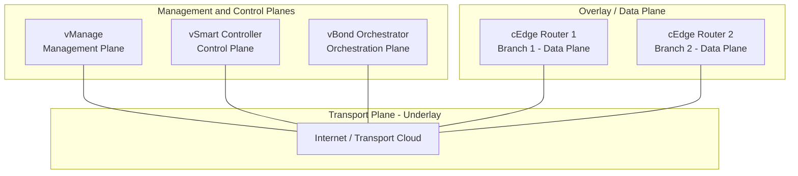

# تدريب عملي: نشر وتكوين Cisco SD-WAN في بيئة CML

يهدف هذا التدريب العملي إلى تطبيق المفاهيم النظرية لبنية Cisco SD-WAN على بيئة عملية باستخدام برنامج Cisco Modeling Labs (CML). سيقوم الطالب ببناء الطوبولوجيا، وتكوين المستويات الأربعة (Management, Control, Orchestration, Data)، والتحقق من عمل بروتوكولات التراكب (Overlay Protocols).

## المتطلبات الأساسية (Prerequisites)
يجب توفر الصور التالية (Node Definitions) في برنامج CML:
1. vManage (Viptela image)
2. vSmart (Viptela image)
3. vBond (Viptela image)
4. cEdge (IOS XE image مثل Catalyst 8000v أو CSR1000v)
5. Internet Cloud أو L2 Switch لمحاكاة طبقة النقل (Transport Plane).


## دور كل Node
**1. SD-WAN Manager (vManage)**
* **المستوى:** مستوى الإدارة (Management Plane).
* **الدور:** يعمل كواجهة إدارة مركزية (Centralized Management GUI). من خلاله يقوم مسؤولو الشبكة بتعريف السياسات (Policies)، ومراقبة أداء الشبكة (Monitoring and Telemetry)، وإدارة الشهادات الرقمية (Certificates)، وتكوين الأجهزة الطرفية (Edge Devices).

**2. Orchestrator (vBond)**
* **المستوى:** مستوى التنسيق والمصادقة (Orchestration Plane).
* **الدور:** يُعد نقطة الدخول الآمنة للشبكة، ويقوم بالمهام التالية أثناء عملية التشغيل الأولي (Bootstrapping):
  - المصادقة الأولية (Initial Authentication) للأجهزة الجديدة باستخدام الشهادات الرقمية.
  - تسهيل عملية اكتشاف الأجهزة (Device Discovery)، خاصة عند وجود الأجهزة خلف بوابات ترجمة عناوين الشبكة (NAT Traversal).
  - توزيع عناوين IP الخاصة بـ vManage و vSmart على الأجهزة الطرفية الجديدة لتتمكن من الاتصال بهما.

**3. vSmart**
* **المستوى:** مستوى التحكم (Control Plane).
* **الدور:** يُعتبر "عقل" الشبكة. مسؤوليته الأساسية هي تبادل معلومات التوجيه (Routing Information) وسياسات التوجيه (Routing Policies) بين الأجهزة الطرفية عبر بروتوكول OMP. كما يقوم بإنشاء أنفاق البيانات (Data Tunnels) وتوزيع مفاتيح التشفير (Encryption Keys) لضمان اتصال آمن.

**4. vEdge**
* **المستوى:** مستوى التوجيه والتنفيذ (Data Plane).
* **الدور:** هو جهاز توجيه افتراضي (Virtual Appliance) يعمل على منصات الخوادم الافتراضية (Hypervisors) مثل VMware أو KVM، ويُستخدم غالباً في مراكز البيانات (Data Centers). وظيفته الأساسية هي التعامل مع حركة المرور الفعلية (Actual Traffic)، وتطبيق السياسات محلياً (Local Policy Enforcement)، وإنشاء أنفاق البيانات المشفرة (Encrypted Data Tunnels) مثل IPsec للاتصال ببقية الشبكة.
---

## أولاً: طوبولوجيا الشبكة (Network Topology)

توضح الصورة التالية كيفية ربط مكونات SD-WAN بطبقة النقل (Underlay) التي تمثل الإنترنت أو شبكة النقل.



---

## ثانياً: خطة العنونة والمعاملات (Addressing & Parameters Plan)

قبل البدء في التكوين، يجب تحديد عناوين IP ومعاملات التهيئة الأولية (Bootstrap Parameters).

| المكون (Component) | دور الجهاز (Role) | عنوان IP للواجهة (Transport IP) | عنوان IP للنظام (System IP) |
| :--- | :--- | :--- | :--- |
| vBond | Orchestration Plane | 10.0.0.1/24 | 192.168.1.1 |
| vSmart | Control Plane | 10.0.0.2/24 | 192.168.1.2 |
| vManage | Management Plane | 10.0.0.3/24 | 192.168.1.3 |
| cEdge1 | Data Plane (Branch 1) | 10.0.0.11/24 | 192.168.1.11 |
| cEdge2 | Data Plane (Branch 2) | 10.0.0.12/24 | 192.168.1.12 |

**المعاملات المشتركة (Common Parameters):**
* اسم المنظمة (Organization Name): `Lab_Org`
* اسم النطاق (Domain Name): `lab.local`

---

## ثالثاً: تكوين الأجهزة (Node Configurations)

تم تجميع إعدادات كل جهاز على حدة مع شرح تفصيلي للوظيفة التي يؤديها كل أمر.

### 1. مكون vBond Orchestrator (مستوى التنسيق والمصادقة)
يعتبر vBond نقطة الدخول الأولى. يقوم بالمصادقة الأولية (Initial Authentication) وتوزيع عناوين الـ Controllers.

**التكوين (Viptela CLI):**
```xml
#cloud-config
write_files:
- path: /etc/confd/init/zcloud.xml
  content: |
    <config xmlns="http://tail-f.com/ns/config/1.0">
      <system xmlns="http://viptela.com/system">
        <host-name>vBond-Orchestrator</host-name>
        <aaa>
          <user>
            <name>admin</name>
            <password>$6$rounds=4096$viptela$QwErTyUiOpAsDfGhJkLzXcVbNm1234567890abcdefghijklmnopqrstuvwxyz</password>
          </user>
        </aaa>
      </system>
      <viptela xmlns="http://viptela.com/viptela">
        <orchestrator>
          <local-address>10.0.0.1</local-address>
        </orchestrator>
        <organization>
          <name>Lab_Org</name>
          <domain-name>lab.local</domain-name>
        </organization>
      </viptela>
    </config>
```
**الشرح:** 
تم تعيين `local-address` ليعرف الجهاز عنوانه في طبقة النقل (Transport Plane). تم تحديد `organization name` و `domain-name` لأن أي جهاز يحاول الانضمام للشبكة يجب أن يتطابق مع هذه المعاملات لضمان الأمان الهوياتي (Identity Security).

### 2. مكون vSmart Controller (مستوى التحكم)
يعمل vSmart كعقل الشبكة، حيث يبادل معلومات التوجيه عبر بروتوكول OMP ويوزع سياسات التوجيه.

**التكوين (Viptela CLI):**
```xml
#cloud-config
write_files:
- path: /etc/confd/init/zcloud.xml
  content: |
    <config xmlns="http://tail-f.com/ns/config/1.0">
      <system xmlns="http://viptela.com/system">
        <host-name>vSmart-Controller</host-name>
        <aaa>
          <user>
            <name>admin</name>
            <password>$6$0270fb81b5b56c1e$LOaD1.Xj7zlP9TwMwZ5sMI1rtsU7b.TTtk3vetlfwVetEq7xmFkSvRCnsCn0rp14WYMC0ydfZtwiXNJL8mVr9/</password>
          </user>
          <user>
            <name>cisco</name>
            <password>$6$0270fb81b5b56c1e$LOaD1.Xj7zlP9TwMwZ5sMI1rtsU7b.TTtk3vetlfwVetEq7xmFkSvRCnsCn0rp14WYMC0ydfZtwiXNJL8mVr9/</password>
            <group>netadmin</group>
          </user>
        </aaa>
      </system>
      <viptela xmlns="http://viptela.com/viptela">
        <system>
          <system-ip>192.168.1.2</system-ip>
          <site-id>0</site-id>
        </system>
        <vbond>
          <local-address>10.0.0.2</local-address>
          <address>
            <ipv4-address>10.0.0.1</ipv4-address>
          </address>
        </vbond>
        <organization>
          <name>Lab_Org</name>
          <domain-name>lab.local</domain-name>
        </organization>
        <omp>
          <advertise>
            <ipv4>true</ipv4>
            <bgp>true</bgp>
            <ospf>true</ospf>
          </advertise>
        </omp>
      </viptela>
    </config>
```
**الشرح:**
أمر `vbond address` يخبر الـ Control Plane بعنوان الـ Orchestrator لبدء عملية الاكتشاف (Device Discovery). تم تفعيل `omp` لتوزيع مسارات BGP و OSPF القادمة من الفروع عبر طبقة التراكب (Overlay Plane).

### 3. مكون vManage (مستوى الإدارة)
vManage هو الواجهة المركزية (Centralized Management GUI). في CML، يتم التكوين المبدئي عبر CLI ثم إكمال الباقي عبر المتصفح.

**التكوين المبدئي (Viptela CLI):**
```xml
#cloud-config
fs_setup:
- device: "/dev/sdb"
  partition: "none"
  filesystem: "ext4"
mounts:
- [ sdb, /opt/data ]
write_files:
- path: /opt/web-app/etc/persona
  owner: vmanage:vmanage-admin
  permissions: '0644'
  content: '{"persona":"COMPUTE_AND_DATA"}'
- path: /etc/confd/init/zcloud.xml
  content: |
    <config xmlns="http://tail-f.com/ns/config/1.0">
      <system xmlns="http://viptela.com/system">
        <host-name>vManage-Manager</host-name>
        <aaa>
          <user>
            <name>admin</name>
            <password>$6$0270fb81b5b56c1e$LOaD1.Xj7zlP9TwMwZ5sMI1rtsU7b.TTtk3vetlfwVetEq7xmFkSvRCnsCn0rp14WYMC0ydfZtwiXNJL8mVr9/</password>
          </user>
          <user>
            <name>cisco</name>
            <password>$6$0270fb81b5b56c1e$LOaD1.Xj7zlP9TwMwZ5sMI1rtsU7b.TTtk3vetlfwVetEq7xmFkSvRCnsCn0rp14WYMC0ydfZtwiXNJL8mVr9/</password>
            <group>netadmin</group>
          </user>
        </aaa>
      </system>
      <viptela xmlns="http://viptela.com/viptela">
        <system>
          <system-ip>192.168.1.3</system-ip>
        </system>
        <vbond>
          <local-address>10.0.0.3</local-address>
          <address>
            <ipv4-address>10.0.0.1</ipv4-address>
          </address>
        </vbond>
        <organization>
          <name>Lab_Org</name>
          <domain-name>lab.local</domain-name>
        </organization>
      </viptela>
    </config>
```
**الشرح:**
بعد هذا التكوين المبدئي، يمكن الوصول إلى vManage عبر المتصفح باستخدام العنوان `https://10.0.0.3`. من خلال الواجهة الرسومية، سيتم لاحقاً اعتماد الشهادات الرقمية (Certificates) لأجهزة cEdge، وإنشاء قوالب الأجهزة (Device Templates)، وتطبيق السياسات المركزية (Centralized Policies).

### 4. أجهزة cEdge Routers (مستوى التوجيه والتنفيذ - Data Plane)
أجهزة cEdge تعمل بنظام IOS XE. سنقوم بتكوين cEdge1، وcEdge2 بنفس المنطق مع تغيير عناوين IP.

**التكوين لـ cEdge1 (IOS XE CLI):**
```xml
#cloud-config
write_files:
- path: /etc/confd/init/zcloud.xml
  content: |
    <config xmlns="http://tail-f.com/ns/config/1.0">
      <system xmlns="http://viptela.com/system">
        <host-name>vEdge-R1</host-name>
        <aaa>
          <user>
            <name>admin</name>
            <password>$6$0270fb81b5b56c1e$LOaD1.Xj7zlP9TwMwZ5sMI1rtsU7b.TTtk3vetlfwVetEq7xmFkSvRCnsCn0rp14WYMC0ydfZtwiXNJL8mVr9/</password>
          </user>
          <user>
            <name>cisco</name>
            <password>$6$0270fb81b5b56c1e$LOaD1.Xj7zlP9TwMwZ5sMI1rtsU7b.TTtk3vetlfwVetEq7xmFkSvRCnsCn0rp14WYMC0ydfZtwiXNJL8mVr9/</password>
            <group>netadmin</group>
          </user>
        </aaa>
      </system>
      <viptela xmlns="http://viptela.com/viptela">
        <system>
          <system-ip>192.168.1.11</system-ip>
          <site-id>11</site-id>
        </system>
        <vbond>
          <local-address>10.0.0.11</local-address>
          <address>
            <ipv4-address>10.0.0.1</ipv4-address>
          </address>
        </vbond>
        <organization>
          <name>Lab_Org</name>
          <domain-name>lab.local</domain-name>
        </organization>
      </viptela>
    </config>
```

**التكوين لـ cEdge2 (IOS XE CLI):**
```text
#cloud-config
write_files:
- path: /etc/confd/init/zcloud.xml
  content: |
    <config xmlns="http://tail-f.com/ns/config/1.0">
      <system xmlns="http://viptela.com/system">
        <host-name>vEdge-R2</host-name>
        <aaa>
          <user>
            <name>admin</name>
            <password>$6$0270fb81b5b56c1e$LOaD1.Xj7zlP9TwMwZ5sMI1rtsU7b.TTtk3vetlfwVetEq7xmFkSvRCnsCn0rp14WYMC0ydfZtwiXNJL8mVr9/</password>
          </user>
          <user>
            <name>cisco</name>
            <password>$6$0270fb81b5b56c1e$LOaD1.Xj7zlP9TwMwZ5sMI1rtsU7b.TTtk3vetlfwVetEq7xmFkSvRCnsCn0rp14WYMC0ydfZtwiXNJL8mVr9/</password>
            <group>netadmin</group>
          </user>
        </aaa>
      </system>
      <viptela xmlns="http://viptela.com/viptela">
        <system>
          <system-ip>192.168.1.12</system-ip>
          <site-id>12</site-id>
        </system>
        <vbond>
          <local-address>10.0.0.12</local-address>
          <address>
            <ipv4-address>10.0.0.1</ipv4-address>
          </address>
        </vbond>
        <organization>
          <name>Lab_Org</name>
          <domain-name>lab.local</domain-name>
        </organization>
      </viptela>
    </config>
```

**الشرح التفصيلي لإعدادات cEdge:**
1. `system system-ip` و `site-id`: يحددان هوية الجهاز في شبكة SD-WAN.
2. `vbond address`: يوجه الجهاز للتواصل مع Orchestration Plane لعملية المصادقة الأولية (Initial Authentication).
3. `tunnel-interface`: تحول الواجهة الفيزيائية إلى واجهة نفق (Tunnel Interface) في طبقة التراكب (Overlay Plane). تم تحديد `encapsulation ipsec` لتشفير حركة مرور البيانات (Data Traffic).
4. `allow-service vbond` و `omp`: يسمح بمرور حركة مرور التحكم (Control Traffic) الخاصة بالمصادقة وتبادل المسارات عبر هذه الواجهة.

---

## رابعاً: التحقق من التشغيل واستكشاف الأخطاء (Verification & Troubleshooting)

بعد تطبيق التكوينات، يجب التحقق من أن المستويات المختلفة تعمل بشكل صحيح.

### 1. التحقق من حالة الاتصال بـ vBond (Orchestration Plane)
على جهاز cEdge، استخدم الأمر التالي:
```text
show sdwan orchestrator connections
```
**النتيجة المتوقعة:** يجب أن تظهر حالة الاتصال بـ vBond كـ `Up`. إذا كانت `Down`، فهذا يعني وجود مشكلة في المصادقة (Authentication Failure) أو أن الشهادة الرقمية (Certificate) غير معتمدة من vManage.

### 2. التحقق من حالة بروتوكول OMP (Control Plane)
على جهاز cEdge، استخدم الأمر:
```text
show sdwan omp summary
```
**النتيجة المتوقعة:** يجب أن تظهر جلسة OMP مع vSmart بحالة `Up`. هذا يؤكد أن نفق التحكم المشفر بـ DTLS/TLS قد تم إنشاؤه بنجاح، وأن vSmart يقوم بتوزيع مسارات التراكب (Overlay Routes).

### 3. التحقق من أنفاق البيانات والتشفير (Data Plane & Security)
للتحقق من أنفاق IPsec بين cEdge1 و cEdge2:
```text
show sdwan security-info
```
أو للتحقق من حالة النفق:
```text
show sdwan tloc summary
```
**النتيجة المتوقعة:** يجب أن تظهر TLOCs (Transport Locators) للفروع الأخرى بحالة `Active`. هذا يثبت أن بروتوكول IPsec يقوم بتشفير حركة مرور البيانات الفعلية (Data Traffic) عبر طبقة التراكب (Overlay Plane).

### 4. التحقق من تبادل المسارات (Forwarding Plane)
للتحقق من المسارات المستلمة من الفروع الأخرى:
```text
show sdwan route omp
```
**النتيجة المتوقعة:** ستظهر مسارات الشبكات المحلية (LAN) الخاصة بالفرع الآخر، مما يدل على أن Forwarding Plane جاهز لتوجيه الحزم (Packets) بناءً على سياسات التوجيه (Forwarding Policies).

---

## خلاصة التدريب
من خلال هذا التطبيق العملي في CML، تم تطبيق الفصل الكامل بين مستويات الشبكة:
* تم استخدام **Transport Plane** (شبكة CML السحابية) كبنية تحتية فيزيائية.
* تم استخدام **vBond** لضمان الأمان الهوياتي (Identity Security) والمصادقة الأولية.
* تم استخدام **vSmart** لتبادل معلومات التوجيه عبر بروتوكول OMP (Control Plane).
* تم استخدام **vManage** للإدارة المركزية (Management Plane).
* تم استخدام **cEdge** لإنشاء أنفاق IPsec وتوجيه البيانات الفعلية (Data/Forwarding Plane)، مما يوضح كيف تحل تقنية SD-WAN مشاكل الشبكات التقليدية وتوفر مرونة وأماناً عاليين.