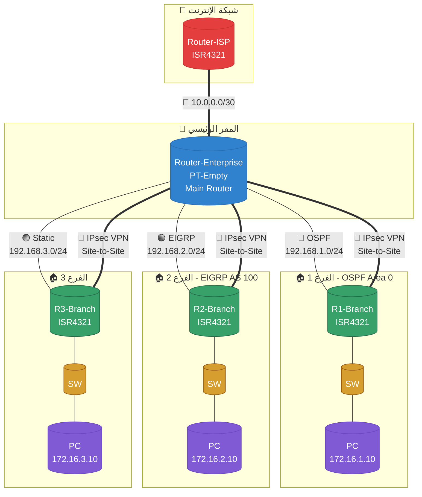

# 🌐 **تدريب Site-to-Site VPN على Cisco Packet Tracer**

## 📊 **رسم الطوبولوجيا باستخدام Mermaid**



---

## 📋 **جدول العناوين**

| الجهاز | الواجهة | IP Address | Subnet Mask | المتصل بـ |
|--------|---------|------------|-------------|-----------|
| **Router-ISP** | g0/0 | 10.0.0.1 | 255.255.255.252 | Router-Enterprise |
| **Router-ISP** | g0/1 | 209.165.200.225 | 255.255.255.252 | الإنترنت |
| **Router-Enterprise** | g0/0 | 10.0.0.2 | 255.255.255.252 | Router-ISP |
| **Router-Enterprise** | g0/1 | 192.168.1.1 | 255.255.255.0 | R1-Branch |
| **Router-Enterprise** | g0/2 | 192.168.2.1 | 255.255.255.0 | R2-Branch |
| **Router-Enterprise** | g0/3 | 192.168.3.1 | 255.255.255.0 | R3-Branch |
| **R1-Branch** | g0/0 | 192.168.1.2 | 255.255.255.0 | Router-Enterprise |
| **R1-Branch** | g0/1 | 172.16.1.1 | 255.255.255.0 | SW1 |
| **R2-Branch** | g0/0 | 192.168.2.2 | 255.255.255.0 | Router-Enterprise |
| **R2-Branch** | g0/1 | 172.16.2.1 | 255.255.255.0 | SW2 |
| **R3-Branch** | g0/0 | 192.168.3.2 | 255.255.255.0 | Router-Enterprise |
| **R3-Branch** | g0/1 | 172.16.3.1 | 255.255.255.0 | SW3 |
| **PC1** | - | 172.16.1.10 | 255.255.255.0 | 172.16.1.1 |
| **PC2** | - | 172.16.2.10 | 255.255.255.0 | 172.16.2.1 |
| **PC3** | - | 172.16.3.10 | 255.255.255.0 | 172.16.3.1 |

---

## 🔧 **تعليمات الإعداد الكاملة**

---

### **1. تكوين Router-ISP**

```cisco
enable
configure terminal
hostname Router-ISP

interface g0/0
 ip address 10.0.0.1 255.255.255.252
 no shutdown
 exit

interface g0/1
 ip address 209.165.200.225 255.255.255.252
 no shutdown
 exit

ip route 0.0.0.0 0.0.0.0 209.165.200.226

exit
write memory
```

---

### **2. تكوين Router-Enterprise (المركز الرئيسي)**

```cisco
enable
configure terminal
hostname Router-Enterprise

interface g0/0
 ip address 10.0.0.2 255.255.255.252
 no shutdown
 exit

interface g0/1
 ip address 192.168.1.1 255.255.255.0
 no shutdown
 exit

interface g0/2
 ip address 192.168.2.1 255.255.255.0
 no shutdown
 exit

interface g0/3
 ip address 192.168.3.1 255.255.255.0
 no shutdown
 exit
```

#### **تكوين OSPF (مع R1)**
```cisco
router ospf 1
 network 192.168.1.0 0.0.0.255 area 0
 network 10.0.0.0 0.0.0.3 area 0
 exit
```

#### **تكوين EIGRP (مع R2)**
```cisco
router eigrp 100
 network 192.168.2.0
 network 10.0.0.0 0.0.0.3
 no auto-summary
 exit
```

#### **إعادة توزيع المسارات بين OSPF و EIGRP**
```cisco
router ospf 1
 redistribute eigrp 100 subnets
 exit

router eigrp 100
 redistribute ospf 1 metric 10000 100 255 1 1500
 exit
```

#### **توجيه ثابت لـ R3**
```cisco
ip route 0.0.0.0 0.0.0.0 192.168.3.1
```

#### **NAT (اختياري)**
```cisco
access-list 1 permit 192.168.1.0 0.0.0.255
access-list 1 permit 192.168.2.0 0.0.0.255
access-list 1 permit 192.168.3.0 0.0.0.255

ip nat inside source list 1 interface g0/0 overload

interface g0/0
 ip nat outside
 exit

interface g0/1
 ip nat inside
 exit

interface g0/2
 ip nat inside
 exit

interface g0/3
 ip nat inside
 exit
```

```cisco
exit
write memory
```

---

### **3. تكوين R1-Branch (OSPF)**

```cisco
enable
configure terminal
hostname R1-Branch

interface g0/0
 ip address 192.168.1.2 255.255.255.0
 no shutdown
 exit

interface g0/1
 ip address 172.16.1.1 255.255.255.0
 no shutdown
 exit
```

#### **تكوين OSPF**
```cisco
router ospf 1
 network 192.168.1.0 0.0.0.255 area 0
 network 172.16.1.0 0.0.0.255 area 0
 exit
```

#### **DHCP لـ PC1 (اختياري)**
```cisco
ip dhcp pool BRANCH1
 network 172.16.1.0 255.255.255.0
 default-router 172.16.1.1
 exit
```

```cisco
exit
write memory
```

---

### **4. تكوين R2-Branch (EIGRP)**

```cisco
enable
configure terminal
hostname R2-Branch

interface g0/0
 ip address 192.168.2.2 255.255.255.0
 no shutdown
 exit

interface g0/1
 ip address 172.16.2.1 255.255.255.0
 no shutdown
 exit
```

#### **تكوين EIGRP**
```cisco
router eigrp 100
 network 192.168.2.0
 network 172.16.2.0
 no auto-summary
 exit
```

#### **DHCP لـ PC2 (اختياري)**
```cisco
ip dhcp pool BRANCH2
 network 172.16.2.0 255.255.255.0
 default-router 172.16.2.1
 exit
```

```cisco
exit
write memory
```

---

### **5. تكوين R3-Branch (Static Route)**

```cisco
enable
configure terminal
hostname R3-Branch

interface g0/0
 ip address 192.168.3.2 255.255.255.0
 no shutdown
 exit

interface g0/1
 ip address 172.16.3.1 255.255.255.0
 no shutdown
 exit
```

#### **توجيه ثابت للعودة إلى المركز**
```cisco
ip route 0.0.0.0 0.0.0.0 192.168.3.1
```

#### **DHCP لـ PC3 (اختياري)**
```cisco
ip dhcp pool BRANCH3
 network 172.16.3.0 255.255.255.0
 default-router 172.16.3.1
 exit
```

```cisco
exit
write memory
```

---

### **6. تكوين Site-to-Site VPN (IPsec)**

---

#### **أولاً: على Router-Enterprise**

```cisco
enable
configure terminal

crypto isakmp policy 10
 encr aes 256
 authentication pre-share
 group 2
 lifetime 86400
 exit

crypto isakmp key vpnkey address 192.168.1.2
crypto isakmp key vpnkey address 192.168.2.2
crypto isakmp key vpnkey address 192.168.3.2

crypto ipsec transform-set TSET esp-aes 256 esp-sha-hmac
 exit

crypto ipsec security-association lifetime seconds 3600
```

##### **خريطة التشفير لـ R1**
```cisco
crypto map CMAP 10 ipsec-isakmp
 set peer 192.168.1.2
 set transform-set TSET
 match address 100
 exit

access-list 100 permit ip 10.0.0.0 0.0.0.3 172.16.1.0 0.0.0.255
```

##### **خريطة التشفير لـ R2**
```cisco
crypto map CMAP 20 ipsec-isakmp
 set peer 192.168.2.2
 set transform-set TSET
 match address 110
 exit

access-list 110 permit ip 10.0.0.0 0.0.0.3 172.16.2.0 0.0.0.255
```

##### **خريطة التشفير لـ R3**
```cisco
crypto map CMAP 30 ipsec-isakmp
 set peer 192.168.3.2
 set transform-set TSET
 match address 120
 exit

access-list 120 permit ip 10.0.0.0 0.0.0.3 172.16.3.0 0.0.0.255
```

##### **تطبيق خريطة التشفير على الواجهة المتصلة بـ ISP**
```cisco
interface g0/0
 crypto map CMAP
 exit
```

```cisco
exit
write memory
```

---

#### **ثانياً: على R1-Branch**

```cisco
enable
configure terminal

crypto isakmp policy 10
 encr aes 256
 authentication pre-share
 group 2
 lifetime 86400
 exit

crypto isakmp key vpnkey address 10.0.0.2

crypto ipsec transform-set TSET esp-aes 256 esp-sha-hmac
 exit

crypto ipsec security-association lifetime seconds 3600

crypto map CMAP 10 ipsec-isakmp
 set peer 10.0.0.2
 set transform-set TSET
 match address 100
 exit

access-list 100 permit ip 172.16.1.0 0.0.0.255 10.0.0.0 0.0.0.3

interface g0/0
 crypto map CMAP
 exit
```

```cisco
exit
write memory
```

---

#### **ثالثاً: على R2-Branch**

```cisco
enable
configure terminal

crypto isakmp policy 10
 encr aes 256
 authentication pre-share
 group 2
 lifetime 86400
 exit

crypto isakmp key vpnkey address 10.0.0.2

crypto ipsec transform-set TSET esp-aes 256 esp-sha-hmac
 exit

crypto ipsec security-association lifetime seconds 3600

crypto map CMAP 10 ipsec-isakmp
 set peer 10.0.0.2
 set transform-set TSET
 match address 100
 exit

access-list 100 permit ip 172.16.2.0 0.0.0.255 10.0.0.0 0.0.0.3

interface g0/0
 crypto map CMAP
 exit
```

```cisco
exit
write memory
```

---

#### **رابعاً: على R3-Branch**

```cisco
enable
configure terminal

crypto isakmp policy 10
 encr aes 256
 authentication pre-share
 group 2
 lifetime 86400
 exit

crypto isakmp key vpnkey address 10.0.0.2

crypto ipsec transform-set TSET esp-aes 256 esp-sha-hmac
 exit

crypto ipsec security-association lifetime seconds 3600

crypto map CMAP 10 ipsec-isakmp
 set peer 10.0.0.2
 set transform-set TSET
 match address 100
 exit

access-list 100 permit ip 172.16.3.0 0.0.0.255 10.0.0.0 0.0.0.3

interface g0/0
 crypto map CMAP
 exit
```

```cisco
exit
write memory
```

---

### **7. تكوين الـ Switches**

#### **SW1**
```cisco
enable
configure terminal
hostname SW1
exit
write memory
```

#### **SW2**
```cisco
enable
configure terminal
hostname SW2
exit
write memory
```

#### **SW3**
```cisco
enable
configure terminal
hostname SW3
exit
write memory
```

---

### **8. تكوين أجهزة الـ PC**

| الجهاز | IP Address | Subnet Mask | Gateway |
|--------|------------|-------------|---------|
| **PC1** | 172.16.1.10 | 255.255.255.0 | 172.16.1.1 |
| **PC2** | 172.16.2.10 | 255.255.255.0 | 172.16.2.1 |
| **PC3** | 172.16.3.10 | 255.255.255.0 | 172.16.3.1 |

**ملاحظة:** إذا قمت بتفعيل DHCP في الخطوات السابقة، يمكنك اختيار "DHCP" بدلاً من Static IP.

---

## 🧪 **اختبار الاتصال**

### **1. اختبار الاتصال الأساسي**
```cisco
! من R1-Branch إلى Router-Enterprise
ping 10.0.0.2

! من R2-Branch إلى Router-Enterprise
ping 10.0.0.2

! من R3-Branch إلى Router-Enterprise
ping 10.0.0.2
```

### **2. اختبار VPN بين الفروع**
```cisco
! من PC1 إلى PC2 (عبر VPN)
ping 172.16.2.10

! من PC2 إلى PC3 (عبر VPN)
ping 172.16.3.10

! من PC3 إلى PC1 (عبر VPN)
ping 172.16.1.10
```

### **3. عرض حالة VPN**
```cisco
! على أي راوتر
show crypto isakmp sa
show crypto ipsec sa
show crypto map
```

### **4. عرض جداول التوجيه**
```cisco
! على Router-Enterprise
show ip route

! على R1-Branch
show ip route ospf

! على R2-Branch
show ip route eigrp

! على R3-Branch
show ip route static
```

---

## 📊 **ملخص التكوين**

| الجهاز | البروتوكول | الشبكات | الدور |
|--------|-----------|---------|-------|
| **Router-ISP** | - | 10.0.0.0/30, 209.165.200.224/30 | مزود الإنترنت |
| **Router-Enterprise** | OSPF + EIGRP + Static | 10.0.0.0/30, 192.168.1.0/24, 192.168.2.0/24, 192.168.3.0/24 | المقر الرئيسي |
| **R1-Branch** | OSPF | 192.168.1.0/24, 172.16.1.0/24 | فرع 1 (OSPF) |
| **R2-Branch** | EIGRP | 192.168.2.0/24, 172.16.2.0/24 | فرع 2 (EIGRP) |
| **R3-Branch** | Static | 192.168.3.0/24, 172.16.3.0/24 | فرع 3 (Static) |
| **VPN** | IPsec (AES 256, SHA) | بين 10.0.0.0/30 وجميع شبكات الفروع | Site-to-Site |

---

## 🔍 **ملاحظات مهمة**

1. **جميع الفروع** متصلة مباشرة بـ **Router-Enterprise**.
2. **VPN** مشفرة بين المركز وكل فرع على حدة باستخدام **AES 256**.
3. تم استخدام **بروتوكولات توجيه مختلفة** (OSPF, EIGRP, Static) لتوضيح التكامل.
4. تمت إضافة **NAT** و **DHCP** اختيارياً لتوسيع نطاق التدريب.
5. يمكنك **تعديل عناوين IP** حسب رغبتك.
6. استخدم الأمر `write memory` أو `copy running-config startup-config` لحفظ التكوين.

---

## ❓ **أسئلة متكررة**

### **1. لماذا لا يعمل VPN؟**
- تأكد من تطبيق `crypto map` على الواجهة الصحيحة.
- تحقق من `access-list` المطابقة للشبكات المطلوبة.
- تأكد من وجود مسار بين الشبكات.

### **2. كيف أحل مشكلة التوجيه؟**
- استخدم `show ip route` للتأكد من وجود المسارات.
- تأكد من إعادة توزيع المسارات بشكل صحيح.

### **3. كيف أضيف فرعاً رابعاً؟**
- كرر خطوات تكوين VPN مع شبكة جديدة.
- أضف بروتوكول توجيه مناسب.

---

## ✅ **تم الانتهاء من التدريب**

الآن لديك **طوبولوجيا Site-to-Site VPN** كاملة تعمل على **Cisco Packet Tracer** مع:
- ✅ رسم الطوبولوجيا
- ✅ جدول العناوين
- ✅ تعليمات الإعداد الكاملة
- ✅ اختبار الاتصال
- ✅ ملخص التكوين

**بالتوفيق!** 🎯