# مفاهيم Firewall و IPS

## جدول المحتويات

## 1. مقدمة في أمن الشبكات

### 1.1 لماذا نحتاج إلى أمن الشبكات

تواجه شبكات المؤسسات الحديثة تهديدات متعددة ومتنوعة:

- هجمات خارجية قادمة من الإنترنت
- تهديدات داخلية من أجهزة مخترقة
- تسريب البيانات وسرقتها (Data Breaches and Exfiltration)
- البرمجيات الخبيثة وبرامج الفدية (Malware and Ransomware)
- هجمات حجب الخدمة (Denial of Service - DoS)

**الأهداف الأمنية الأساسية - مثلث CIA:**

| الهدف | الشرح |
|-------|-------|
| **Confidentiality - السرية** | ضمان أن البيانات لا يصل إليها إلا المستخدمون المصرح لهم فقط |
| **Integrity - النزاهة** | الحفاظ على دقة البيانات واكتمالها وعدم التلاعب بها |
| **Availability - التوافر** | ضمان أن المستخدمين المصرح لهم يستطيعون الوصول للبيانات في أي وقت يحتاجونها |

---

### 1.2 استراتيجية الدفاع المتعمق (Defense in Depth)

الفكرة الأساسية هي أنك لا تعتمد على طبقة حماية واحدة فقط، بل تبني عدة طبقات متتالية. إذا فشلت طبقة واحدة، تكون الطبقة التي تليها جاهزة لصد التهديد.

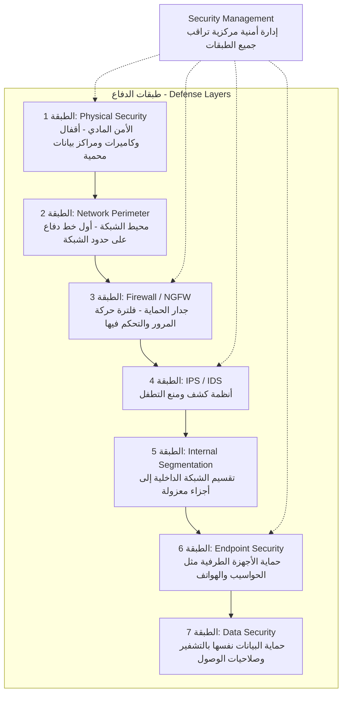

**مثال توضيحي:** تخيل أن شبكتك مثل قلعة محصنة:
- **Physical Security**: الأسوار الخارجية والبوابات المقفلة
- **Firewall**: الحراس على البوابة يفحصون هوية كل داخل
- **IPS**: دوريات داخل القلعة تبحث عن أي نشاط مشبوه
- **Endpoint Security**: حراسة شخصية لكل شخص مهم داخل القلعة

---

## 2. تطور Firewall والأساسيات

### 2.1 الجيل الأول: Packet Filtering Firewalls - جدران حماية تصفية الحزم

هذا هو أبسط أنواع جدران الحماية وأقدمها. يعمل على مستوى Layer 3 (طبقة الشبكة) و Layer 4 (طبقة النقل) فقط.

**آلية العمل:**

يفحص كل حزمة (Packet) بشكل مستقل عن غيرها، ويتخذ قرار السماح أو الرفض بناءً على معلومات محدودة:

| المعلومة المستخدمة | الشرح |
|---------------------|-------|
| Source IP Address | عنوان IP المصدر - من أين جاءت الحزمة |
| Destination IP Address | عنوان IP الوجهة - إلى أين تذهب الحزمة |
| Source Port | منفذ المصدر |
| Destination Port | منفذ الوجهة (مثل 80 للويب، 443 للـ HTTPS) |
| Protocol | نوع البروتوكول (TCP, UDP, ICMP) |

**مثال عملي: تكوين ACL بسيط**

```
Access-list 101 permit tcp 192.168.1.0 0.0.0.255 any eq 80
Access-list 101 permit tcp 192.168.1.0 0.0.0.255 any eq 443
Access-list 101 deny ip any any
```

**شرح كل سطر:**
- **السطر الأول:** اسمح لأي جهاز في الشبكة `192.168.1.0/24` بالاتصال بأي عنوان على المنفذ 80 (تصفح HTTP)
- **السطر الثاني:** اسمح لنفس الشبكة بالاتصال على المنفذ 443 (تصفح HTTPS)
- **السطر الثالث:** ارفض كل شيء آخر (قاعدة Implicit Deny)

**القيود والمشاكل:**

- لا يعرف هل الحزمة جزء من اتصال قائم أم لا (No State Awareness)
- لا يستطيع فحص محتوى البيانات داخل الحزمة (No Deep Inspection)
- يمكن خداعه بسهولة عن طريق IP Spoofing (تزييف عنوان المصدر)
- كل حزمة تُعامل بشكل منفصل تماماً، فلا يوجد "ذاكرة" للاتصالات السابقة

---

### 2.2 الجيل الثاني: Stateful Inspection Firewalls - جدران حماية فحص الحالة

هذا الجيل يحل المشكلة الأساسية للجيل الأول. بدلاً من فحص كل حزمة على حدة، يقوم بتتبع حالة كل اتصال (Connection State) في جدول يسمى **State Table**.

**الفكرة الجوهرية:**

عندما يبدأ جهاز داخلي اتصالاً بخادم خارجي، يسجل Firewall هذا الاتصال في جدول الحالة. وعندما يعود الرد من الخادم، يتحقق Firewall من أن هذا الرد ينتمي لاتصال مسموح به مسبقاً.

**حالات الاتصال المختلفة:**

| الحالة | المعنى | مثال |
|--------|--------|------|
| **NEW** | أول حزمة في اتصال جديد | حزمة SYN لبدء اتصال TCP |
| **ESTABLISHED** | الحزمة جزء من اتصال قائم ومعروف | حزم البيانات بعد اكتمال TCP Handshake |
| **RELATED** | الحزمة مرتبطة باتصال قائم لكنها ليست جزءاً مباشراً منه | قناة بيانات FTP Data Channel المرتبطة بقناة التحكم |
| **INVALID** | الحزمة لا تنتمي لأي اتصال معروف | حزمة مشبوهة ظهرت من العدم |

**مخطط يوضح كيف يعمل Stateful Inspection مع TCP Handshake:**

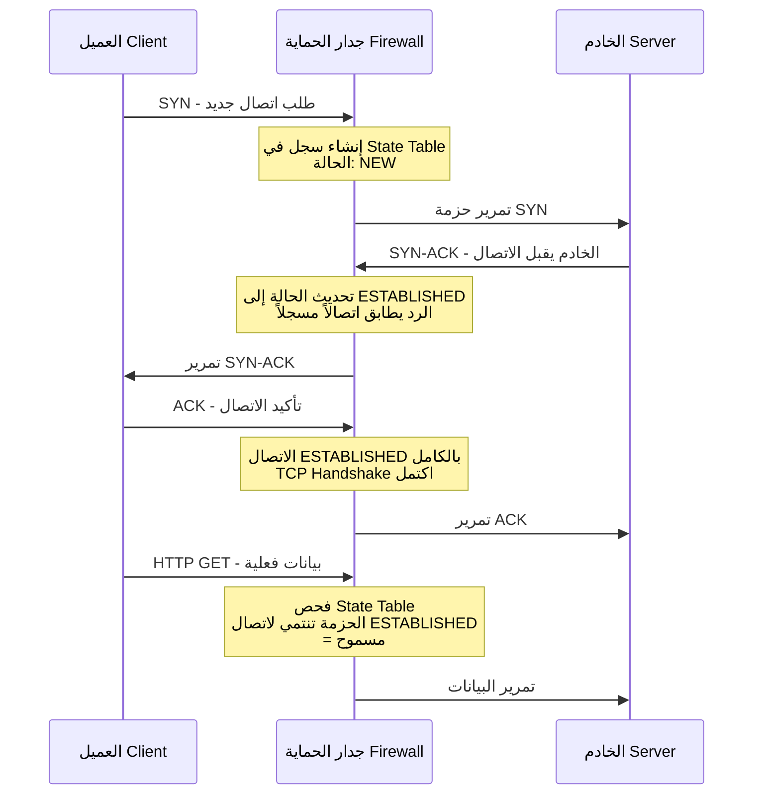

---

### تمرين عملي 2.1: تحليل Stateful Firewall

**السيناريو:** لديك Stateful Firewall بالقواعد التالية. حلل كل حزمة وقرر: هل يتم السماح بها أم رفضها؟

```
State Table في البداية: فارغ تماماً

القواعد:
1. السماح بحركة TCP الصادرة من 192.168.1.0/24 إلى أي وجهة على المنفذ 80 و 443
2. السماح بالاتصالات المصنفة ESTABLISHED أو RELATED
3. رفض كل شيء آخر
```

**حركة المرور المطلوب تحليلها:**

```
الحزمة 1: 192.168.1.10:50000 -> 93.184.216.34:80 [SYN]
الحزمة 2: 93.184.216.34:80 -> 192.168.1.10:50000 [SYN-ACK]
الحزمة 3: 192.168.1.10:50000 -> 93.184.216.34:80 [ACK]
الحزمة 4: 10.0.0.5:12345 -> 192.168.1.10:22 [SYN]
الحزمة 5: 192.168.1.10:50000 -> 93.184.216.34:80 [HTTP GET]
```

**الحل التفصيلي:**

| الحزمة | التحليل | القرار | السبب |
|--------|---------|--------|-------|
| **1** | جهاز من الشبكة `192.168.1.0/24` يبدأ اتصال TCP على المنفذ 80 | **ALLOW** | تطابق القاعدة 1 - اتصال NEW صادر مسموح به. يتم إنشاء سجل في State Table |
| **2** | رد من الخادم الخارجي إلى الجهاز الداخلي | **ALLOW** | الحزمة جزء من اتصال ESTABLISHED مسجل في State Table (القاعدة 2) |
| **3** | إكمال TCP Handshake | **ALLOW** | جزء من اتصال ESTABLISHED (القاعدة 2) |
| **4** | جهاز خارجي يحاول بدء اتصال SSH على المنفذ 22 مع جهاز داخلي | **DENY** | لا يطابق القاعدة 1 (ليس صادراً من الشبكة الداخلية على المنفذ 80/443) ولا يوجد سجل له في State Table. يتم تطبيق القاعدة 3 |
| **5** | طلب HTTP GET ضمن الاتصال القائم | **ALLOW** | جزء من اتصال ESTABLISHED (القاعدة 2) |

**الملاحظة المهمة:** الحزمة 4 هي محاولة اختراق نموذجية. جهاز من خارج الشبكة يحاول الاتصال بمنفذ SSH. الـ Stateful Firewall يرفضها لأنها لا تنتمي لأي اتصال بدأه جهاز داخلي.

---

### 2.3 الجيل الثالث: Application Layer Firewalls - جدران حماية طبقة التطبيقات

هذا الجيل يضيف قدرة فحص أعمق بكثير:

| القدرة | الشرح |
|--------|-------|
| **Deep Packet Inspection - DPI** | فحص محتوى الحزمة بالكامل وليس فقط الترويسة (Header) |
| **Application Protocol Awareness** | فهم بروتوكولات التطبيقات مثل HTTP و DNS و FTP |
| **Content Filtering** | تصفية المحتوى (مثل حجب مواقع معينة أو أنواع ملفات) |
| **User Authentication** | التحقق من هوية المستخدم قبل السماح بالمرور |

---

## 3. جدران الحماية من الجيل التالي (NGFW)

### 3.1 الميزات الأساسية لـ NGFW

الـ NGFW يمثل تطوراً جذرياً في مفهوم جدار الحماية. بدلاً من أن يكون مجرد "حارس بوابة" يفحص العناوين والمنافذ، أصبح نظاماً ذكياً يدمج عدة وظائف أمنية في جهاز واحد.

**مسار فحص حركة المرور في NGFW:**

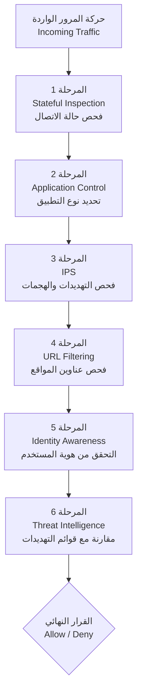

**النقطة المهمة:** حركة المرور تمر عبر جميع هذه المراحل بالتتابع. إذا فشلت في أي مرحلة، يتم رفضها فوراً دون الحاجة لإكمال باقي المراحل.

---

### 3.2 الوعي بالتطبيقات (Application Awareness)

**المشكلة التي يحلها:**

في الماضي، كان Firewall يعرف فقط أن هناك حركة مرور على المنفذ 80 (HTTP) أو المنفذ 443 (HTTPS). لكنه لا يعرف هل المستخدم يتصفح موقع الشركة أم يستخدم Facebook أم يشغل BitTorrent عبر نفس المنفذ.

**NGFW يحل هذه المشكلة بثلاث تقنيات:**

1. **Protocol Analysis**: تحليل بنية البروتوكول لتحديد التطبيق الحقيقي
2. **Behavioral Detection**: مراقبة سلوك الاتصال (نمط الحزم، حجمها، تواترها)
3. **Signature Matching**: مقارنة الحركة مع بصمات تطبيقات معروفة

**أمثلة على التطبيقات التي يمكن تحديدها:**

| الفئة | التطبيقات | المنفذ التقليدي | ملاحظة |
|-------|----------|----------------|--------|
| تصفح الويب | HTTP / HTTPS | 80 / 443 | أساسي |
| التواصل الاجتماعي | Facebook, Twitter, LinkedIn | 443 | يستخدم HTTPS |
| مشاركة الملفات | BitTorrent, Dropbox | متنوع | قد يستخدم أي منفذ |
| المكالمات | Skype, Zoom, Teams | متنوع | بروتوكولات خاصة |
| البريد | SMTP, IMAP, POP3 | 25, 143, 110 | قد يكون مشفراً |

---

### تمرين عملي 3.1: تصميم Application Control Policy

**السيناريو:** أنت مسؤول أمن الشبكة في شركة تضم 500 موظف. طُلب منك إنشاء سياسة تحكم في التطبيقات.

**المتطلبات:**
- السماح بتطبيقات العمل (Office 365, Salesforce)
- حظر التطبيقات عالية المخاطر (Torrent, أدوات Proxy)
- تقييد وسائل التواصل الاجتماعي بساعة واحدة يومياً
- حظر تطبيقات البث (Streaming) خلال ساعات العمل فقط (9 صباحاً - 5 مساءً)

**الحل:**

```
Policy Name: Corporate_Access_Control

Rule 1:
  Name: Allow_Business_Apps
  Action: Allow
  Applications: Office365, Salesforce, SAP
  Users: All_Employees
  Schedule: Always
  السبب: هذه تطبيقات ضرورية للعمل ويجب أن تكون متاحة دائماً

Rule 2:
  Name: Block_High_Risk
  Action: Block
  Applications: BitTorrent, TeamViewer, AnyDesk
  Users: All_Employees
  Schedule: Always
  السبب: تطبيقات عالية المخاطر قد تستخدم لنقل بيانات غير مصرح بها

Rule 3:
  Name: Limit_Social_Media
  Action: Allow with Quota
  Applications: Facebook, Twitter, LinkedIn
  Users: All_Employees
  Quota: 1 hour/day
  Schedule: Always
  السبب: السماح بالاستخدام المحدود للحفاظ على رضا الموظفين

Rule 4:
  Name: Block_Streaming_Business_Hours
  Action: Block
  Applications: Netflix, YouTube, Spotify
  Users: All_Employees
  Schedule: Business_Hours (Mon-Fri 09:00-17:00)
  السبب: توفير عرض النطاق الترددي (Bandwidth) لتطبيقات العمل
```

**ملاحظة مهمة حول ترتيب القواعد:** القواعد تُطبق من الأعلى إلى الأسفل (Top-Down). القاعدة الأولى التي تتطابق هي التي تُنفذ. لذلك يجب وضع القواعد الأكثر تحديداً أولاً.

---

### 3.3 الوعي بالهوية (Identity Awareness)

هذه ميزة ثورية في NGFW تغير طريقة كتابة السياسات بالكامل.

**المقارنة بين النهج التقليدي ونهج الهوية:**

| النهج التقليدي (IP-Based) | نهج الهوية (Identity-Based) |
|---------------------------|---------------------------|
| `Allow 192.168.1.0/24 to Server` | `Allow Finance_Group to Server` |
| ثابت وصعب الإدارة | ديناميكي ويتبع المستخدم |
| لا يوجد رؤية لمن يستخدم الشبكة | رؤية كاملة لهوية المستخدم |
| يتغير مع تغيير عنوان IP | يبقى ثابتاً بغض النظر عن IP |
| لا يعرف إذا انتقل المستخدم لمكتب آخر | يتبع المستخدم أينما ذهب |

**مثال عملي:**

لنفترض أن أحمد من قسم المالية (Finance) يعمل عادةً من مكتبه بعنوان IP `192.168.1.50`. في يوم ما، انتقل إلى قاعة الاجتماعات وحصل على عنوان IP جديد `192.168.2.75`.

- **النهج التقليدي:** أحمد يفقد الوصول لأن القاعدة مرتبطة بالعنوان `192.168.1.0/24`
- **نهج الهوية:** أحمد يحتفظ بصلاحياته لأن القاعدة مرتبطة بمجموعة `Finance_Group` وليس بعنوان IP

---

## 4. نظام Cisco Firepower Threat Defense (FTD)

### 4.1 نظرة عامة على البنية المعمارية

**ما هو FTD؟**

نظام FTD هو نظام التشغيل الذي طورته Cisco ليجمع بين قدرات جدار الحماية التقليدي ASA وقدرات Firepower المتقدمة في نظام واحد متكامل.

**المكونات التي يجمعها:**

| المكون | الوظيفة |
|--------|---------|
| **ASA Firewall Features** | فحص الحالة Stateful Inspection و NAT و VPN |
| **Firepower Services** | نظام IPS وكشف البرمجيات الخبيثة Malware Detection |
| **Advanced Malware Protection - AMP** | تحليل الملفات وكشف التهديدات المتقدمة |

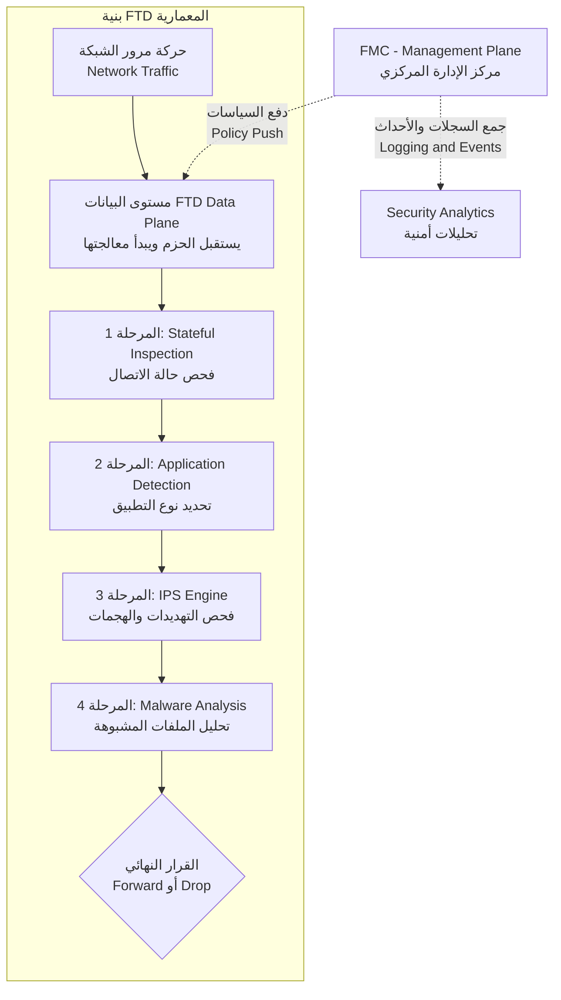

---

### 4.2 أوضاع النشر (Deployment Modes)

#### 4.2.1 وضع التوجيه (Routed Mode)

**الشرح:** في هذا الوضع، يعمل FTD كموجه (Router) في الطبقة الثالثة. كل واجهة (Interface) تحصل على عنوان IP خاص بها، ويقوم الجهاز بتوجيه الحزم بين الشبكات المختلفة.

**الخصائص الأساسية:**
- كل واجهة لها عنوان IP مختلف ومستوى أمان (Security Level) مختلف
- يقوم بـ NAT (ترجمة عناوين الشبكة) لإخفاء العناوين الداخلية
- يعمل كـ Default Gateway للأجهزة في الشبكة الداخلية

**مثال على الطوبولوجيا:**
```
Internet --- [WAN: 203.0.113.1] --- FTD --- [LAN: 192.168.1.1] --- الشبكة الداخلية
```

**مثال على التكوين:**
```
Interface Configuration:
  Outside:                          (الواجهة الخارجية - تتصل بالإنترنت)
    Name: outside
    IP: 203.0.113.1/29
    Security Level: 0               (أقل مستوى أمان - غير موثوقة)

  Inside:                           (الواجهة الداخلية - تتصل بالشبكة المحلية)
    Name: inside
    IP: 192.168.1.1/24
    Security Level: 100              (أعلى مستوى أمان - موثوقة)

NAT Configuration:
  object network INSIDE_NET
    subnet 192.168.1.0 255.255.255.0
    nat (inside,outside) dynamic interface
    (ترجمة جميع العناوين الداخلية إلى عنوان الواجهة الخارجية)
```

**متى تستخدم Routed Mode:**
- عند إنشاء شبكة جديدة من الصفر
- عندما تحتاج إلى NAT
- عندما يكون FTD هو البوابة الافتراضية للشبكة

---

#### 4.2.2 الوضع الشفاف (Transparent Mode)

**الشرح:** في هذا الوضع، يعمل FTD كجسر (Bridge) في الطبقة الثانية. لا يغير أي شيء في عناوين IP للحزم المارة. الأجهزة في الشبكة لا تعرف حتى بوجوده.

**لماذا يسمى "Bump in the Wire"؟**

لأنه مثل وضع عقبة صغيرة في السلك - الحزم تمر من خلاله ويفحصها، لكنه لا يغير مسارها أو عناوينها.

**مثال على الطوبولوجيا:**
```
Router --- [VLAN 10] --- FTD --- [VLAN 10] --- Switch --- الشبكة الداخلية
192.168.1.1              (شفاف - لا عنوان IP)           192.168.1.0/24
```

**متى تستخدم Transparent Mode:**
- عندما تريد إضافة حماية لشبكة موجودة بدون تغيير تصميمها
- عندما يكون تغيير عناوين IP مكلفاً أو معقداً
- لأغراض المراقبة والتدقيق (Compliance)

---

### تمرين عملي 4.1: اختيار وضع النشر المناسب

**لكل سيناريو، حدد الوضع المناسب (Routed أم Transparent) مع تبرير اختيارك:**

| السيناريو | الإجابة | التبرير |
|-----------|---------|---------|
| **أ:** فرع جديد للشركة باتصال إنترنت مخصص | **Routed Mode** | نحتاج NAT و Default Gateway لأن الشبكة جديدة |
| **ب:** مركز بيانات قائم بتوجيه معقد ولا نريد تغيير أي شيء | **Transparent Mode** | تجنب إعادة تكوين الشبكة بالكامل |
| **ج:** نريد فصل منطقة DMZ بشبكة فرعية مختلفة | **Routed Mode** | نحتاج واجهات بعناوين IP مختلفة لكل منطقة أمنية |

---

### 4.3 مركز إدارة Firepower (FMC)

**ما هو FMC؟**

هو "الدماغ المركزي" الذي يتحكم في جميع أجهزة FTD في الشبكة. بدلاً من تكوين كل جهاز FTD على حدة، تقوم بكل شيء من مكان واحد.

**وظائف FMC:**

| الوظيفة | الشرح |
|---------|-------|
| **Centralized Policy Management** | إدارة جميع السياسات من مكان واحد |
| **Device Configuration** | تكوين أجهزة FTD عن بعد |
| **Event Monitoring and Analysis** | مراقبة الأحداث الأمنية وتحليلها في الوقت الفعلي |
| **Reporting and Compliance** | إنشاء تقارير للامتثال والتدقيق |

**الكائنات التي يديرها FMC:**

| الكائن | الوظيفة |
|--------|---------|
| **Access Control Policy - ACP** | سياسات التحكم في الوصول (من يصل إلى ماذا) |
| **Network Analysis Policy - NAP** | سياسات تحليل الشبكة |
| **Intrusion Policy** | سياسات كشف ومنع التطفل |
| **File and Malware Policy** | سياسات فحص الملفات والبرمجيات الخبيثة |
| **DNS Policy** | سياسات التحكم في استعلامات DNS |

---

### تمرين عملي 4.2: تكوين Access Control Policy في FMC

**المهمة:** إنشاء سياسة أساسية تسمح للشبكة الداخلية بالوصول إلى خوادم الويب.

**الخطوة 1 - إنشاء السياسة:**
```
Policy Name: Corporate_ACP
Default Action: Block all traffic
(افتراضياً: حجب كل شيء - ثم نسمح بما نحتاجه فقط - مبدأ Least Privilege)
```

**الخطوة 2 - إنشاء Network Objects:**
```
Object Name: Internal_Network
Type: Network
Value: 192.168.1.0/24
(يمثل الشبكة الداخلية بالكامل)

Object Name: Web_Servers
Type: Network
Value: 10.0.0.0/24
(يمثل شبكة خوادم الويب)
```

**الخطوة 3 - إنشاء قاعدة الوصول:**
```
Rule Name: Allow_Internal_to_Web
Source: Internal_Network
Destination: Web_Servers
Services: TCP/80, TCP/443
Action: Allow
Logging: Enable
(السماح للشبكة الداخلية بالوصول لخوادم الويب على HTTP و HTTPS فقط)
```

**لماذا نفعل Logging: Enable؟**
لتسجيل كل اتصال يمر عبر هذه القاعدة. هذا مهم للمراقبة الأمنية واستكشاف الأخطاء والامتثال للمعايير.

---

## 5. أنظمة منع التطفل (IPS)

### 5.1 الفرق بين IDS و IPS

هذان نظامان مختلفان في آلية العمل رغم تشابه الهدف:

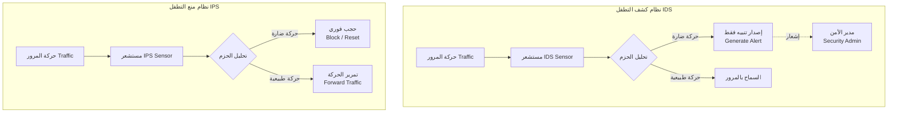

**جدول المقارنة التفصيلي:**

| الميزة | IDS | IPS |
|--------|-----|-----|
| **الموضع في الشبكة** | خارج مسار البيانات - Out-of-band (يستقبل نسخة عبر SPAN Port) | داخل مسار البيانات - Inline (الحزم تمر من خلاله) |
| **الإجراء عند اكتشاف تهديد** | تنبيه فقط (Alert) - لا يوقف الهجوم | حجب فوري (Block) أو إعادة تعيين الاتصال (Reset) |
| **التأثير على الأداء** | لا يؤثر على سرعة الشبكة إطلاقاً | يضيف تأخيراً طفيفاً (عادةً أقل من 1 مللي ثانية) |
| **تأثير False Positives** | لا يؤثر على الخدمة (تنبيه خاطئ فقط) | قد يحجب حركة مرور مشروعة بالخطأ |
| **حالة الاستخدام** | المراقبة والتحليل الجنائي (Forensics) | الحماية الفورية والنشطة |

**تشبيه مبسط:**
- **IDS** مثل كاميرا المراقبة: ترى السارق وتسجله، لكنها لا توقفه
- **IPS** مثل حارس الأمن: يرى السارق ويمسك به فوراً

---

### 5.2 آليات الكشف (Detection Methods)

#### 5.2.1 الكشف المبني على التواقيع (Signature-Based Detection)

**المفهوم:**

يعمل مثل برنامج مكافحة الفيروسات تماماً. لديه قاعدة بيانات ضخمة تحتوي على "بصمات" (Signatures) لهجمات معروفة. يقارن كل حزمة مع هذه البصمات، وإذا تطابقت يتخذ الإجراء المناسب.

**مكونات التوقيع الواحد:**

| المكون | الوظيفة | مثال |
|--------|---------|------|
| **Signature ID** | معرف فريد للتوقيع | 1001 |
| **Name** | اسم وصفي للهجوم | SQL Injection Attempt |
| **Severity** | درجة الخطورة | Critical, High, Medium, Low |
| **Protocol** | البروتوكول المستهدف | TCP, UDP, ICMP |
| **Pattern** | النمط المطلوب مطابقته | تسلسل بايتات محدد أو Regular Expression |
| **Action** | الإجراء عند المطابقة | Alert, Block, Reset |

**أمثلة على تواقيع حقيقية:**

```
Signature ID: 1001
Name: SQL Injection Attempt
Protocol: TCP
Port: Any
Pattern: "UNION SELECT" OR "1=1" OR "DROP TABLE"
Severity: High
Action: Block and Alert
الشرح: يكتشف محاولات حقن SQL في طلبات HTTP

Signature ID: 1002
Name: XSS Attack
Protocol: TCP
Port: 80, 443
Pattern: "<script>" OR "javascript:"
Severity: Medium
Action: Alert
الشرح: يكتشف محاولات Cross-Site Scripting

Signature ID: 1003
Name: Buffer Overflow Attempt
Protocol: TCP
Pattern: NOP sled (0x90909090)
Severity: Critical
Action: Block and Reset
الشرح: يكتشف محاولات Buffer Overflow عبر كشف NOP Sled
```

---

### تمرين عملي 5.1: تحليل التواقيع (Signature Analysis)

**المطلوب:** حلل الحزم التالية وحدد التوقيع المطابق والإجراء المناسب.

**الحزمة 1:**
```
HTTP Request:
GET /search?q=test' UNION SELECT username,password FROM users--
Host: example.com
```

**التحليل:**
- **النمط المكتشف:** الكلمات `UNION SELECT` و `FROM users` في عنوان URL
- **التوقيع المطابق:** SQL Injection Attempt (ID: 1001)
- **الخطورة:** High
- **الإجراء:** Block - لأن هذا هجوم SQL Injection واضح يحاول سحب أسماء المستخدمين وكلمات المرور من قاعدة البيانات

**الحزمة 2:**
```
HTTP Request:
GET /page?name=<script>alert('XSS')</script>
Host: example.com
```

**التحليل:**
- **النمط المكتشف:** وسم `<script>` داخل معامل URL
- **التوقيع المطابق:** XSS Attack (ID: 1002)
- **الخطورة:** Medium
- **الإجراء:** Alert - لأن هذا هجوم Cross-Site Scripting يحاول تنفيذ كود JavaScript في متصفح الضحية

---

#### 5.2.2 الكشف المبني على السلوك والشذوذ (Anomaly-Based Detection)

**المفهوم:**

بدلاً من البحث عن هجمات معروفة، يقوم النظام بتعلم "السلوك الطبيعي" للشبكة (Baseline) ثم يبحث عن أي انحراف عن هذا السلوك.

**تقنيات الكشف:**

| التقنية | ماذا تراقب | مثال |
|---------|-----------|------|
| **Statistical Anomaly Detection** | حجم حركة المرور ومعدل الاتصالات | ارتفاع مفاجئ في عدد الاتصالات |
| **Behavioral Analysis** | أنماط سلوك المستخدمين والتطبيقات | مستخدم يعمل في الساعة 3 صباحاً بشكل غير معتاد |
| **Protocol Anomaly Detection** | مدى التزام الحزم بمعايير RFC | حزمة TCP بأعلام (Flags) غير منطقية |

**أمثلة على قواعد كشف الشذوذ:**

```
Rule 1: DDoS Detection
  الشرط: أكثر من 10,000 اتصال في الثانية من عنوان IP واحد
  الإجراء: Block source IP
  الخطورة: Critical
  الشرح: هذا المعدل غير طبيعي ويشير إلى هجوم حجب خدمة

Rule 2: Port Scanning Detection
  الشرط: محاولة الوصول لأكثر من 50 منفذ خلال 60 ثانية
  الإجراء: Block and Alert
  الخطورة: High
  الشرح: مسح المنافذ عادةً يسبق هجوماً فعلياً

Rule 3: Data Exfiltration Detection
  الشرط: حركة مرور صادرة تتجاوز 100 MB خلال 5 دقائق
  الإجراء: Alert
  الخطورة: Medium
  الشرح: قد يشير إلى تسريب بيانات
```

---

### تمرين عملي 5.2: سيناريو كشف الشذوذ

**السيناريو:** خط الأساس (Baseline) لشبكتك يظهر:

| المقياس | القيمة الطبيعية |
|---------|----------------|
| متوسط الاتصالات لكل جهاز | 50 اتصال في الساعة |
| متوسط البيانات الصادرة | 10 MB في الساعة |
| ساعات العمل الطبيعية | 8 صباحاً - 6 مساءً |

**النشاط المكتشف:**
```
Host: 192.168.1.100
Time: 2:00 AM (الساعة الثانية صباحاً)
Connections: 5,000 خلال ساعة واحدة
Outbound Data: 500 MB خلال ساعة واحدة
Destination: عناوين IP خارجية متعددة ومتنوعة
```

**التحليل التفصيلي:**

| نوع الشذوذ | القيمة الطبيعية | القيمة المكتشفة | نسبة الانحراف |
|-----------|----------------|----------------|--------------|
| **التوقيت** | 8 صباحاً - 6 مساءً | الساعة 2 صباحاً | خارج ساعات العمل تماماً |
| **عدد الاتصالات** | 50 في الساعة | 5,000 في الساعة | **100 ضعف** المعدل الطبيعي |
| **حجم البيانات الصادرة** | 10 MB في الساعة | 500 MB في الساعة | **50 ضعف** المعدل الطبيعي |
| **الوجهات** | عدد محدود ومعروف | وجهات متعددة وغير معروفة | سلوك غير طبيعي |

**الاستنتاج:** احتمال كبير جداً أن الجهاز مخترق (Compromised) ويقوم بتسريب بيانات (Data Exfiltration). الإجراء الموصى به: عزل الجهاز فوراً والبدء بالتحقيق.

---

### 5.3 أوضاع عمل IPS

#### 5.3.1 الوضع المباشر (Inline Mode)

حركة المرور تمر فعلياً عبر جهاز IPS. يستطيع حجب أي حزمة قبل أن تصل لوجهتها.

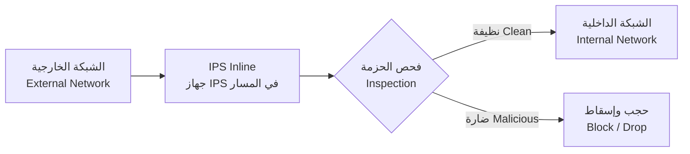

| المزايا | العيوب |
|---------|--------|
| منع فوري للتهديدات | نقطة فشل أحادية (يحتاج HA) |
| يمكنه إعادة تعيين الاتصالات (TCP Reset) | قد يصبح عنق زجاجة في الأداء |
| يمنع نجاح الهجوم بالكامل | False Positives تحجب حركة مشروعة |

#### 5.3.2 الوضع السامع (Promiscuous Mode)

يستقبل نسخة من حركة المرور عبر SPAN Port. لا يستطيع حجب الحزم مباشرةً.

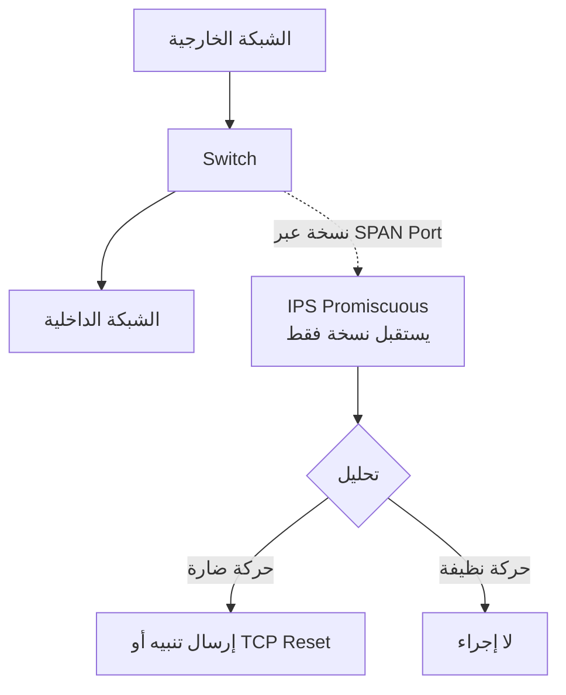

| المزايا | العيوب |
|---------|--------|
| لا يؤثر على أداء الشبكة إطلاقاً | لا يمنع الهجوم الأول |
| ليس نقطة فشل أحادية | استجابة متأخرة |
| سهل النشر والتركيب | قد يفقد حزماً مجزأة (Fragmented) |

---

### تمرين عملي 5.3: اختيار الوضع المناسب

| السيناريو | المتطلب | الإجابة | السبب |
|-----------|---------|---------|-------|
| شبكة تداول مالي | صفر تأخير في الأداء | **Promiscuous Mode** | لا يمكن تحمل أي تأخير مهما كان طفيفاً - كل مللي ثانية تساوي أموالاً |
| خوادم ويب مواجهة للإنترنت | أقصى درجات الحماية | **Inline Mode** | نحتاج حجب الهجمات فوراً قبل وصولها للخوادم |
| شبكة أنظمة قديمة (Legacy) | أقل تأثير ممكن على الشبكة | **Promiscuous Mode** | لا نستطيع تغيير تصميم الشبكة القديمة |

---

### 5.4 ضبط تواقيع IPS (Signature Tuning)

**لماذا نحتاج ضبط التواقيع؟**

عند تفعيل IPS لأول مرة بالإعدادات الافتراضية، ستحصل على عدد كبير جداً من التنبيهات الكاذبة (False Positives). الضبط يهدف إلى تقليل هذه التنبيهات مع الحفاظ على مستوى الحماية.

**حالات التوقيع:**

| الحالة | المعنى |
|--------|--------|
| **Enabled** | التوقيع نشط ويعمل |
| **Disabled** | التوقيع معطل مؤقتاً |
| **Retired** | التوقيع أزيل من السياسة نهائياً |

**عملية الضبط التدريجية:**

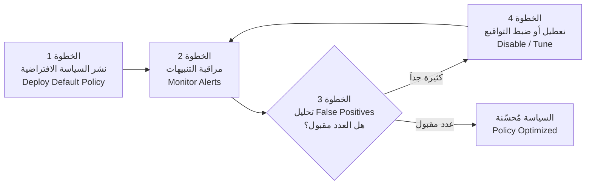

**أفضل الممارسات لضبط IPS:**

| الترتيب | الخطوة | الشرح |
|---------|--------|-------|
| 1 | ابدأ بسياسة "Connectivity over Security" | اعطِ الأولوية لاستمرارية الخدمة |
| 2 | فعّل التواقيع في وضع Alert-only أولاً | تنبيه فقط بدون حجب |
| 3 | راقب لمدة 2-4 أسابيع | اجمع بيانات كافية عن False Positives |
| 4 | اضبط التواقيع المسببة لتنبيهات كاذبة | عطّل ما لا يناسب بيئتك |
| 5 | فعّل الحجب (Block) للتواقيع المعتمدة | بعد التأكد من دقتها |
| 6 | حدّث التواقيع بانتظام | تواقيع جديدة لتهديدات جديدة |

---

## 6. الاستخبارات الأمنية (Security Intelligence)

### 6.1 المفهوم العام

**ما هي Security Intelligence؟**

هي ميزة تسمح لجدار الحماية بالاستفادة من معلومات تهديدات محدثة في الوقت الفعلي. بدلاً من الاعتماد فقط على القواعد التي كتبتها أنت، يستعين النظام بقوائم عالمية تحتوي على عناوين IP ومواقع URL ونطاقات (Domains) معروفة بأنها خبيثة.

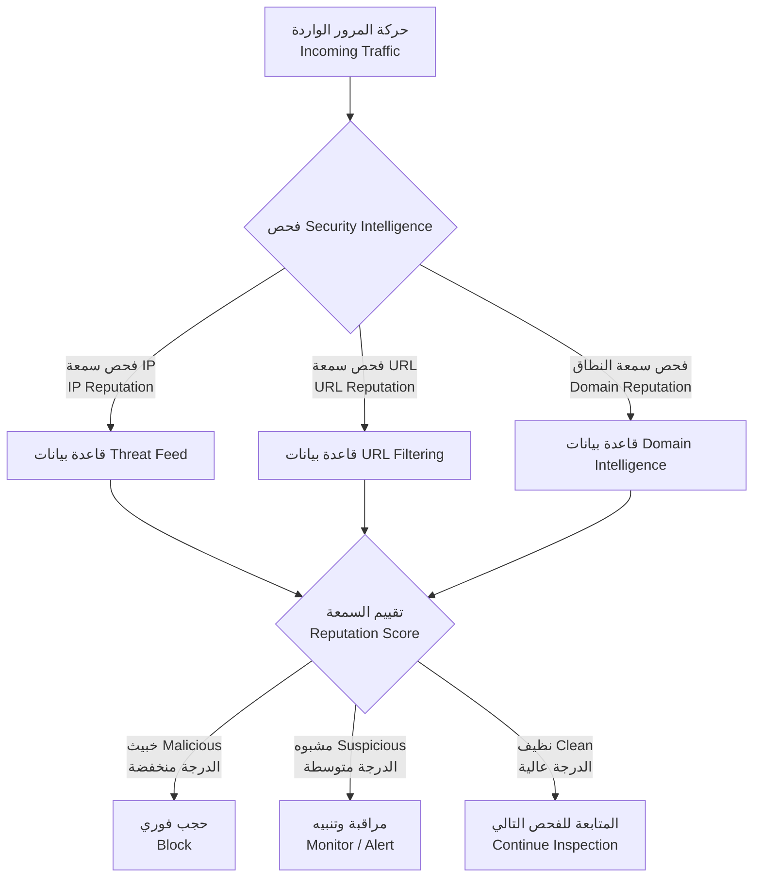

---

### 6.2 أنواع مصادر الاستخبارات (Intelligence Feed Types)

**1. IP Reputation Feeds - مصادر سمعة عناوين IP:**

| ما تحتويه | الشرح |
|-----------|-------|
| عناوين IP خبيثة معروفة | مصادر هجمات مؤكدة |
| خوادم التحكم Botnet C2 Servers | خوادم تتحكم في شبكات البوتات |
| مصادر البريد العشوائي Spam | مرسلي البريد المزعج |
| أجهزة المسح Scanning Hosts | أجهزة تقوم بمسح الشبكات بحثاً عن ثغرات |

**2. URL Reputation Feeds - مصادر سمعة عناوين المواقع:**

| ما تحتويه | الشرح |
|-----------|-------|
| مواقع توزيع البرمجيات الخبيثة | مواقع تنشر Malware |
| مواقع التصيد Phishing | مواقع تنتحل هوية مواقع أخرى لسرقة البيانات |
| نطاقات C2 | نطاقات تستخدم للتحكم بالأجهزة المخترقة |
| مواقع تعدين العملات الرقمية Cryptomining | مواقع تستغل موارد المستخدم للتعدين |

**3. Domain Reputation - سمعة النطاقات:**

| ما تحتويه | الشرح |
|-----------|-------|
| نطاقات مسجلة حديثاً | النطاقات الجديدة مشبوهة لأن المهاجمين يسجلون نطاقات جديدة باستمرار |
| نطاقات Dynamic DNS | تستخدم كثيراً في الهجمات لأنها تتغير بسرعة |
| نطاقات خبيثة معروفة | نطاقات ثبت استخدامها في هجمات |

---

### 6.3 أنواع الإجراءات (Action Types)

| الإجراء | الوصف | متى يُستخدم |
|---------|-------|-------------|
| **Block** | رفض الاتصال فوراً | مصادر خبيثة مؤكدة |
| **Allow** | السماح رغم وجوده في القائمة | تجاوز لـ False Positive أو شريك موثوق |
| **Monitor** | السماح مع التسجيل والتنبيه | مشبوه لكن غير مؤكد |
| **Interactive Block** | حجب مع إشعار المستخدم | انتهاكات السياسة الداخلية |

---

### تمرين عملي 6.1: تكوين سياسة Security Intelligence

**السيناريو:** أنت تقوم بتكوين سياسة Security Intelligence لشركتك.

```
Policy: Corporate_SI_Policy

حركة المرور الواردة (Inbound Traffic):
  سمعة IP المصدر:
    الدرجة < 30 (خبيث Malicious): Block
    الدرجة 30-60 (مشبوه Suspicious): Monitor
    الدرجة > 60 (نظيف Clean): Allow

  سمعة URL:
    الفئة: Malware, Phishing -> Block (حجب دائم)
    الفئة: Gambling, Adult -> Block خلال ساعات العمل فقط
    الفئة: Social Media -> Monitor (مراقبة فقط)

حركة المرور الصادرة (Outbound Traffic):
  سمعة IP الوجهة:
    الدرجة < 30: Block and Alert
    الدرجة 30-60: Monitor

  استعلامات DNS:
    فحص ضد قائمة النطاقات الخبيثة
    حجب نطاقات C2 المعروفة

الاستثناءات (Exclusions):
  - عنوان IP الشريك: 203.0.113.50 -> Allow بغض النظر عن السمعة
  - خادم DNS الداخلي: 192.168.1.10 -> تجاوز فحص SI
```

---

### 6.4 إنشاء مصادر استخبارات مخصصة (Custom Intelligence Feeds)

**متى تحتاج مصدراً مخصصاً؟**

عندما تكتشف تهديداً خاصاً بشبكتك لم تغطيه المصادر الخارجية بعد، أو عندما تريد حجب عناوين محددة لأسباب تتعلق بسياسة الشركة.

```
Feed Name: Internal_Blacklist
Type: IP Address List
Update Frequency: Manual
Format: CSV

المحتوى:
192.168.100.50,Compromised_Host,2024-01-15
10.0.0.100,Policy_Violator,2024-01-14
203.0.113.99,Scanner,2024-01-13

Action: Block
```

---

### تمرين عملي 6.2: الاستجابة للحوادث باستخدام Security Intelligence

**السيناريو:** فريق الأمن اكتشف تهديداً جديداً.

**تفاصيل الحادثة:**
```
عنوان IP الخبيث: 198.51.100.77
نوع النشاط: اتصال C2 (Command and Control)
الأجهزة المتأثرة: 192.168.1.50 و 192.168.1.75
```

**خطوات الاستجابة المنهجية:**

| المرحلة | الخطوة | الإجراء |
|---------|--------|---------|
| **1. الإجراء الفوري** | إضافة للقائمة السوداء | إضافة `198.51.100.77` إلى SI Block List مع وصف "C2 Server" |
| **2. التحقيق** | البحث في السجلات | البحث في سجلات FMC عن جميع الاتصالات بالعنوان `198.51.100.77` وتحديد جميع الأجهزة التي تواصلت معه والتحقق من وجود تسريب بيانات |
| **3. الاحتواء** | عزل الأجهزة المصابة | عزل الجهازين `192.168.1.50` و `192.168.1.75` عن الشبكة وحجب كل حركة المرور الصادرة منهما باستثناء أدوات الأمن |
| **4. الإزالة** | تنظيف الأجهزة | فحص الأجهزة المصابة بحثاً عن Malware وإزالة البرمجيات الخبيثة وإعادة تعيين كلمات المرور |
| **5. الاستعادة** | العودة للعمل | الاستعادة من نسخة احتياطية نظيفة إذا لزم الأمر وإعادة تفعيل الوصول للشبكة بعد التحقق |

---

## 7. التكامل مع الهوية عبر Cisco ISE

### 7.1 نظرة عامة على Cisco ISE

**ما هو Cisco ISE؟**

هو محرك خدمات الهوية (Identity Services Engine) الذي يدير من يدخل شبكتك ويحدد ماذا يُسمح له بفعله. يعمل كنقطة مركزية للتحقق من الهويات وتطبيق السياسات.

**الوظائف الرئيسية:**

| الوظيفة | الشرح |
|---------|-------|
| **Centralized Identity Management** | إدارة مركزية لجميع هويات المستخدمين والأجهزة |
| **Policy Enforcement** | تطبيق السياسات الأمنية بناءً على الهوية |
| **Network Access Control** | التحكم في من يصل للشبكة |
| **Guest Management** | إدارة وصول الضيوف |
| **Device Profiling** | تحديد نوع الجهاز المتصل وتصنيفه |

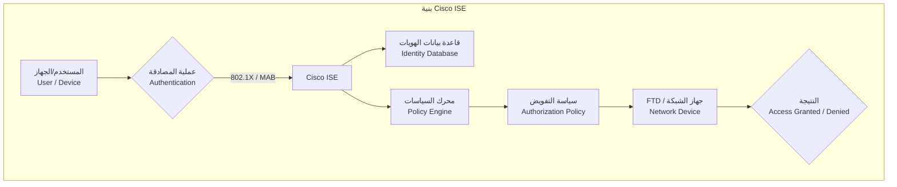

---

### 7.2 طرق المصادقة (Authentication Methods)

| الطريقة | آلية العمل | متطلبات الجهاز | مستوى الأمان |
|---------|-----------|----------------|-------------|
| **802.1X** | بروتوكول EAP للمصادقة عبر الشبكة | يحتاج Supplicant (برنامج مصادقة) على الجهاز | عالي جداً |
| **MAB (MAC Authentication Bypass)** | مصادقة بناءً على عنوان MAC | لا يحتاج برنامجاً - يستخدم MAC Address | متوسط (يمكن تزييف MAC) |
| **Web Authentication** | بوابة تسجيل دخول عبر المتصفح (Captive Portal) | يحتاج متصفح ويب فقط | متوسط |

**متى تستخدم كل طريقة:**
- **802.1X**: للحواسيب المُدارة (Corporate Laptops) والأجهزة التي تدعم المصادقة
- **MAB**: للطابعات والكاميرات وأجهزة IoT التي لا تدعم 802.1X
- **Web Authentication**: للضيوف والزوار الذين يحتاجون وصولاً مؤقتاً

---

### 7.3 السياسات القائمة على المجموعات (Group-Based Policy)

**المشكلة مع النهج التقليدي:**

```
النهج التقليدي (IP-Based):
  Rule 1: Allow 192.168.1.0/24 to 10.0.0.0/24
  Rule 2: Allow 192.168.2.0/24 to 10.0.0.0/24
  Rule 3: Deny all

المشكلة: المستخدمون ينتقلون، عناوين IP تتغير، السياسات تتعطل!
```

**الحل مع نهج الهوية:**

```
النهج المبني على الهوية (Identity-Based):
  Rule 1: Allow Finance_Group to Finance_Servers
  Rule 2: Allow HR_Group to HR_Applications
  Rule 3: Allow All_Employees to Internet (filtered)
  Rule 4: Deny all

الميزة: السياسة تتبع المستخدم أينما ذهب بغض النظر عن عنوان IP
```

---

### تمرين عملي 7.1: تصميم سياسة قائمة على الهوية

**السيناريو:** صمم سياسات وصول لشركة بالأقسام التالية:

| القسم | عدد المستخدمين | الموارد التي يحتاجها |
|-------|---------------|---------------------|
| Finance - المالية | 50 | Finance_Server (10.0.1.0/24) + الإنترنت |
| HR - الموارد البشرية | 20 | HR_System (10.0.2.0/24) + الإنترنت |
| Engineering - الهندسة | 200 | Dev_Servers (10.0.3.0/24) + الإنترنت |
| Sales - المبيعات | 100 | الإنترنت فقط |
| **الجميع** | 370 | حظر وسائل التواصل خلال العمل |

**الحل الكامل:**

```
Identity Groups (مجموعات الهوية):
  - Finance_Users
  - HR_Users
  - Engineering_Users
  - Sales_Users

Network Resources (موارد الشبكة):
  - Finance_Server: 10.0.1.0/24
  - HR_System: 10.0.2.0/24
  - Dev_Servers: 10.0.3.0/24

Access Policies (سياسات الوصول):

Rule 1:
  Name: Finance_Access
  Identity: Finance_Users
  Resource: Finance_Server
  Action: Allow
  Schedule: Always
  الشرح: السماح لقسم المالية بالوصول لخوادم المالية

Rule 2:
  Name: HR_Access
  Identity: HR_Users
  Resource: HR_System
  Action: Allow
  Schedule: Always
  الشرح: السماح لقسم HR بالوصول لأنظمة الموارد البشرية

Rule 3:
  Name: Engineering_Access
  Identity: Engineering_Users
  Resource: Dev_Servers
  Action: Allow
  Schedule: Always
  الشرح: السماح للمهندسين بالوصول لخوادم التطوير

Rule 4:
  Name: Internet_Access
  Identity: All_Employees
  Resource: Internet
  Action: Allow
  URL Filtering: Enabled
  الشرح: السماح لجميع الموظفين بالوصول للإنترنت مع تصفية المحتوى

Rule 5:
  Name: Block_Social_Media_Work_Hours
  Identity: All_Employees
  Resource: Social_Media_Category
  Action: Block
  Schedule: Mon-Fri 09:00-17:00
  الشرح: حظر وسائل التواصل خلال ساعات العمل

Rule 6:
  Name: Default_Deny
  Identity: Any
  Resource: Any
  Action: Deny
  الشرح: رفض كل ما لم يُسمح به صراحةً (مبدأ Least Privilege)
```

**ملاحظة مهمة حول ترتيب القواعد:** القاعدة 5 يجب أن تكون قبل القاعدة 4 لأنها أكثر تحديداً. إذا وضعنا القاعدة 4 أولاً، سيُسمح بوسائل التواصل ضمن "Internet" قبل أن نصل للقاعدة 5.

---

### 7.4 تكامل ISE مع FTD

**كيف يعمل التكامل:**

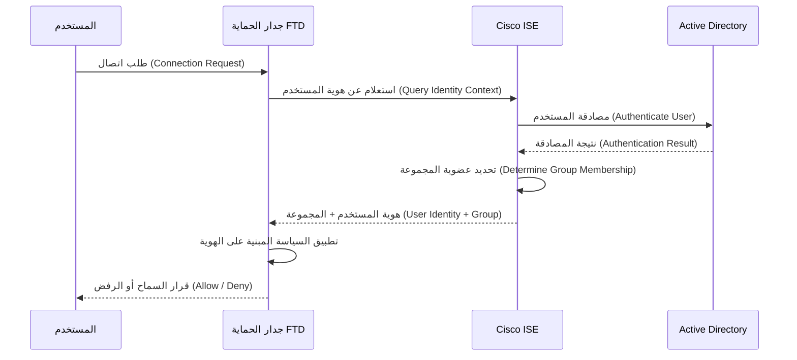

**خطوات التكوين:**

**الخطوة 1 - تسجيل ISE كمصدر هوية في FMC:**
```
FMC > Objects > Identity Sources
Add ISE Server:
  Name: Corporate_ISE
  IP: 10.0.0.100
  Shared Secret: ********
```

**الخطوة 2 - إنشاء مجموعات الهوية:**
```
FMC > Objects > Identity Groups
  - Finance_Group
  - HR_Group
  - Engineering_Group
```

**الخطوة 3 - ربط مجموعات ISE بمجموعات FTD:**
```
ISE_Group: Finance_Users   ->  FTD_Group: Finance_Group
ISE_Group: HR_Users         ->  FTD_Group: HR_Group
ISE_Group: Engineering_Users -> FTD_Group: Engineering_Group
```

---

### تمرين عملي 7.2: استكشاف أخطاء سياسة الهوية

**المشكلة:** مستخدم من قسم المالية (Finance) لا يستطيع الوصول إلى Finance_Server.

**خطوات استكشاف الأخطاء بالترتيب:**

| الخطوة | ماذا تفحص | أين تفحص | ماذا تبحث عنه |
|--------|----------|----------|---------------|
| **1** | هل المستخدم مصادق بنجاح؟ | ISE Live Logs | حالة المصادقة: Success أو Failure |
| **2** | هل المستخدم في المجموعة الصحيحة؟ | ISE > User Details | عضوية المجموعة: Finance_Users |
| **3** | هل المجموعة مربوطة بشكل صحيح؟ | FMC > Identity Groups | Finance_Users مربوطة بـ Finance_Group |
| **4** | هل قاعدة الوصول موجودة؟ | FMC > Access Control Policy | قاعدة Finance_Access موجودة وفعالة |
| **5** | هل ترتيب القواعد صحيح؟ | FMC > ACP Rule Order | تأكد أن قاعدة أعلى لا تحجب المستخدم |
| **6** | فحص السجلات | FMC > Analysis > Connections | ابحث عن محاولة الاتصال وأي قاعدة طُبقت عليها |

**الأخطاء الشائعة:**

- المجموعة غير مربوطة بشكل صحيح بين ISE و FTD
- ترتيب القواعد خاطئ (قاعدة Deny تسبق قاعدة Allow)
- قيد زمني (Schedule) يمنع الوصول في هذا الوقت
- كائن الشبكة (Network Object) لـ Finance_Server معرّف بشكل خاطئ

---

## 8. التوفر العالي (High Availability - HA)

### 8.1 لماذا نحتاج High Availability

**المشكلة:**

جدار الحماية هو نقطة مرور إجبارية لكل حركة المرور. إذا تعطل، تتوقف الشبكة بالكامل. هذا ما يسمى **Single Point of Failure** (نقطة الفشل الأحادية).

**الحل:**

استخدام جهازين (أو أكثر) يعملان معاً بحيث إذا تعطل أحدهما يتولى الآخر فوراً.

**أهداف HA:**

| الهدف | الشرح |
|-------|-------|
| **إزالة نقطة الفشل الأحادية** | لا يوجد مكون واحد يوقف كل شيء عند تعطله |
| **استمرارية الخدمة** | الحفاظ على عمل الشبكة أثناء أعطال الأجهزة |
| **الصيانة بدون توقف** | تحديث جهاز بينما الآخر يعمل |

---

### 8.2 وضع Active/Standby

**المفهوم:**

جهاز واحد نشط (Active) يعالج كل حركة المرور. الجهاز الثاني في وضع الاستعداد (Standby) يراقب الجهاز النشط ويستقبل نسخة مستمرة من جدول الحالة (State Table). عند فشل الجهاز النشط، يتولى الجهاز الاحتياطي العمل فوراً.

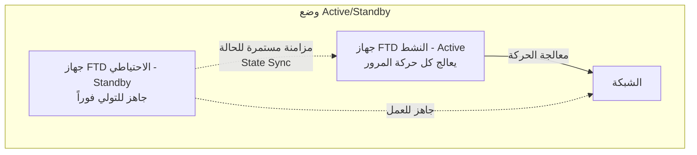

**تسلسل عملية Failover بالتفصيل:**

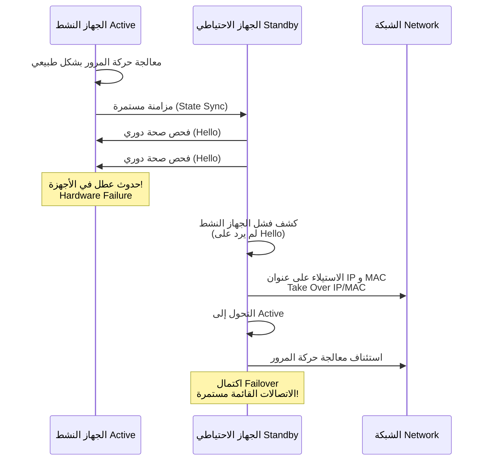

**النقطة الأهم:** بفضل State Synchronization، الاتصالات القائمة (مثل جلسة تصفح أو مكالمة VoIP) لا تنقطع عند حدوث Failover.

**مثال على التكوين:**

```
الجهاز الأساسي (Primary FTD):
  failover lan unit primary
  failover lan interface failover GigabitEthernet0/0
  failover link failover GigabitEthernet0/0
  failover interface ip failover 192.168.100.1 255.255.255.0 standby 192.168.100.2

الجهاز الثانوي (Secondary FTD):
  failover lan unit secondary
  failover lan interface failover GigabitEthernet0/0
  failover link failover GigabitEthernet0/0
  failover interface ip failover 192.168.100.2 255.255.255.0 standby 192.168.100.1
```

**ما الذي يسبب Failover؟**

| السبب | الشرح |
|-------|-------|
| Hardware Failure | عطل في المعالج أو الذاكرة أو مكون مادي |
| Power Failure | انقطاع الكهرباء عن الجهاز |
| Interface Failure | تعطل واجهة شبكة مراقبة |
| Software Crash | تعطل نظام التشغيل |
| Manual Failover | تبديل يدوي من قبل المسؤول (للصيانة مثلاً) |

---

### 8.3 وضع Active/Active

**المفهوم:**

كلا الجهازين يعملان معاً ويعالجان حركة المرور في نفس الوقت. هذا يوفر توزيع الحمل (Load Balancing) بالإضافة إلى التوفر العالي.

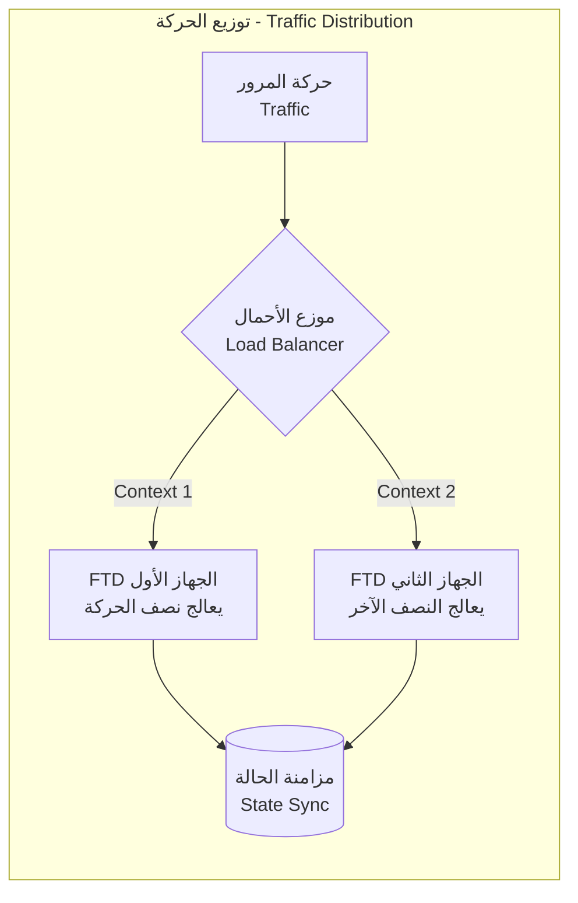

**مقارنة بين الوضعين:**

| الميزة | Active/Standby | Active/Active |
|--------|---------------|---------------|
| **الاستخدام** | جهاز واحد فقط يعمل | كلا الجهازين يعملان |
| **التعقيد** | بسيط | أكثر تعقيداً |
| **استغلال الموارد** | 50% (جهاز واحد معطل فعلياً) | 100% (كلاهما يعمل) |
| **حالة الاستخدام** | معظم البيئات | بيئات عالية الحركة |
| **التكوين** | أبسط | يحتاج Context-based routing و HSRP |

---

### 8.4 اعتبارات تصميم HA

**متطلبات الشبكة:**

**1. رابط Failover Link:**

| المتطلب | الشرح |
|---------|-------|
| واجهة مخصصة | لا تُستخدم لحركة مرور عادية |
| عرض نطاق عالي | 1 Gbps كحد أدنى |
| تأخير منخفض | الاتصال المباشر أو VLAN معزولة |

**2. رابط Stateful Failover Link:**

| المتطلب | الشرح |
|---------|-------|
| يمكن أن يكون نفس رابط Failover | لكن يُفضل فصله |
| رابط منفصل للحركة العالية | لتجنب التنافس على عرض النطاق |
| ينقل جداول الحالة | لضمان استمرارية الاتصالات |

---

### تمرين عملي 8.1: تصميم حل HA

**السيناريو:** صمم حل High Availability لجدار حماية مؤسسة.

**المتطلبات:**
- وقت تشغيل 99.999% (أقصى 5 دقائق توقف في السنة)
- إنتاجية 10 Gbps
- مطلوب Stateful Failover
- الميزانية تسمح بجهازين فقط

**الحل:**

```
البنية المعمارية: Active/Standby

الأجهزة:
  - 2x FTD 4140 (كل جهاز يدعم 20 Gbps - ضعف المطلوب للأمان)
  - مزودات طاقة مزدوجة (Redundant Power Supplies) في كل جهاز

الواجهات:
  - Outside: 2x 10 Gbps (EtherChannel) - للاتصال بالإنترنت
  - Inside: 2x 10 Gbps (EtherChannel) - للشبكة الداخلية
  - Failover Link: 1 Gbps مخصصة - لمراقبة صحة الجهاز الآخر
  - Stateful Link: 10 Gbps مخصصة - لمزامنة جداول الحالة

التكوين:
  Mode: Active/Standby
  Failover Type: Stateful
  المراقبة:
    - Interface monitoring: تفعيل على جميع الواجهات
    - Health check interval: 1 ثانية (فحص كل ثانية)
    - Hold time: 3 ثوانٍ (انتظار 3 ثوانٍ قبل إعلان الفشل)

اختبار Failover:
  - اختبار شهري للتبديل
  - التحقق من استمرارية الاتصالات القائمة
  - قياس وقت التبديل (يجب أن يكون أقل من ثانية واحدة)
  - توثيق النتائج
```

---

### تمرين عملي 8.2: استكشاف أخطاء Failover

**المشكلة:** الجهاز الاحتياطي (Standby) لا يتزامن مع الجهاز النشط (Active).

**خطوات استكشاف الأخطاء:**

| الخطوة | الأمر | ماذا تبحث عنه |
|--------|-------|---------------|
| **1. فحص حالة Failover** | `show failover` | `Failover On` + `Primary - Active` + `Secondary - Standby Ready` |
| **2. فحص رابط Failover** | `show interface GigabitEthernet0/0` | الحالة: `up/up` + لا أخطاء + القدرة على Ping |
| **3. فحص مزامنة التكوين** | `show failover config-sync` | التكوين متزامن + لا أخطاء مزامنة |
| **4. مراجعة السجلات** | `show log \| grep failover` | البحث عن تغييرات الحالة ورسائل الخطأ |

**الأخطاء الشائعة:**

| الخطأ | السبب | الحل |
|-------|-------|------|
| رابط Failover معطل | كابل مفصول أو واجهة معطلة | فحص الكابل وتفعيل الواجهة |
| عدم تطابق الإصدار | نسخة البرنامج مختلفة بين الجهازين | تحديث كلا الجهازين لنفس الإصدار |
| عدم تطابق الترخيص | تراخيص مختلفة | توحيد التراخيص |
| اختلاف التكوين | تعديلات يدوية على جهاز واحد فقط | إعادة مزامنة التكوين عبر FMC |

---

## الملخص الشامل وأفضل الممارسات

### مراجعة المفاهيم الأساسية

| الموضوع | النقاط الرئيسية |
|---------|----------------|
| **تطور Firewall** | من Packet Filtering إلى Stateful Inspection إلى NGFW الذي يدمج Application Awareness و Identity Awareness |
| **بنية FTD** | يجمع بين ميزات ASA و Firepower ويُدار مركزياً عبر FMC |
| **IPS** | يستخدم Signature-based للتهديدات المعروفة و Anomaly-based للتهديدات المجهولة. Inline Mode للمنع الفوري و Promiscuous Mode للمراقبة |
| **Security Intelligence** | تستخدم Threat Intelligence Feeds لتحديث قوائم الحظر ديناميكياً |
| **تكامل الهوية** | السياسة تتبع المستخدم وليس عنوان IP عبر تكامل ISE مع FTD |
| **High Availability** | Active/Standby للبساطة، Active/Active لأقصى استغلال للموارد |

---

### أفضل الممارسات

**عند النشر:**

| الممارسة | الشرح |
|---------|-------|
| ابدأ بوضع المراقبة | Alert-only أولاً قبل تفعيل Block |
| فعّل الحجب تدريجياً | بعد التأكد من عدم وجود False Positives كثيرة |
| اختبر في بيئة معملية أولاً | لا تطبق مباشرة على الإنتاج |
| وثّق كل التكوينات | لتسهيل استكشاف الأخطاء لاحقاً |

**عند إدارة السياسات:**

| الممارسة | الشرح |
|---------|-------|
| اتبع مبدأ Least Privilege | امنح أقل صلاحيات ممكنة |
| راجع السياسات دورياً | احذف القواعد غير المستخدمة |
| استخدم Version Control | تتبع تغييرات السياسات |

**عند المراقبة:**

| الممارسة | الشرح |
|---------|-------|
| فعّل Logging لجميع القواعد | لتتمكن من التحليل لاحقاً |
| حلل السجلات بانتظام | لاكتشاف الأنماط المشبوهة |
| أنشئ تنبيهات للأحداث الحرجة | لإشعارك فوراً عند حدوث شيء خطير |

**عند الصيانة:**

| الممارسة | الشرح |
|---------|-------|
| حدّث التواقيع بانتظام | تواقيع جديدة لتهديدات جديدة |
| حدّث Firmware بعد الاختبار | اختبر في المعمل قبل الإنتاج |
| اختبر Failover دورياً | تأكد أنه يعمل قبل أن تحتاجه فعلاً |
| انسخ التكوينات احتياطياً | لاستعادتها عند الحاجة |

---

## سيناريوهات تدريبية إضافية

### السيناريو 1: تأمين فرع الشركة (Branch Office Security)

**المتطلبات:** 50 مستخدم، وصول إنترنت، وصول لموارد المقر الرئيسي، امتثال لمعايير PCI-DSS

**التصميم المقترح:**
```
FTD في وضع Routed Mode
السياسة الافتراضية: Block all (حجب كل شيء)

مسموح:
  - HTTP/HTTPS الصادر (مع URL Filtering)
  - VPN إلى المقر الرئيسي
  - DNS إلى خوادم معتمدة فقط

محجوب:
  - تطبيقات P2P
  - مواقع عالية المخاطر
  - وصول عن بعد غير مصرح به
```

### السيناريو 2: تقسيم مركز البيانات (Data Center Segmentation)

**المتطلبات:** طبقة ويب (DMZ)، طبقة تطبيقات (داخلية)، طبقة قواعد بيانات (مقيدة)، امتثال PCI

**التصميم المقترح:**
```
عدة سياقات FTD (Multiple Contexts)

Web إلى App: السماح بمنافذ محددة فقط (8080, 8443)
App إلى DB: السماح بمنافذ SQL فقط (1433, 3306)
DMZ إلى Internal: حجب افتراضي
IPS مفعل على جميع الأجزاء
Logging مفعل للامتثال
```

### السيناريو 3: القوى العاملة عن بعد (Remote Workforce)

**المتطلبات:** وصول آمن عن بعد، سياسات مبنية على الهوية، وصول لتطبيقات سحابية، منع تسريب البيانات

**التصميم المقترح:**
```
AnyConnect VPN إلى FTD
تكامل ISE للمصادقة
سياسات مجموعات بناءً على الدور الوظيفي
وصول السحابة عبر Proxy
سياسات DLP (Data Loss Prevention) للبيانات الحساسة
```

---
---
