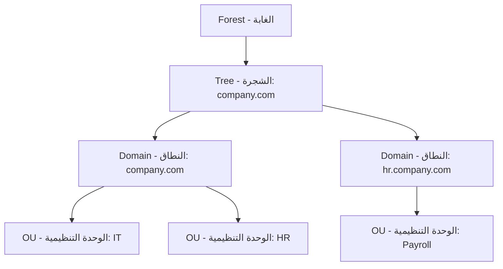
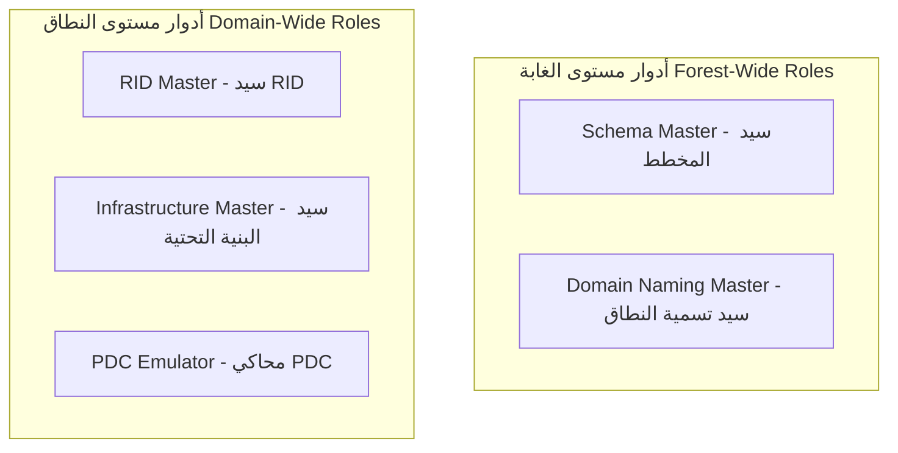

### المستوى الأول: الأساسيات والمفاهيم الجوهرية (Foundations & Core Concepts)

تُعد خدمات مجال خدمات نشطة (Active Directory Domain Services) أو اختصاراً (AD DS)، قاعدة البيانات المركزية والمدير الرئيسي لموارد الشبكة في بيئة ويندوز (Windows Environment). 

الأهداف الرئيسية للخدمة:
1. المصادقة (Authentication): التحقق من هوية المستخدمين والأجهزة قبل السماح لهم بالدخول.
2. الترخيص (Authorization): تحديد ما يمكن للمستخدم المصادق عليه الوصول إليه أو تعديله.
3. إدارة الكائنات (Object Management): التحكم في دورة حياة الكائنات مثل المستخدمين (Users)، المجموعات (Groups)، وأجهزة الحاسوب (Computers).

#### البنية المنطقية (Logical Structure)
لفهم كيفية تنظيم الشبكة، يجب استيعاب التسلسل الهرمي التالي:
* الغابة (Forest): أعلى مستوى من التسلسل، وتمثل حدود الأمان (Security Boundaries) الكاملة. تشترك جميع مكونات الغابة في مخطط واحد (Schema) ودليل تكوين عام (Configuration Container).
* الشجرة (Tree): مجموعة من النطاقات (Domains) التي تشارك نفس مساحة الأسماء (Namespace) بشكل متسلسل (مثل: company.com و hr.company.com).
* النطاق (Domain): الوحدة الإدارية الأساسية التي تحتوي على الكائنات، وتشترك في قاعدة بيانات واحدة (Directory Database) وسياسات أمان موحدة.
* الوحدة التنظيمية (Organizational Unit - OU): حاوية فرعية داخل النطاق تُستخدم لتنظيم الكائنات وتطبيق سياسات المجموعة (Group Policy Objects - GPOs) بشكل دقيق.



### المستوى الثاني: الآليات المتقدمة وأدوار العمليات الرئيسية (Advanced Mechanics & FSMO Roles)

في البيئات التي تحتوي على أكثر من متحكم مجال (Domain Controller)، يجب ضمان عدم تضارب البيانات عند إجراء تغييرات حرجة. هنا تأتي أهمية أدوار العمليات الرئيسية المرنة (Flexible Single Master Operations - FSMO). تنقسم هذه الأدوار إلى مستويين:

#### أدوار مستوى الغابة (Forest-Wide Roles)
يوجد دور واحد فقط لكل غابة:
1. سيد المخطط (Schema Master): المسؤول الوحيد عن تحديث أو تعديل المخطط (Schema) والذي يحدد تعريفات الكائنات وخصائصها (Attributes).
2. سيد تسمية النطاق (Domain Naming Master): المسؤول عن إضافة أو حذف نطاقات (Domains) جديدة داخل الغابة.

#### أدوار مستوى النطاق (Domain-Wide Roles)
يوجد دور واحد لكل نطاق:
1. سيد معرف الموارد (RID Master): يخصص حزم من معرفات الموارد (Resource IDs) لمتحكمي المجال لضمان أن كل كائن جديد (مثل مستخدم) يحصل على معرف أمان (SID) فريد.
2. سيد البنية التحتية (Infrastructure Master): مسؤول عن تحديث المراجع (References) للكائنات غير العالمية (Non-Global Objects) عند نقلها بين النطاقات.
3. محاكي PDC (PDC Emulator): يتولى مهام التوافق مع الأنظمة القديمة، ويدير مزامنة الوقت (Time Synchronization)، وتغييرات كلمات المرور (Password Resets)، وتطبيق سياسات كلمات المرور (Password Policies).



### المستوى الثالث: التثبيت والتكوين العملي (Installation & Configuration Practical)

لتحويل خادم ويندوز (Windows Server) إلى متحكم مجال (Domain Controller)، يجب اتباع تسلسل دقيق.

**المتطلبات الأساسية:**
* تعيين عنوان IP ثابت (Static IP Address).
* تعيين خادم نظام أسماء النطاقات (DNS Server) بشكل صحيح.

**التمرين العملي الأول: إنشاء غابة جديدة (New Forest)**
1. افتح مدير الخادم (Server Manager).
2. اختر إضافة الأدوار والميزات (Add Roles and Features).
3. حدد دور خدمات مجال خدمات نشطة (Active Directory Domain Services) وقم بتثبيته.
4. بعد التثبيت، انقر على أيقونة التنبيه واختر "ترقية هذا الخادم إلى متحكم مجال" (Promote this server to a domain controller).
5. اختر "إضافة غابة جديدة" (Add a new forest) واكتب اسم النطاق الجذري (Root domain name) مثل `corp.local`.
6. اتبع المعالج لتحديد كلمة مرور استعادة خدمات الدليل (DSRM Password)، ثم انقر على تثبيت (Install) وإعادة التشغيل.

### المستوى الرابع: الإدارة اليومية وأتمتة المهام (Day-to-Day Management & Automation)

يمكن إدارة البيئة عبر الواجهة الرسومية (Active Directory Users and Computers - ADUC) أو عبر سطر الأوامر المتقدم (PowerShell). يُفضل استخدام (PowerShell) للأتمتة والسرعة.

**التمرين العملي الثاني: إنشاء هيكل تنظيمي ومستخدمين عبر PowerShell**

الخطوة 1: إنشاء وحدات تنظيمية (OUs) للأقسام المختلفة.
```powershell
# إنشاء وحدة تنظيمية للقسم التقني
New-ADOrganizationalUnit -Name "IT_Department" -Path "DC=corp,DC=local"

# إنشاء وحدة تنظيمية للقسم المالي
New-ADOrganizationalUnit -Name "Finance_Department" -Path "DC=corp,DC=local"
```

الخطوة 2: إنشاء مستخدمين جدد وتعيين خصائصهم.
```powershell
# إنشاء مستخدم جديد في القسم التقني
New-ADUser -Name "Ahmed.Ali" -SamAccountName "ahmed.ali" -UserPrincipalName "ahmed.ali@corp.local" -GivenName "Ahmed" -Surname "Ali" -Path "OU=IT_Department,DC=corp,DC=local" -AccountPassword (ConvertTo-SecureString "P@ssw0rd123" -AsPlainText -Force) -Enabled $true

# إنشاء مستخدم جديد في القسم المالي
New-ADUser -Name "Sara.Mohamed" -SamAccountName "sara.mohamed" -UserPrincipalName "sara.mohamed@corp.local" -GivenName "Sara" -Surname "Mohamed" -Path "OU=Finance_Department,DC=corp,DC=local" -AccountPassword (ConvertTo-SecureString "P@ssw0rd456" -AsPlainText -Force) -Enabled $true
```

الخطوة 3: إنشاء مجموعة أمان (Security Group) وإضافة المستخدمين إليها.
```powershell
# إنشاء مجموعة للمدراء
New-ADGroup -Name "IT_Managers" -GroupScope Global -GroupCategory Security -Path "OU=IT_Department,DC=corp,DC=local"

# إضافة المستخدم أحمد إلى المجموعة
Add-ADGroupMember -Identity "IT_Managers" -Members "ahmed.ali"
```

### المستوى الخامس: الأمان، النسخ الاحتياطي، واستكشاف الأخطاء (Security, Backup & Troubleshooting)

#### أفضل ممارسات الأمان (Security Best Practices)
1. مبدأ أقل صلاحية (Least Privilege Principle): امنح المستخدمين الحد الأدنى من الصلاحيات اللازمة لأداء مهامهم فقط.
2. استخدام المجموعات (Groups): لا تمنح الصلاحيات للمستخدمين بشكل مباشر (Direct Permissions)، بل أضفهم إلى مجموعات (Groups) وامنح الصلاحيات للمجموعات.
3. الحسابات الإدارية المخصصة (Privileged Accounts): افصل بين الحساب اليومي (Daily Account) والحساب الإداري (Admin Account). لا تستخدم حساب المدير العام (Domain Admin) لتصفح الإنترنت أو قراءة البريد.
4. التدقيق (Auditing): فعّل سياسات التدقيق المتقدم (Advanced Audit Policy) لمراقبة تغييرات الكائنات ومحاولات الدخول الفاشلة.

#### النسخ الاحتياطي (Backup)
يعتمد النسخ الاحتياطي لـ (AD DS) على خدمة (Volume Shadow Copy Service - VSS). يجب إجراء نسخ احتياطي لحالة النظام (System State) بشكل دوري لضمان القدرة على الاستعادة في حال تلف قاعدة البيانات.

**التمرين العملي الثالث: استكشاف أخطاء المزامنة (Replication Troubleshooting)**
عند وجود أكثر من متحكم مجال، يجب التأكد من نجاح عملية المزامنة (Replication).

الخطوة 1: استخدام أداة تشخيص متحكم المجال (Dcdiag).
```cmd
dcdiag /v /c /d /e
```
هذا الأمر يشغل اختبارات شاملة (Comprehensive Tests) ويظهر الأخطاء التفصيلية (Detailed Errors).

الخطوة 2: التحقق من حالة المزامنة باستخدام (Repadmin).
```cmd
repadmin /replsummary
```
يظهر هذا الأمر ملخصاً لحالة المزامنة بين جميع متحكمي المجال، ويوضح عدد حالات الفشل (Failures) إن وجدت.

الخطوة 3: إجبار المزامنة فورية باستخدام (Dsrepl).
```cmd
repadmin /syncall /AdeP
```
يقوم هذا الأمر بفرض المزامنة (Force Replication) لجميع أقسام الدليل (Partitions) عبر جميع متحكمي المجال.

الخطوة 4: مراجعة السجلات (Event Viewer).
افتح عارض الأحداث (Event Viewer)، وانتقل إلى سجلات ويندوز (Windows Logs) ثم خدمة الدليل (Directory Service). ابحث عن الأخطاء (Errors) والتحذيرات (Warnings) التي قد تشير إلى مشاكل في الاتصال بـ (DNS) أو مشاكل في المزامنة.

### خاتمة
إتقان خدمات مجال خدمات نشطة (Active Directory Domain Services) يتطلب فهم البنية المنطقية (Logical Structure)، وإدارة أدوار (FSMO) بحذر، والاعتماد على (PowerShell) لأتمتة المهام الإدارية، مع تطبيق صارم لمبادئ الأمان (Security Principles). هذا الأساس هو حجر الزاوية لبنية تحتية تقنية (IT Infrastructure) مستقرة وآمنة.